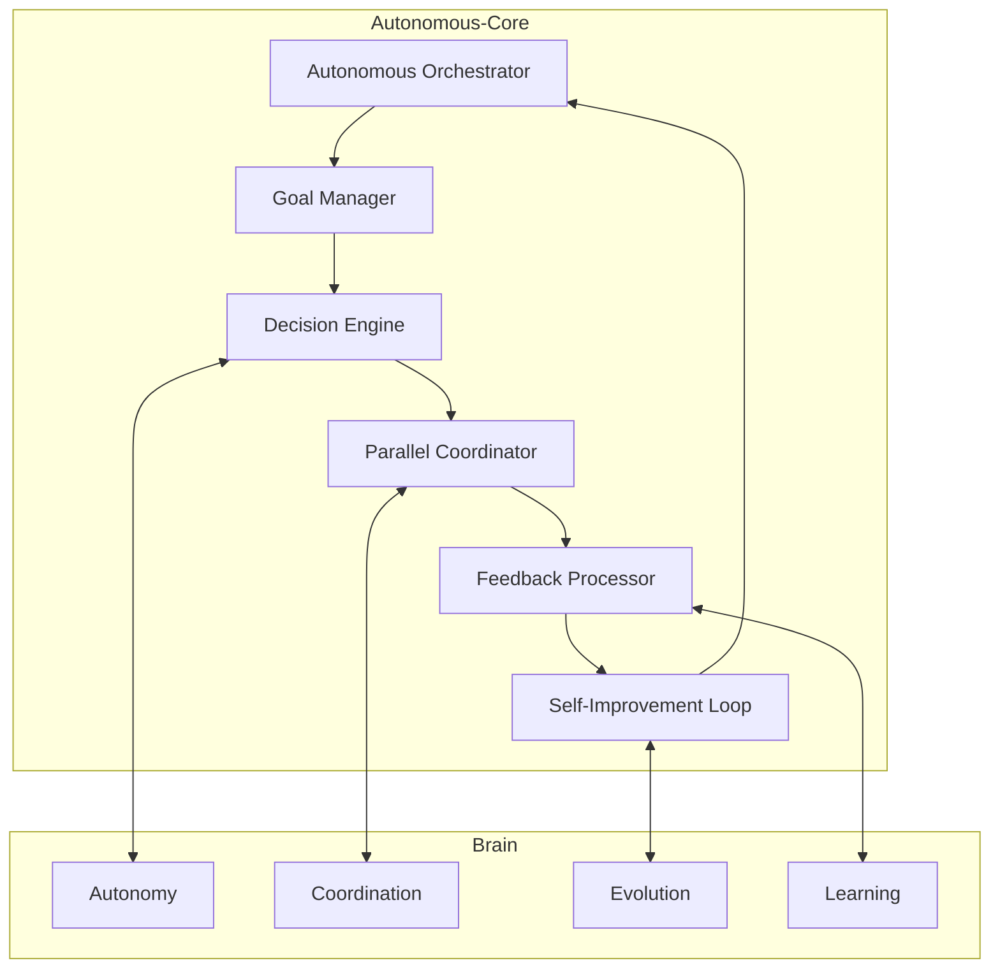

# Autonomous-Core

> **L5 Full Autonomy Engine | vnBuilderProMax v2.3.1**
> Zero-Human-Loop | Goal-Driven | Self-Improving
> **CoreModules Integration**: SubagentManager, MemoryStore, AgentLoop

---

## Overview

The Autonomous-Core is the central nervous system for fully autonomous workforce execution. It enables workforces to operate end-to-end without human intervention, making decisions based on goals and constraints.

### CoreModules Dependencies

| CoreModule | Integration Point |
|------------|-------------------|
| **SubagentManager** | Parallel Coordinator spawning |
| **MemoryStore** | Decision and goal persistence |
| **AgentLoop** | Worker core processing |
| **ContextBuilder** | Bootstrap files for agents |

---

| Component | Function | Integration Point |
|-----------|----------|-------------------|
| **Autonomous Orchestrator** | Master controller, goal-driven execution | Team Orchestration/WORKFLOW.md |
| **Goal Manager** | Goal decomposition, priority hierarchy | All Workers via Memory Bus |
| **Decision Engine** | Constraint satisfaction, policy execution | Brain/Decisions |
| **Parallel Coordinator** | Multi-agent parallel execution | Tier 3 Content Workers |
| **Feedback Processor** | Active feedback loop processing | Brain/Learning |
| **Self-Improvement Loop** | Continuous optimization system | Brain/Evolution |

---

## Autonomy Levels

| Level | Name | Self-Decision | Human Oversight |
|-------|------|---------------|-----------------|
| L3 | Delegated | 80% | Exception-based |
| L4 | Autonomous | 95% | Post-hoc audit |
| **L5** | **Full Auto** | **100%** | **Emergency override only** |

This framework operates at **L5 Full Auto** by default.

---

## Core Capabilities

### 1. Advanced Multi-Agent Collaboration

- Parallel execution within tiers (Tier 3: W09-W14)
- Shared state synchronization via Memory Bus
- Conflict resolution for competing decisions
- Real-time inter-agent communication

### 2. Self-Improving Workflows

- Performance metrics: execution time, quality scores, success rates
- Active feedback processing (real-time)
- A/B testing for workflow optimization
- Automated hypothesis generation and validation

### 3. Autonomous Decision-Making

- Goal decomposition (high-level → atomic tasks)
- Constraint satisfaction solver
- Zero-human-loop execution protocol
- Emergency override safety mechanism

---

## Memory Bus Keys

| Key | Type | Description |
|-----|------|-------------|
| `autonomous.execution_mode` | enum | L3/L4/L5 |
| `autonomous.current_goal` | object | Active goal hierarchy |
| `autonomous.decision_log` | array | Autonomous decisions made |
| `autonomous.parallel_state` | object | Parallel execution state |
| `autonomous.feedback_queue` | array | Pending feedback items |
| `autonomous.improvement_log` | array | Applied improvements |

---

## Integration

---

*Autonomous-Core v1.0 | vnBuilderProMax v2.2.0 | L5 Full Autonomy*
