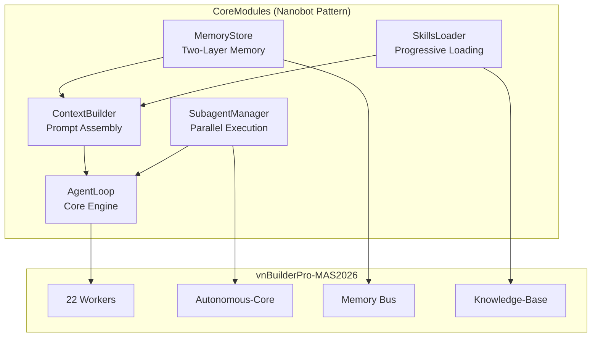
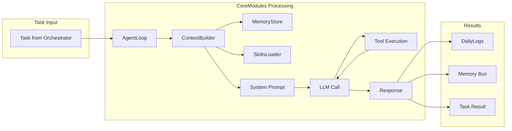

# CoreModules - vnBuilderPro-MAS2026

> **Lightweight Agent Architecture** | Nanobot Pattern Integration
>
> 5 Core Modules for Memory, Context, Skills, Loop, and Subagent Management

---

## 📋 Overview

CoreModules provides a lightweight, efficient architecture for managing agent state, context, and execution. Based on the [nanobot](https://github.com/HKUDS/nanobot) framework patterns, optimized for the 528-agent vnBuilderPro-MAS2026 HierarchicalSwarm.

| Module | Purpose | Source |
|--------|---------|--------|
| [MemoryStore](memory-store.md) | Dual-layer persistent memory | nanobot `agent/memory.py` |
| [ContextBuilder](context-builder.md) | Prompt assembly with bootstrap | nanobot `agent/context.py` |
| [SkillsLoader](skills-loader.md) | Progressive skill loading | nanobot `agent/skills.py` |
| [AgentLoop](agent-loop.md) | Core processing engine | nanobot `agent/loop.py` |
| [SubagentManager](subagent-manager.md) | Background task execution | nanobot `agent/subagent.py` |

---

## 🏗️ Architecture



---

## 📚 Module Details

### 1. MemoryStore

**Purpose**: Dual-layer persistent memory following CLAWDBOT v2.2.0

**Key Methods**:

- `get_today_file()` - Get today's daily log path
- `read_today()` / `append_today()` - Daily log operations
- `read_long_term()` / `write_long_term()` - MEMORY.md operations
- `get_recent_memories(days)` - Historical context
- `get_memory_context()` - Combined context for prompts

**Integration**: Replaces complex Memory/ structure with simple, efficient pattern.

---

### 2. ContextBuilder

**Purpose**: Assembles complete context for LLM calls

**Bootstrap Files**:

- `AGENTS.md` - Behavior instructions
- `SOUL.md` - Personality and tone
- `USER.md` - User preferences
- `TOOLS.md` - Tool guidelines
- `IDENTITY.md` - Custom overrides

**Key Methods**:

- `build_system_prompt()` - Complete system prompt
- `build_messages()` - Full message list
- `add_tool_result()` - Append tool results

**Integration**: Unifies Brain/ structure into coherent prompt assembly.

---

### 3. SkillsLoader

**Purpose**: Progressive skill loading with requirements checking

**SKILL.md Format**:

```yaml
---
vnbuilder:
  name: skill-name
  description: Brief description
  always: false
  tier: [1,2,3]
  requires:
    bins: [tool]
    env: [API_KEY]
---
```

**Key Methods**:

- `list_skills()` - Available skills
- `load_skill(name)` - Load specific skill
- `get_always_skills()` - Always-loaded skills
- `get_tier_skills(tier)` - Tier-specific skills
- `build_skills_summary()` - XML summary for progressive loading

**Integration**: Transforms existing 12 SKILLS to standard format.

---

### 4. AgentLoop

**Purpose**: Core processing engine for 22 workers

**Features**:

- Tier-aware skill loading
- Iterative tool execution (max 20)
- Session persistence
- Auto-logging to DailyLogs

**Key Methods**:

- `run()` - Main processing loop
- `_process_task()` - Single task processing
- `process_direct()` - CLI/testing interface

**Integration**: Unifies worker execution across all 8 tiers.

---

### 5. SubagentManager

**Purpose**: Background task execution for parallel operations

**Features**:

- Max 10 concurrent subagents per worker
- Isolated execution context
- Result routing via Memory Bus

**Key Methods**:

- `spawn(task, label)` - Spawn subagent
- `get_running_count()` - Active count
- `get_pending_results()` - Collect results

**Integration**: Powers parallel execution in Tiers 2-4.

---

## 🔄 Data Flow



---

## 💡 Key Benefits

| Benefit | Description |
|---------|-------------|
| **Lightweight** | ~4k LoC equivalent vs complex monolithic structures |
| **Progressive Loading** | Skills loaded only when needed, saving context tokens |
| **Two-Layer Memory** | Clean separation of daily logs and curated knowledge |
| **Bootstrap Pattern** | Consistent identity and behavior across workers |
| **Parallel Support** | SubagentManager enables concurrent operations |

---

## 📊 Comparison

| Aspect | Before (Complex) | After (CoreModules) |
|--------|------------------|---------------------|
| Memory | 7 subdirs, complex pipeline | 2-layer (MEMORY.md + DailyLogs/) |
| Context | Scattered Brain/ files | 5 bootstrap files + unified builder |
| Skills | No progressive loading | YAML frontmatter + on-demand |
| Workers | Ad-hoc execution | Unified AgentLoop pattern |
| Parallel | Custom implementation | Standard SubagentManager |

---

## 🔗 Related Documentation

| Document | Description |
|----------|-------------|
| [Memory CLAWDBOT v2.2.0](../Second-Brain/Memory/README.md) | Memory system details |
| [Knowledge-Base SKILLS](../Knowledge-Base/SKILLS/) | Skill files |
| [Autonomous-Core](../../Autonomous-Core/) | L5 autonomous engine |
| [Team Orchestration](../../Team Orchestration/) | Tier coordination |

---

## 📚 Source Reference

Based on [nanobot](https://github.com/HKUDS/nanobot) repository:

- Knowledge-Base: `E:\AGENTS\GithubClone\Repos2026\nanobot\_Knowledge-Base\CoreModules\`
- Skills: `E:\AGENTS\GithubClone\Repos2026\nanobot\_Knowledge-Base\Skills\`

---

*vnBuilderPro-MAS2026 CoreModules v2.3.0 | Nanobot Pattern Integration*
