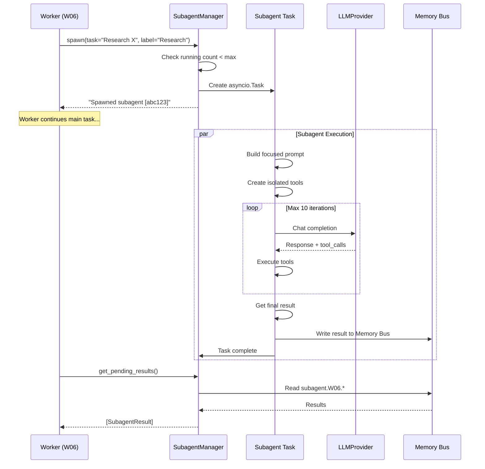

# SubagentManager - Background Task Execution

> **Module Documentation**: vnBuilderPro-MAS2026 CoreModules
>
> Manages background subagent execution for parallel worker operations.

---

## 📋 Overview

| Attribute | Value |
|-----------|-------|
| **Source** | nanobot `agent/subagent.py` pattern |
| **Purpose** | Spawn and manage background task agents |
| **Max Subagents** | 10 per worker |
| **Integration** | Parallel Tiers (2-4), Autonomous-Core |

---

## 🏗️ Architecture

```
┌─────────────────────────────────────────────────────────────────┐
│                      WORKER (e.g., W06)                          │
│  ┌─────────────────────────────────────────────────────────────┐│
│  │                    AgentLoop                                 ││
│  │  spawn("Research pattern X") ──►  SubagentManager           ││
│  └─────────────────────────────────────────────────────────────┘│
└─────────────────────────────────────────────────────────────────┘
                              │
                              ▼
┌─────────────────────────────────────────────────────────────────┐
│                    SUBAGENT POOL                                 │
│  ┌──────────────┐  ┌──────────────┐  ┌──────────────┐          │
│  │ Subagent #1  │  │ Subagent #2  │  │ Subagent #3  │   ...    │
│  │ (Research)   │  │ (Analysis)   │  │ (Generate)   │          │
│  └──────────────┘  └──────────────┘  └──────────────┘          │
│         │                 │                 │                    │
│         ▼                 ▼                 ▼                    │
│  ┌──────────────────────────────────────────────────────────┐   │
│  │                   Memory Bus (Results)                    │   │
│  └──────────────────────────────────────────────────────────┘   │
└─────────────────────────────────────────────────────────────────┘
                              │
                              ▼
┌─────────────────────────────────────────────────────────────────┐
│                      WORKER (e.g., W06)                          │
│        Receives subagent results via Memory Bus                  │
└─────────────────────────────────────────────────────────────────┘
```

---

## 🔧 Class Structure

```python
class SubagentManager:
    """
    Manages background subagent execution for workers.
    
    Subagents are lightweight agent instances that run in the background
    to handle specific sub-tasks. They share memory context but have
    isolated tool access and execution.
    """
    
    def __init__(
        self,
        worker_id: str,
        workspace: Path,
        model: str | None = None,
        max_subagents: int = 10,
    ):
        self.worker_id = worker_id
        self.workspace = workspace
        self.model = model
        self.max_subagents = max_subagents
        self.memory = MemoryStore(workspace)
        self._running_tasks: dict[str, asyncio.Task] = {}
```

---

## 📚 Methods

### `spawn(...) -> str`

Spawn a subagent to execute a task in the background.

```python
async def spawn(
    self,
    task: str,
    label: str | None = None,
    priority: str = "normal",
) -> str:
    """
    Spawn a subagent to execute a task in the background.
    
    Args:
        task: The task description for the subagent.
        label: Optional human-readable label for the task.
        priority: Task priority ("low", "normal", "high").
    
    Returns:
        Status message indicating the subagent was started.
    """
    if len(self._running_tasks) >= self.max_subagents:
        return f"❌ Max subagents ({self.max_subagents}) reached. Wait for completion."
    
    task_id = str(uuid.uuid4())[:8]
    label = label or task[:50]
    
    # Create async task
    async_task = asyncio.create_task(
        self._run_subagent(task_id, task, label, priority)
    )
    self._running_tasks[task_id] = async_task
    
    return f"🚀 Spawned subagent [{task_id}]: {label}"
```

### `_run_subagent(...) -> None`

Execute the subagent task and report the result.

```python
async def _run_subagent(
    self,
    task_id: str,
    task: str,
    label: str,
    priority: str,
) -> None:
    """Execute the subagent task and report the result."""
    start_time = datetime.now()
    
    try:
        logger.info(f"Subagent {task_id} starting: {label}")
        
        # Build focused system prompt
        system_prompt = self._build_subagent_prompt(task)
        
        # Create isolated tool registry
        tools = ToolRegistry()
        tools.register(ReadFileTool())
        tools.register(WriteFileTool())
        tools.register(ListDirTool())
        tools.register(ExecTool())
        tools.register(WebSearchTool())
        tools.register(WebFetchTool())
        
        # Run agent loop (reduced iterations for subagents)
        messages = [
            {"role": "system", "content": system_prompt},
            {"role": "user", "content": task}
        ]
        
        for _ in range(10):  # Reduced max iterations
            response = await self._call_llm(messages)
            
            if not response.tool_calls:
                break
            
            # Execute tools
            for call in response.tool_calls:
                result = await tools.execute(call.name, call.arguments)
                messages.append({
                    "role": "assistant", 
                    "content": None, 
                    "tool_calls": [call]
                })
                messages.append({
                    "role": "tool", 
                    "tool_call_id": call.id, 
                    "name": call.name, 
                    "content": result
                })
        
        # Get final response
        final_response = response.content or "Task completed."
        
        # Report result to Memory Bus
        await self._report_result(
            task_id, label, task, final_response, 
            "completed", start_time
        )
        
    except Exception as e:
        logger.error(f"Subagent {task_id} failed: {e}")
        await self._report_result(
            task_id, label, task, str(e), 
            "failed", start_time
        )
    
    finally:
        self._running_tasks.pop(task_id, None)
```

### `_report_result(...) -> None`

Report the subagent result to Memory Bus.

```python
async def _report_result(
    self,
    task_id: str,
    label: str,
    task: str,
    result: str,
    status: str,
    start_time: datetime,
) -> None:
    """Report the subagent result to Memory Bus."""
    duration = (datetime.now() - start_time).total_seconds()
    
    # Log to DailyLogs
    log_entry = f"""
## 🤖 Subagent Report [{task_id}]
- **Worker**: {self.worker_id}
- **Task**: {label}
- **Status**: {status}
- **Duration**: {duration:.2f}s
- **Time**: {datetime.now().isoformat()}

### Result
{result[:500]}{"..." if len(result) > 500 else ""}
"""
    self.memory.append_today(log_entry)
    
    # Write to Memory Bus for worker retrieval
    result_key = f"subagent.{self.worker_id}.{task_id}"
    await self._write_memory_bus(result_key, {
        "task_id": task_id,
        "label": label,
        "task": task,
        "result": result,
        "status": status,
        "duration": duration
    })
```

### `_build_subagent_prompt(task: str) -> str`

Build a focused system prompt for the subagent.

```python
def _build_subagent_prompt(self, task: str) -> str:
    """Build a focused system prompt for the subagent."""
    return f"""You are a focused subagent for worker {self.worker_id}.

## Workspace
{self.workspace}

## Available Tools
- read_file: Read file contents
- write_file: Write to files
- list_dir: List directory contents
- exec: Execute shell commands
- web_search: Search the web
- web_fetch: Fetch web page content

## Task
{task}

## Instructions
1. Stay focused on the assigned task
2. Be efficient - minimize tool calls
3. Provide a clear, actionable result
4. If you encounter errors, try alternative approaches
5. Summarize your findings concisely

Complete the task and provide a summary of what you accomplished."""
```

### `get_running_count() -> int`

Return the number of currently running subagents.

```python
def get_running_count(self) -> int:
    """Return the number of currently running subagents."""
    return len(self._running_tasks)
```

### `get_pending_results() -> list[dict]`

Get completed subagent results from Memory Bus.

```python
async def get_pending_results(self) -> list[dict]:
    """Get completed subagent results from Memory Bus."""
    results = []
    pattern = f"subagent.{self.worker_id}.*"
    
    for key in await self._search_memory_bus(pattern):
        result = await self._read_memory_bus(key)
        if result:
            results.append(result)
            await self._delete_memory_bus(key)  # Clear after reading
    
    return results
```

---

## 🔄 Subagent Lifecycle



---

## 💡 Key Features

### 1. **Isolated Execution**

Each subagent runs with its own:

- Focused system prompt
- Isolated tool registry
- Reduced max iterations (10 vs 20)
- Independent error handling

### 2. **Result Routing**

Results are routed back to the parent worker via:

- Memory Bus with namespaced keys
- DailyLogs for audit trail

### 3. **Parallel Execution**

Multiple subagents can run simultaneously:

```python
# Spawn multiple subagents in parallel
tasks = [
    agent.spawn("Research pattern A"),
    agent.spawn("Research pattern B"),
    agent.spawn("Research pattern C"),
]
await asyncio.gather(*tasks)
```

### 4. **Resource Management**

Maximum 10 concurrent subagents per worker to prevent resource exhaustion.

### 5. **Error Handling**

Failed subagents report their error status:

```python
{
    "task_id": "abc123",
    "status": "failed",
    "result": "Error: API rate limit exceeded"
}
```

---

## 📝 Usage Example

```python
# Worker spawns subagents for parallel research
class ArchitectureWorker(AgentLoop):
    async def design_topology(self, requirements):
        # Spawn parallel research tasks
        await self.subagents.spawn(
            "Research HierarchicalSwarm patterns for enterprise",
            label="Hierarchical Research"
        )
        await self.subagents.spawn(
            "Research LinearParallel patterns for streaming",
            label="LinearParallel Research"
        )
        
        # Continue with other work...
        await self.process_other_tasks()
        
        # Collect subagent results
        results = await self.subagents.get_pending_results()
        
        # Use results in decision
        for r in results:
            if r["status"] == "completed":
                self.incorporate_finding(r["result"])
```

---

## 🔧 SpawnTool Integration

The SpawnTool provides the interface for workers to spawn subagents:

```python
class SpawnTool(BaseTool):
    name = "spawn"
    description = "Spawn a subagent for background task execution"
    
    def __init__(self, subagent_manager: SubagentManager):
        self.manager = subagent_manager
    
    async def execute(self, task: str, label: str = None) -> str:
        return await self.manager.spawn(task, label)
```

**Tool Definition**:

```json
{
    "name": "spawn",
    "description": "Spawn a subagent for background task execution",
    "parameters": {
        "type": "object",
        "properties": {
            "task": {
                "type": "string",
                "description": "Task description for the subagent"
            },
            "label": {
                "type": "string",
                "description": "Human-readable label for the task"
            }
        },
        "required": ["task"]
    }
}
```

---

## 📊 Tier Integration

| Tier | Parallel Execution | Subagents Use Case |
|------|-------------------|-------------------|
| 1 | Limited | Research sub-topics |
| 2 | **Parallel** | Parse requirements in parallel |
| 3 | **Parallel** | Evaluate multiple architectures |
| 4 | **Parallel** | Generate KB sections in parallel |
| 5 | Sequential | Agent spec is dependent |
| 6 | Sequential | Integration is ordered |
| 7 | Limited | Validation checks |
| 8 | Limited | Sequential deployment |

---

## 🔗 Related Modules

| Module | Relationship |
|--------|--------------|
| [AgentLoop](agent-loop.md) | Parent worker uses subagents |
| [MemoryStore](memory-store.md) | Results stored in Memory Bus |
| [Autonomous-Core](../Autonomous-Core/) | Orchestrates parallel tiers |

---

*vnBuilderPro-MAS2026 CoreModules | SubagentManager v2.3.0 | Nanobot Pattern*
