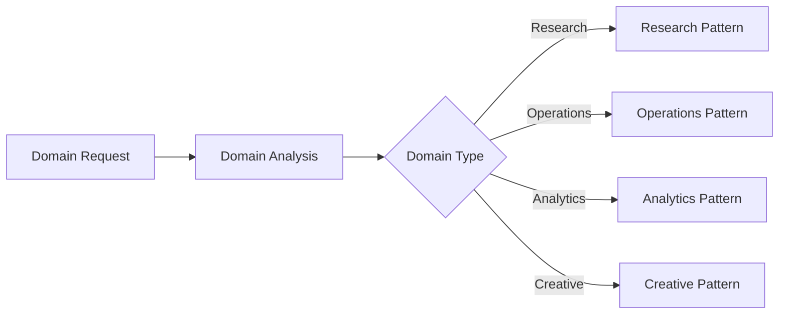

# PLAYBOOK: Domain Workforce Blueprint

> **Purpose**: Generate domain-specific workforce architectures matching enterprise v2.0.0 standards.

---

## Overview

| Attribute | Value |
|-----------|-------|
| **Version** | 2.0.0 |
| **Pattern** | Domain Adaptation |
| **Output** | Complete workforce structure |

---

## Domain Analysis Framework

### Step 1: Domain Classification



### Domain Types

| Type | Workers | Focus | Example |
|------|---------|-------|---------|
| **Research** | 22 | Literature, synthesis, validation | ScholarDeepResearch |
| **Operations** | 8-16 | Workflows, monitoring, automation | SupplyChain |
| **Analytics** | 12-20 | Data, visualization, insights | DataAnalysis |
| **Creative** | 6-12 | Content, design, generation | ContentMarketing |

---

## Worker Taxonomy Template

### 8-Tier Domain Mapping

| Tier | Generic | Research Domain | Operations Domain |
|------|---------|-----------------|-------------------|
| 1 | Intelligence | QueryClarification, DomainClassification | InputValidation, ContextGathering |
| 2 | Strategy | SearchStrategy, SourcePrioritization | WorkflowPlanning, ResourceMapping |
| 3 | Acquisition | ScholarSearch, ArxivSearch, WebSearch | DataIngestion, APICollector |
| 4 | Processing | ContentExtraction, DatasetProcessing | Transformation, Normalization |
| 5 | Analysis | CriticalReading, ContrastAnalysis | BusinessLogic, RuleEngine |
| 6 | Synthesis | DataAnalysis, Visualization | Aggregation, Reporting |
| 7 | Validation | FactCheck, CitationValidation | QualityAssurance, Compliance |
| 8 | Delivery | ReportGeneration, Evolution | OutputFormatter, Optimization |

---

## Knowledge-Base Generation Rules

### PLAYBOOKS (Domain-Specific)

Generate 8-12 playbooks covering:

1. **Core Process Orchestration** - Main domain workflow
2. **Data/Content Pipeline** - Input-to-output processing
3. **Quality Validation** - Domain-specific quality gates
4. **Tool Integration** - Domain tools and APIs
5. **Error Handling** - Domain-specific recovery
6. **Efficiency Optimization** - arXiv:2601.14192v1 patterns

### SKILLS (Domain-Specific)

Generate 10-14 skills covering:

1. **Domain Search/Acquisition** - How to gather domain data
2. **Domain Processing** - How to transform domain data
3. **Domain Analysis** - How to analyze domain content
4. **Domain Validation** - How to verify domain outputs
5. **Domain Visualization** - How to present domain insights

---

## Output Structure Template

```
{DomainName}-Workforce/
├── Context-Layer/
│   ├── Knowledge-Base/
│   │   ├── PLAYBOOKS/          (8-12 domain playbooks)
│   │   ├── SKILLS/             (10-14 domain skills)
│   │   └── EXPERIENCE/         (3-5 experience patterns)
│   ├── Second-Brain/
│   │   ├── Brain/              (Autonomy, Evolution)
│   │   ├── Memory/             (PhaseOutputs with dynamic sessions)
│   │   ├── Command/            (Domain slash commands)
│   │   └── Scripts/            (Automation)
│   ├── Research-Integration/
│   └── Retrieval/
├── Workers/                     (N workers with WORKFLOW.md each)
├── Team Orchestration/          (8 orchestration files)
├── Tools/
├── README.md
└── README-VI.md
```

---

## Quality Checklist

- [ ] Worker count matches domain complexity
- [ ] 8-tier structure maintained
- [ ] Domain-specific PLAYBOOKS generated
- [ ] Domain-specific SKILLS generated
- [ ] Auto-Persistence v2.0.0 configured
- [ ] README includes 10 practical examples
- [ ] E-O Score target ≥ 0.85

---

*PLAYBOOK v2.0.0 | Domain Workforce Blueprint | MASDesign-Workforce*
