# PLAYBOOK: Auto-Persistence Orchestration v2.0.0

> **Purpose**: Implement dynamic session folder naming and phase output persistence for generated workforces.

---

## Overview

| Attribute | Value |
|-----------|-------|
| **Version** | 2.0.0 |
| **Pattern** | Dynamic Session Folders |
| **Storage** | `Context-Layer/Second-Brain/Memory/PhaseOutputs/` |

---

## Dynamic Session Folder System

### Naming Convention

```
{YYYY-MM-DD}_{sanitized_topic}/
```

### Sanitization Rules

| Input | Output |
|-------|--------|
| Spaces | Underscores `_` |
| Special chars | Removed |
| Uppercase | Lowercase |
| Length | Max 50 chars |
| Numbers | Preserved |

### Examples

| Task Input | Session Folder |
|------------|----------------|
| "AI in Education (2024-2026)" | `2026-01-31_ai_in_education_2024_2026` |
| "LLM Progress: Recent Advances" | `2026-01-30_llm_progress_recent_advances` |
| "Climate Change & Policy" | `2026-01-29_climate_change_policy` |

---

## Phase Output Structure

### Folder Layout

```
PhaseOutputs/
├── {session_folder}/
│   ├── session-metadata.json    # Created at end
│   ├── phase-01-{tier1-name}.json
│   ├── phase-02-{tier2-name}.json
│   ├── phase-03-{tier3-name}.json
│   ├── phase-04-{tier4-name}.json
│   ├── phase-05-{tier5-name}.json
│   ├── phase-06-{tier6-name}.json
│   ├── phase-07-{tier7-name}.json
│   └── phase-08-{tier8-name}.json
└── _legacy/
    └── (pre-v2.0.0 files)
```

### Phase Output Schema

```json
{
    "phase": 1,
    "tier_name": "Query & Intelligence",
    "workers_executed": ["W01", "W02", "W03"],
    "started_at": "2026-01-31T12:40:00+07:00",
    "completed_at": "2026-01-31T12:45:00+07:00",
    "memory_keys": {
        "query.original": "...",
        "query.clarified": "...",
        "domain.classification": "..."
    },
    "quality_score": 0.92,
    "status": "completed"
}
```

---

## Session Metadata Schema

```json
{
    "session_folder": "2026-01-31_ai_in_education_2024_2026",
    "task_topic": "AI in Education (2024-2026)",
    "mode": "Deep",
    "started_at": "2026-01-31T12:40:00+07:00",
    "completed_at": "2026-01-31T13:15:00+07:00",
    "duration_minutes": 35,
    "total_phases": 8,
    "total_workers": 22,
    "total_agents": 528,
    "quality_score": 0.92,
    "efficiency_score": 0.88,
    "workforce_version": "2.0.0"
}
```

---

## Orchestration Flow

```mermaid
flowchart TD
    Start[Task Start] --> T1[Tier 1 Execution]
    T1 --> Extract[Extract Topic from Memory]
    Extract --> Slug[Generate Session Slug]
    Slug --> Create[Create Session Folder]
    Create --> Save1[💾 phase-01-*.json]
    Save1 --> T2[Tier 2 Execution]
    T2 --> Save2[💾 phase-02-*.json]
    Save2 --> T3[...]
    T3 --> T8[Tier 8 Execution]
    T8 --> Save8[💾 phase-08-*.json]
    Save8 --> Meta[📋 session-metadata.json]
    Meta --> End[Session Complete]
```



---

## Memory Bus Integration

### Session Keys

| Key | Type | Description |
|-----|------|-------------|
| `session.folder` | string | Current session folder name |
| `session.topic` | string | Original task topic |
| `session.started_at` | timestamp | Session start time |
| `session.mode` | enum | Deep/Standard/Quick |
| `phase.current` | number | Current phase (1-8) |
| `phase.output.*` | object | Phase-specific outputs |

---

## Configuration Template

Add to `swarm-router-config.json`:

```json
{
    "auto_persistence": {
        "enabled": true,
        "version": "2.0.0",
        "storage_path": "Context-Layer/Second-Brain/Memory/PhaseOutputs",
        "session_naming": {
            "format": "{date}_{topic_slug}",
            "max_length": 50,
            "sanitize": true
        },
        "phase_outputs": {
            "save_on_tier_complete": true,
            "include_memory_keys": true,
            "include_quality_score": true
        },
        "session_metadata": {
            "create_on_complete": true,
            "include_duration": true,
            "include_efficiency": true
        }
    }
}
```

---

## Error Recovery

| Scenario | Recovery Action |
|----------|-----------------|
| Interrupted session | Resume from last phase output |
| Corrupted phase file | Re-execute tier |
| Missing session folder | Create new session |
| Duplicate folder name | Append counter `_001` |

---

*PLAYBOOK v2.0.0 | Auto-Persistence Orchestration | MASDesign-Workforce*
