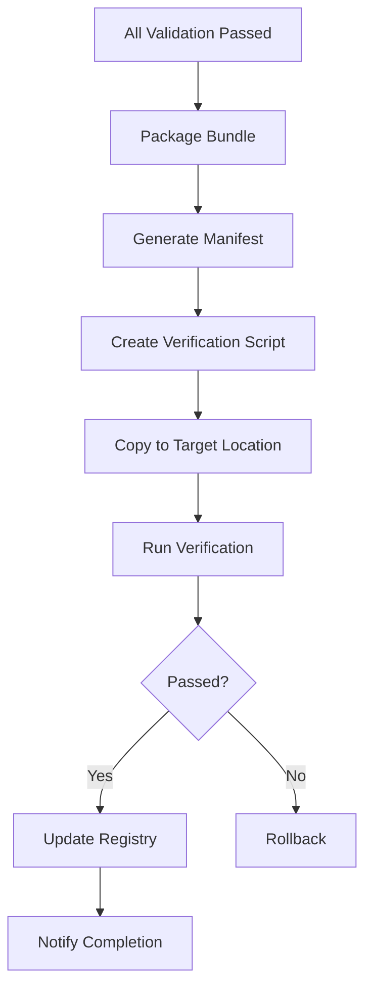

# Deployment Playbook

> **Workforce Bundling & Deployment Guide**

---

## Deployment Checklist

### Pre-Deployment
- [ ] E-O score ≥ 0.85
- [ ] All validation passed
- [ ] Documentation complete
- [ ] Cross-references verified

### Bundle Contents
- [ ] README.md
- [ ] Second-Brain/ complete
- [ ] Knowledge-Base/ complete
- [ ] Workers/ (all WORKFLOWs)
- [ ] Team Orchestration/ (all configs)

### Verification Script
- [ ] Directory structure check
- [ ] File count validation
- [ ] Content spot check

---

## Deployment Process



---

## Target Location

```
D:\AGENTS\_Workforce\{WorkforceName}
```

---

## Post-Deployment

1. Verify workforce loads correctly
2. Test sample queries
3. Log initial session
4. Update conversation memory

---

*Deployment Playbook v1.0 | MASDesign-Workforce*
