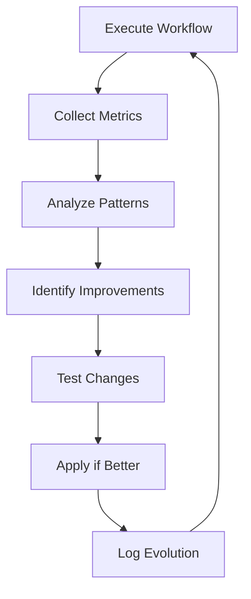

# Evolution Management Playbook

> **Self-Evolution & Continuous Improvement Protocols**

---

## Evolution Goals

1. **Pattern Effectiveness**: Track which patterns work best
2. **Performance Optimization**: Improve execution speed
3. **Quality Improvement**: Increase E-O scores
4. **Autonomy Expansion**: Reduce human escalations

---

## Evolution Cycle

---

## Metrics Tracked

| Metric | Target | Evolution Trigger |
|--------|--------|-------------------|
| Execution time | < 30s/worker | > 2x baseline |
| E-O score | ≥ 0.85 | < 0.80 |
| Pattern match | ≥ 85% | < 75% |
| Human escalation | ≤ 20% | > 30% |
| Error rate | ≤ 5% | > 10% |

---

## Evolution Types

### Micro-Evolution
- Threshold tuning
- Prompt refinement
- Timeout adjustments
*Automatic, no approval needed*

### Macro-Evolution
- New pattern addition
- Workflow restructure
- Worker redistribution
*Requires human review*

---

## Storage

| Data | Location |
|------|----------|
| Evolution log | `Memory/Evolution/evolution-log.json` |
| Learned patterns | `Memory/Evolution/learned-patterns.json` |
| Behavior policies | `Memory/Evolution/behavior-policies.json` |

---

*Evolution Management Playbook v1.0 | MASDesign-Workforce*
