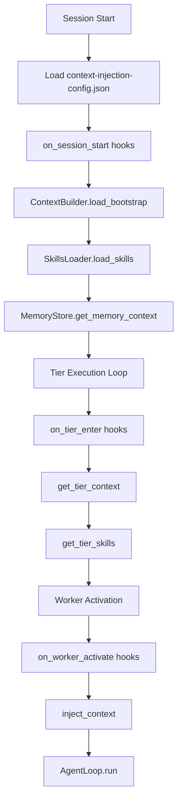

# Context-Layer Architecture

> **vnBuilderProMax v2.3.2** | 6-Tier HierarchicalSwarm
>
> Unified Intelligence Hub with CoreModules Integration

---

## Overview

| Component | Purpose |
|-----------|---------|
| **Knowledge-Base/** | 3-tier domain knowledge (PLAYBOOKS, SKILLS, EXPERIENCE) |
| **Second-Brain/** | Intelligence hub (Brain, Memory, Command, bootstrap) |
| **CoreModules/** | Nanobot-style module specifications |
| **context-injection-config-TEMPLATE.json** | Worker-to-context binding template |
| **context-loader.md** | Context injection documentation |

---

## Directory Structure

```
Context-Layer/
├── Knowledge-Base/           # Domain Knowledge
│   ├── PLAYBOOKS/           # Strategic procedures
│   ├── SKILLS/              # Technical implementations
│   └── EXPERIENCE/          # Best practices
├── Second-Brain/             # Intelligence Hub
│   ├── bootstrap/           # Bootstrap files (AGENTS, SOUL, USER, TOOLS, IDENTITY)
│   ├── Brain/               # Autonomy, Evolution, Learning, Planning
│   ├── Command/             # CLAWDBOT commands (9 files)
│   └── Memory/              # CLAWDBOT memory system
├── CoreModules/              # Nanobot-style modules
│   ├── README.md            # Module overview
│   ├── agent-loop.md        # AgentLoop specification
│   ├── context-builder.md   # ContextBuilder specification
│   ├── memory-store.md      # MemoryStore specification
│   ├── skills-loader.md     # SkillsLoader specification
│   └── subagent-manager.md  # SubagentManager specification
├── context-injection-config-TEMPLATE.json  # Worker-context bindings template
├── context-loader.md         # Context injection documentation
└── README.md                 # This file
```

---

## CoreModules Integration

Following the Nanobot architecture pattern:

| Module | Purpose | Key Methods |
|--------|---------|-------------|
| **MemoryStore** | Two-layer persistent memory | `read_today()`, `append_today()`, `get_memory_context()` |
| **ContextBuilder** | Bootstrap context assembly | `load_bootstrap()`, `get_tier_context()`, `inject_context()` |
| **SkillsLoader** | Progressive skill loading | `load_skills()`, `get_tier_skills()`, `filter_by_worker()` |
| **AgentLoop** | Core agent execution | `initialize()`, `run(max_iterations=20)` |
| **SubagentManager** | Parallel task spawning | `spawn_parallel()`, `coordinate_tier()`, `aggregate_results()` |

---

## Context Injection Flow



---

## Worker-Context Binding

Each workforce must have `Team Orchestration/context-injection-config.json` defining:

### Tier Bindings (6 Tiers)

| Tier | Name | Workers | Execution Mode |
|------|------|---------|----------------|
| 1 | Strategy | W01-W04 | Sequential |
| 2 | Intelligence | W05-W08 | Parallel |
| 3 | Content | W09-W14 | Partial Parallel (W14 aggregator) |
| 4 | Analysis | W15-W18 | Barrier Sync |
| 5 | Validation | W19-W20 | Sequential |
| 6 | Synthesis | W21-W22 | Sequential |

### Worker Context Map

Each worker (W01-W22) receives:

- Primary playbook
- Skills array
- Commands array
- Bootstrap files
- Role (optional: aggregator, synthesizer)

---

## Usage

### For Workforce Generation

1. Copy `context-injection-config-TEMPLATE.json` to new workforce
2. Replace placeholders with actual playbook/skill names
3. Customize tier_bindings for domain
4. Update worker_context_map with specific assignments

### For Execution

1. Load `context-injection-config.json` at session start
2. Execute Phase 0: Bootstrap hooks
3. For each tier: execute tier_enter hooks, then worker_activate hooks
4. At session end: execute session_end hooks

---

## Related Files

| File | Purpose |
|------|---------|
| [context-injection-config-TEMPLATE.json](context-injection-config-TEMPLATE.json) | Template for workforce generation |
| [context-loader.md](context-loader.md) | Detailed injection process documentation |
| [CoreModules/README.md](CoreModules/README.md) | Module specifications overview |

---

*Context-Layer v2.3.2 | vnBuilderProMax v2.3.2 | CoreModules Integration*
