# Full Autonomy Framework

> **MASDesign-Workforce | Autonomy Level: L5 (Full Auto)**
> vnBuilderProMax v2.2.0 | Zero-Human-Loop | Autonomous-Core Integrated

---

## Autonomy Levels

| Level | Name | Self-Decision Rate | Human Oversight |
|-------|------|-------------------|-----------------|
| L0 | Manual | 0% | Full approval required |
| L1 | Assisted | 20% | Approve major decisions |
| L2 | Supervised | 50% | Review critical outputs |
| L3 | Delegated | 80% | Exception-based review |
| L4 | Autonomous | 95% | Post-hoc audit |
| **L5** | **Full Auto** | **100%** | **Emergency override only** |

---

## L5 Full Auto Capabilities

### Zero-Human-Loop Execution

All decisions are made autonomously without human intervention:

| Category | Actions | Confidence Threshold | Fallback |
|----------|---------|---------------------|----------|
| **Pattern Selection** | Choose from 107 MAS patterns | ≥ 0.70 | Deep Research |
| **Architecture Design** | Select swarm type, topology | ≥ 0.75 | Template-based |
| **Content Generation** | Create all content types | ≥ 0.65 | Retry with context |
| **Quality Validation** | Run validation, scoring | Always | Auto-remediation |
| **Error Recovery** | Handle failures, retry | Always | Circuit breaker |
| **Memory Operations** | Full memory bus access | Always | Local cache |

### Emergency Override Protocol

| Trigger | Condition | Action | Recovery |
|---------|-----------|--------|----------|
| **Critical Failure** | 3+ consecutive errors | Pause & checkpoint | Auto-retry after 60s |
| **Quality Collapse** | E-O score < 0.50 | Halt execution | Escalate + log |
| **Resource Exhausted** | Memory > 90% | Checkpoint & GC | Resume after cleanup |
| **Infinite Loop** | Same state 5+ cycles | Break & reset | New approach |
| **External Dependency** | API down > 5min | Fallback mode | Cached responses |

---

## Autonomous Decision Authority

### Full Authority Matrix (L5)

| Decision Type | Orchestrator | Workers | Validators |
|---------------|--------------|---------|------------|
| Goal interpretation | ✅ Full | ❌ None | ❌ None |
| Pattern selection | ✅ Full | 🔶 Input | 🔶 Validate |
| Swarm architecture | ✅ Full | 🔶 Input | 🔶 Validate |
| Content generation | 🔶 Delegate | ✅ Full | 🔶 Validate |
| Quality thresholds | 🔶 Set | 🔶 Apply | ✅ Full |
| Parallel execution | ✅ Full | 🔶 Execute | 🔶 Monitor |
| Error recovery | ✅ Full | 🔶 Retry | 🔶 Validate |
| Deployment approval | ✅ Full (L5) | ❌ None | ✅ Gate |

**Legend**: ✅ Full authority | 🔶 Participates | ❌ No authority

---

## Advanced Multi-Agent Collaboration

### Parallel Execution Tiers

```mermaid
graph TD
    subgraph Sequential[Sequential Execution]
        T1[Tier 1: Strategy]
        T5[Tier 5: Validation]
        T6[Tier 6: Synthesis]
    end
    
    subgraph Parallel[Parallel Execution]
        T2[Tier 2: Intelligence<br/>W05-W08 Parallel]
        T3[Tier 3: Content<br/>W09-W13 Parallel → W14 Aggregate]
        T4[Tier 4: Analysis<br/>W15-W18 Parallel]
    end
    
    T1 --> T2 --> T3 --> T4 --> T5 --> T6
```



### Shared State Synchronization

```yaml
synchronization:
  mechanism: "memory_bus"
  consistency: "eventual"
  conflict_resolution: "priority_merge"
  
  shared_keys:
    - "parallel.state.*"
    - "context.shared.*"
    - "decisions.pending.*"
    
  locks:
    type: "optimistic"
    timeout: "5s"
    retry: 3
```

---

## Self-Improving Workflows

### Continuous Improvement Cycle


### Feedback Integration Points

| Point | Metrics | Action |
|-------|---------|--------|
| **Per-Worker** | Time, quality, errors | Adjust routing |
| **Per-Phase** | Throughput, efficiency | Optimize parallelism |
| **Per-Session** | Total time, success rate | Update baselines |
| **Per-Domain** | Domain-specific metrics | Refine patterns |

---

## Autonomous Decision-Making

### Goal-Driven Execution

```python
class AutonomousExecutor:
    def __init__(self, goal, constraints):
        self.goal = goal
        self.constraints = constraints
        self.orchestrator = AutonomousOrchestrator()
        self.decision_engine = DecisionEngine()
        
    async def execute(self):
        # Decompose goal into tasks
        tasks = await self.orchestrator.decompose_goal(self.goal)
        
        # Execute with full autonomy
        for task in tasks:
            # Make autonomous decision
            decision = await self.decision_engine.decide(task)
            
            # Execute without human intervention
            result = await self.execute_autonomous(task, decision)
            
            # Self-improve based on result
            await self.feedback_loop.process(result)
        
        return self.aggregate_results()
    
    async def execute_autonomous(self, task, decision):
        try:
            return await task.execute(decision)
        except Exception as e:
            # Autonomous error recovery
            return await self.recover(task, e)
```

### Constraint Satisfaction

```yaml
constraint_solver:
  hard_constraints:
    - max_workers: 22
    - max_agents: 528
    - quality_threshold: 0.70
    
  soft_constraints:
    - preferred_time: "< 4h"
    - resource_efficiency: "> 80%"
    
  optimization:
    - minimize: execution_time
    - maximize: quality_score
```

---

## Integration with Autonomous-Core

### Component Linkage

| Brain Module | Autonomous-Core Component |
|--------------|--------------------------|
| **Autonomy** | autonomous-orchestrator.md |
| **Coordination** | parallel-coordinator.md |
| **Decisions** | decision-engine.md |
| **Evolution** | self-improvement-loop.md |
| **Learning** | feedback-processor.md |

### Memory Bus Keys (L5)

| Key | Type | Description |
|-----|------|-------------|
| `autonomy.level` | enum | Current autonomy level (L5) |
| `autonomy.decisions.auto` | integer | Autonomous decisions count |
| `autonomy.decisions.override` | integer | Emergency overrides count |
| `autonomy.parallel.active` | object | Active parallel executions |
| `autonomy.improvement.applied` | array | Applied improvements |

---

## Quality Gates (L5)

| Gate | Threshold | Auto-Pass | Override |
|------|-----------|-----------|----------|
| Pattern Match | ≥ 0.70 | Yes | Research fallback |
| Architecture Valid | ≥ 0.75 | Yes | Template fallback |
| Content Quality | ≥ 0.80 | Yes | Retry with context |
| Integration Test | ≥ 0.85 | Yes | Auto-fix + retry |
| Final Validation | ≥ 0.90 | Yes | Mark for review |

---

*Full Autonomy Framework v2.0 | L5 Full Auto | vnBuilderProMax v2.2.0*
