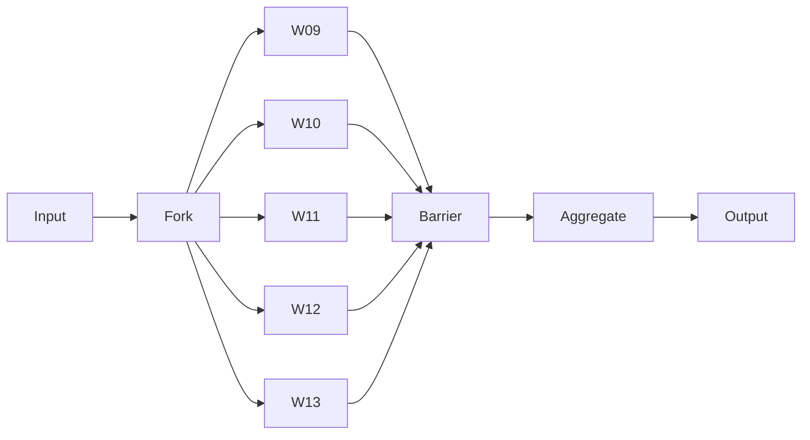
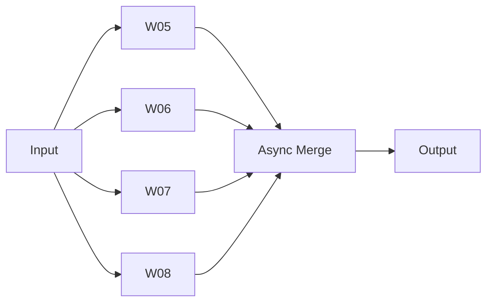

# Parallel Execution Patterns

> **Multi-Agent Parallel Execution Architecture**
> L5 Full Autonomy | Autonomous-Core Integration

---

## Overview

Defines parallel execution patterns for L5 autonomous operation across workforce tiers.

---

## Parallel Tier Configuration

| Tier | Mode | Workers | Synchronization |
|------|------|---------|-----------------|
| 1 | Sequential | W01-W04 | N/A |
| **2** | **Parallel** | W05-W08 | Async merge |
| **3** | **Parallel** | W09-W13 → W14 | Barrier + aggregate |
| **4** | **Parallel** | W15-W18 | Async merge |
| 5 | Sequential | W19-W20 | N/A |
| 6 | Sequential | W21-W22 | N/A |

---

## Execution Patterns

### Fork-Join (Tier 3)



### Async Merge (Tier 2, 4)



---

## Synchronization Protocols

### Barrier Synchronization

```yaml
barrier:
  type: "count_down"
  expected_workers: 5
  timeout: "1h"
  on_timeout: "proceed_with_available"
  on_failure: "retry_failed_worker"
```

### State Synchronization

```yaml
state_sync:
  mechanism: "memory_bus"
  keys:
    - "parallel.progress.*"
    - "parallel.results.*"
  conflict: "priority_merge"
```

---

## Load Balancing

```python
def balance_load(tasks, workers):
    # Complexity-weighted distribution
    worker_loads = {w: 0 for w in workers}
    
    for task in sorted(tasks, key=complexity, reverse=True):
        min_worker = min(worker_loads, key=worker_loads.get)
        assign(task, min_worker)
        worker_loads[min_worker] += complexity(task)
    
    return assignments
```

---

## Error Handling

| Error Type | Strategy | Recovery |
|------------|----------|----------|
| Worker timeout | Continue with available | Mark incomplete |
| Worker failure | Retry 2x | Redistribute to peers |
| All workers fail | Circuit breaker | Escalate |
| Conflict unresolvable | Priority wins | Log conflict |

---

*Parallel Execution Patterns v1.0 | L5 Full Autonomy*
