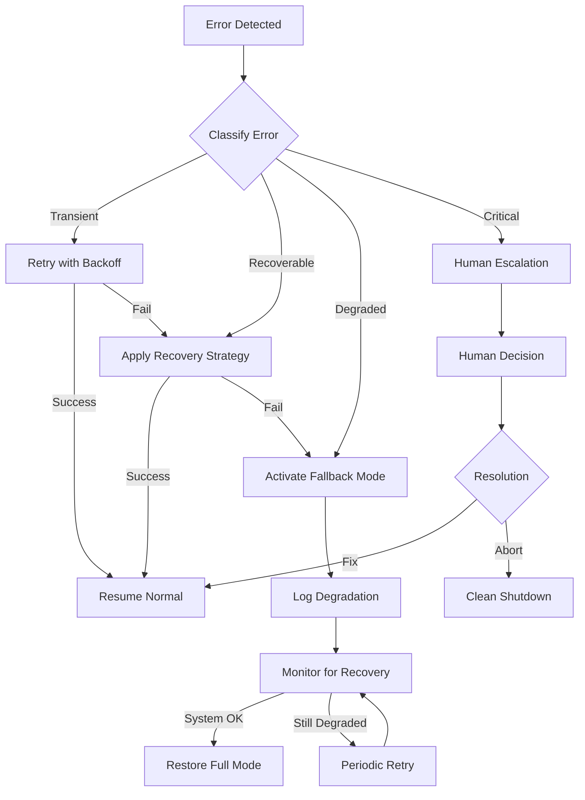

# Self-Healing Protocol

> **Automated Error Recovery & System Resilience**

---

## Error Classification

| Error Class | Severity | Auto-Recovery | Example |
|-------------|----------|---------------|---------|
| **Transient** | Low | Always retry | API timeout, rate limit |
| **Recoverable** | Medium | Retry with backoff | Token limit, parse error |
| **Degraded** | High | Fallback mode | Worker failure, pattern miss |
| **Critical** | Severe | Human escalation | Data corruption, security |

---

## Recovery Strategies

### Transient Errors (Auto-Retry)

```python
def handle_transient_error(error, context):
    retry_config = {
        'max_retries': 3,
        'backoff_base': 2,  # seconds
        'backoff_multiplier': 1.5
    }
    
    for attempt in range(retry_config['max_retries']):
        wait_time = retry_config['backoff_base'] * (
            retry_config['backoff_multiplier'] ** attempt
        )
        time.sleep(wait_time)
        
        result = retry_operation(context)
        if result.success:
            return result
    
    escalate_to_recoverable(error, context)
```

### Recoverable Errors (Adaptive Retry)

| Error Type | Recovery Action |
|------------|-----------------|
| Token limit exceeded | Reduce context, summarize |
| Parse error | Re-prompt with format spec |
| Pattern not found | Search alternative patterns |
| Validation failure | Adjust parameters, re-execute |

### Degraded State (Fallback Mode)

| Degradation | Fallback | Capability Loss |
|-------------|----------|-----------------|
| Worker failure | Redistribute to siblings | ~10% throughput |
| Pattern engine down | Use cached patterns | No new patterns |
| Memory bus full | Prune old entries | Historical context |
| Quality gate failing | Lower threshold temporarily | Quality risk |

---

## Self-Healing Flow



---

## Health Monitoring

| Metric | Normal | Warning | Critical |
|--------|--------|---------|----------|
| Worker response time | < 5s | 5-15s | > 15s |
| Memory bus utilization | < 70% | 70-90% | > 90% |
| Pattern match rate | > 80% | 50-80% | < 50% |
| E-O quality score | > 0.85 | 0.70-0.85 | < 0.70 |
| Error rate | < 5% | 5-15% | > 15% |

---

## Recovery Logging

All recovery actions logged to: `Second-Brain/Memory/History/execution-logs/`

```json
{
  "timestamp": "2026-01-30T08:00:00Z",
  "error_class": "recoverable",
  "error_type": "token_limit_exceeded",
  "worker": "11-AgentSpecificationWorker",
  "recovery_action": "context_reduction",
  "attempts": 2,
  "outcome": "success",
  "duration_ms": 3500
}
```

---

*Self-Healing Protocol v1.0 | MASDesign-Workforce*
