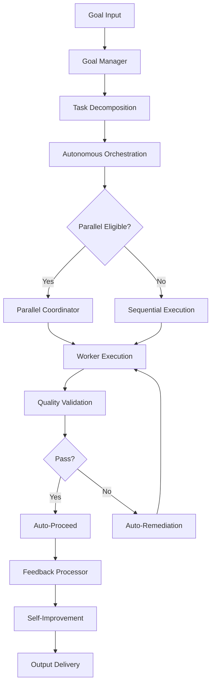

# Zero-Human-Loop Protocol

> **End-to-End Autonomous Execution Without Human Intervention**
> L5 Full Autonomy | Emergency Override Only

---

## Protocol Overview

The Zero-Human-Loop (ZHL) protocol enables complete autonomous execution from goal to delivery.

---

## Execution Flow



---

## ZHL Decision Matrix

| Decision Point | Traditional | ZHL |
|----------------|-------------|-----|
| Goal interpretation | Human review | Autonomous |
| Architecture choice | Human approval | Auto-select |
| Content review | Human checkpoint | Auto-validate |
| Quality gate | Human sign-off | Auto-pass |
| Error recovery | Human intervention | Auto-recover |
| Deployment | Human trigger | Auto-deploy |

---

## Autonomous Checkpoints

### Self-Validation Gates

| Gate | Auto-Criteria | Fallback |
|------|---------------|----------|
| **Strategy** | Standards ≥ 95% | Template |
| **Intelligence** | Sources ≥ 10 | Cache |
| **Content** | Quality ≥ 0.80 | Retry |
| **Analysis** | Coverage ≥ 90% | Supplement |
| **Validation** | Compliance ✓ | Auto-fix |
| **Synthesis** | Completeness ≥ 95% | Fill gaps |

---

## Auto-Remediation

```python
async def auto_remediate(failure):
    strategies = [
        retry_with_enhanced_context,
        use_alternative_approach,
        reduce_scope_and_retry,
        use_cached_fallback
    ]
    
    for strategy in strategies:
        result = await strategy(failure)
        if result.success:
            return result
    
    # All strategies failed
    return await emergency_checkpoint(failure)
```

---

## Emergency Override Triggers

| Trigger | Threshold | Action |
|---------|-----------|--------|
| Consecutive failures | 3 | Pause + checkpoint |
| Quality collapse | < 0.50 | Halt + log |
| Resource exhaustion | > 90% | GC + resume |
| Infinite loop | 5 cycles | Break + reset |

---

## ZHL Metrics

| Metric | Target | Monitoring |
|--------|--------|------------|
| Human interventions | 0 | Per-session |
| Auto-recovery rate | > 95% | Per-failure |
| End-to-end success | > 90% | Per-session |
| Average session time | < 4h | Per-session |

---

*Zero-Human-Loop Protocol v1.0 | L5 Full Autonomy*
