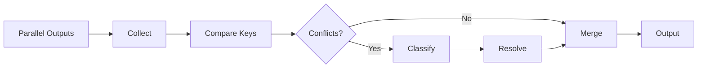

# Conflict Resolution Engine

> **Multi-Agent Conflict Detection & Resolution**
> Autonomous Conflict Handling | Priority-Based Resolution

---

## Overview

Detects and resolves conflicts from parallel agent execution without human intervention.

---

## Conflict Types

| Type | Description | Detection | Resolution |
|------|-------------|-----------|------------|
| **Value** | Different values for same key | Key comparison | Priority |
| **Resource** | Competing for same resource | Lock request | Queue |
| **State** | Concurrent state modifications | Version check | CAS |
| **Semantic** | Logically incompatible outputs | Validation | Domain rules |

---

## Detection Pipeline



---

## Resolution Strategies

### Priority-Based (Default)

```yaml
priority_resolution:
  priority_map:
    tier: 10      # Higher tier = higher priority
    worker_id: 1  # Earlier worker = higher priority
    confidence: 5 # Higher confidence = higher priority
    
  calculation: |
    priority = tier * 10 + confidence * 5 + (22 - worker_num)
```

### Consensus-Based

```yaml
consensus_resolution:
  threshold: 0.66  # 2/3 majority
  tie_breaker: "priority"
  fallback: "escalate"
```

### Domain-Specific

```yaml
domain_resolution:
  rules:
    - pattern: "quality_score"
      strategy: "max"  # Take highest
    - pattern: "error_count"
      strategy: "sum"  # Accumulate
    - pattern: "timestamp"
      strategy: "latest"
```

---

## Resolution Flow

```python
def resolve_conflict(conflict, strategy="priority"):
    if strategy == "priority":
        return max(conflict.values, key=lambda v: v.priority)
    elif strategy == "consensus":
        counts = Counter(conflict.values)
        majority = counts.most_common(1)[0]
        if majority[1] / len(conflict.values) >= 0.66:
            return majority[0]
        return resolve_conflict(conflict, "priority")
    elif strategy == "domain":
        rule = get_domain_rule(conflict.key)
        return apply_rule(conflict.values, rule)
```

---

## Conflict Logging

```json
{
  "conflict_id": "C-001",
  "key": "output.content.section_3",
  "workers": ["W09", "W11"],
  "values": ["Version A", "Version B"],
  "resolution": "priority",
  "winner": "W09",
  "timestamp": "2026-02-03T15:00:00Z"
}
```

---

*Conflict Resolution Engine v1.0 | L5 Full Autonomy*
