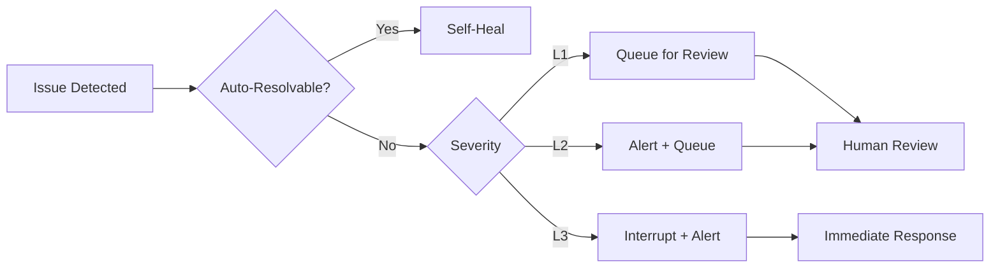

# Escalation Matrix

> **Human Escalation Triggers & Protocols**

---

## Escalation Levels

| Level | Trigger | Response Time | Handler |
|-------|---------|---------------|---------|
| **L0** | Info only | Async | Log only |
| **L1** | Advisory | < 1 hour | Product owner |
| **L2** | Blocking | < 15 min | Technical lead |
| **L3** | Critical | Immediate | On-call engineer |

---

## Escalation Triggers

### L1 - Advisory

- Novel domain with no matching patterns
- Quality score between 0.70-0.80
- Resource usage > 80% budget
- Worker taking > 2x expected time

### L2 - Blocking

- Quality score < 0.70
- Pattern conflict > 3 unresolved
- Memory bus near capacity
- Integration tests failing

### L3 - Critical

- Data corruption detected
- Security concern identified
- System-wide degradation
- Unrecoverable error state

---

## Escalation Flow

---

*Escalation Matrix v1.0 | MASDesign-Workforce*
