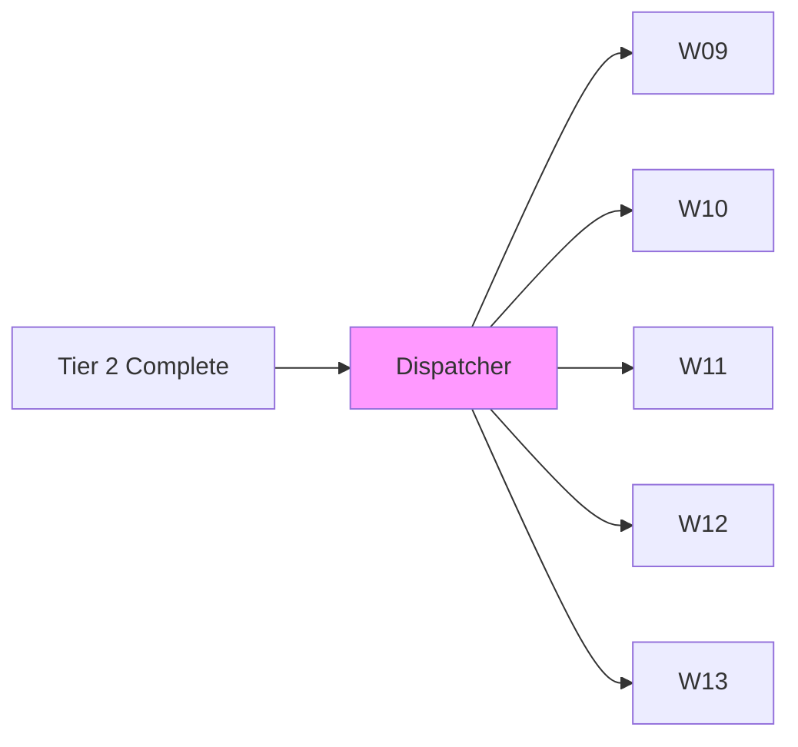
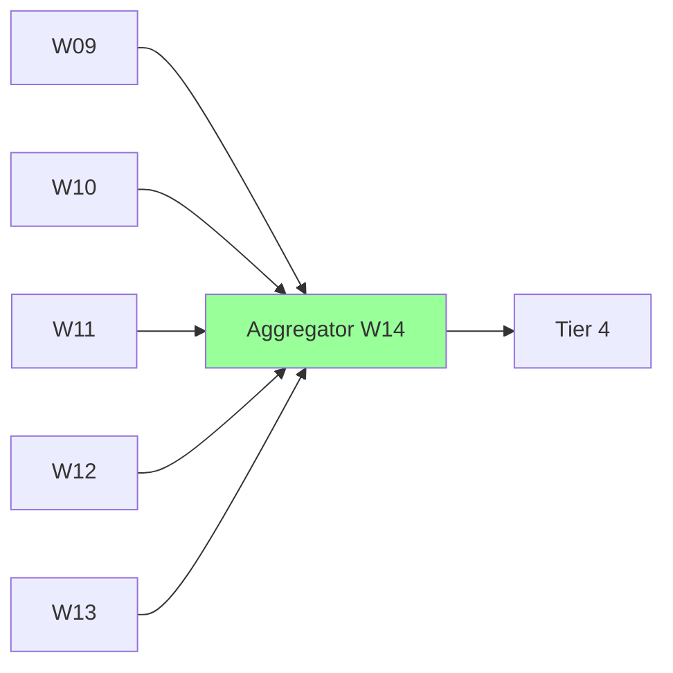

# Parallel Handoffs

> **Multi-Agent Parallel Coordination Protocols**
> State Merging | Result Aggregation | Conflict Handling

---

## Overview

Defines handoff protocols for parallel worker coordination in L5 autonomous execution.

---

## Parallel Handoff Types

| Type | Description | Use Case |
|------|-------------|----------|
| **Fan-Out** | One → Many | Start parallel tier |
| **Fan-In** | Many → One | Aggregate results |
| **Broadcast** | One → All | State update |
| **Converge** | Many → Many | Cross-worker sync |

---

## Fan-Out Protocol



### Configuration

```yaml
fan_out:
  source: "tier_2_output"
  targets: ["W09", "W10", "W11", "W12", "W13"]
  distribution: "full_context"  # Each gets full input
  timeout: "5min"
```

---

## Fan-In Protocol



### Aggregation

```yaml
fan_in:
  sources: ["W09", "W10", "W11", "W12", "W13"]
  aggregator: "W14"
  strategy: "deep_merge"
  conflict: "priority_based"
  timeout: "30min"
```

---

## State Merging Strategies

| Strategy | Description | When |
|----------|-------------|------|
| **Deep Merge** | Recursive object merge | Non-conflicting |
| **Priority** | Higher priority wins | Conflict |
| **Latest** | Most recent wins | Time-sensitive |
| **Consensus** | Majority value | Validation |

### Merge Algorithm

```python
def merge_parallel_outputs(outputs, strategy="deep_merge"):
    merged = {}
    conflicts = []
    
    for output in outputs:
        for key, value in output.items():
            if key not in merged:
                merged[key] = value
            elif merged[key] != value:
                conflicts.append({
                    'key': key,
                    'values': [merged[key], value],
                    'sources': [output.worker_id]
                })
    
    # Resolve conflicts based on strategy
    for conflict in conflicts:
        merged[conflict['key']] = resolve(conflict, strategy)
    
    return merged, conflicts
```

---

## Conflict Resolution

| Conflict Type | Resolution | Log |
|---------------|------------|-----|
| Value differs | Priority wins | Yes |
| Type mismatch | Convert + merge | Yes |
| Missing key | Use available | No |
| Both null | Skip | No |

---

## Memory Bus Handoff Keys

| Key | Type | Description |
|-----|------|-------------|
| `handoff.parallel.{tier}.input` | object | Tier input |
| `handoff.parallel.{tier}.outputs` | array | Worker outputs |
| `handoff.parallel.{tier}.merged` | object | Merged result |
| `handoff.parallel.{tier}.conflicts` | array | Conflict log |

---

*Parallel Handoffs v1.0 | L5 Full Autonomy*
