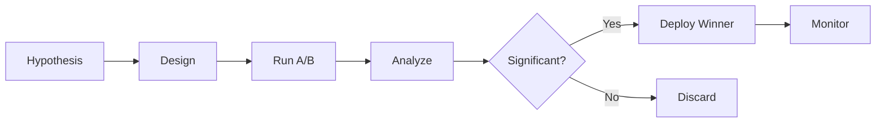

# A/B Testing Framework

> **Workflow Optimization Through Controlled Experiments**
> Hypothesis Testing | Statistical Validation | Auto-Deployment

---

## Overview

Enables autonomous workflow optimization through controlled A/B experiments.

---

## Experiment Lifecycle



---

## Experiment Configuration

```yaml
experiment:
  id: "EXP-001"
  name: "Enhanced Prompts Test"
  
  control:
    name: "baseline_v1"
    allocation: 0.50
    
  treatment:
    name: "enhanced_v2"
    allocation: 0.50
    changes:
      prompt_examples: 3
      temperature: 0.7
      
  metrics:
    primary: "quality_score"
    secondary: ["time", "tokens"]
    
  criteria:
    min_samples: 50
    max_duration: "24h"
    significance: 0.95
    min_improvement: 0.05
```

---

## Statistical Analysis

### T-Test Implementation

```python
def analyze_ab_test(control, treatment):
    t_stat, p_value = stats.ttest_ind(control, treatment)
    
    effect_size = (mean(treatment) - mean(control)) / pooled_std
    improvement = (mean(treatment) - mean(control)) / mean(control)
    
    return ABResult(
        p_value=p_value,
        effect_size=effect_size,
        improvement=improvement,
        significant=p_value < 0.05,
        recommend="deploy" if p_value < 0.05 and improvement > 0.05 else "reject"
    )
```

---

## Canary Deployment

| Stage | Allocation | Duration | Health Check |
|-------|------------|----------|--------------|
| Canary | 10% | 1h | quality ≥ 0.80 |
| Partial | 50% | 2h | quality ≥ 0.82 |
| Full | 100% | - | quality ≥ 0.85 |

---

## Experiment History

```json
{
  "completed": 15,
  "success_rate": 0.47,
  "deployed": 7,
  "avg_improvement": "8.2%",
  "rollbacks": 1
}
```

---

*A/B Testing Framework v1.0 | Self-Improvement*
