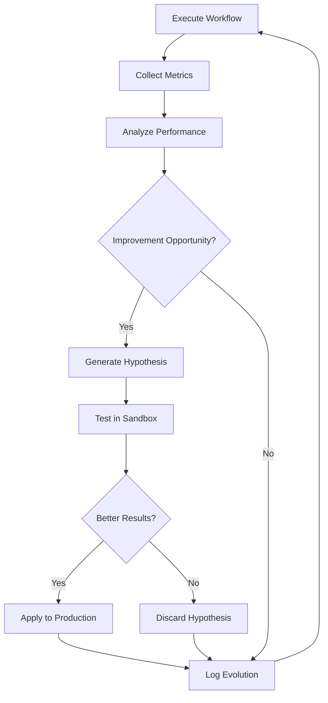

# Self-Evolution Engine

> **Continuous Learning & Adaptation System**

---

## Evolution Capabilities

| Capability | Description | Trigger |
|------------|-------------|---------|
| **Pattern Learning** | Identify new effective patterns | Success rate analysis |
| **Threshold Tuning** | Adjust quality thresholds | Performance metrics |
| **Workflow Optimization** | Improve execution paths | Execution time data |
| **Prompt Refinement** | Enhance agent prompts | Output quality scores |

---

## Learning Loop

---

## Evolution Metrics

| Metric | Target | Current | Trend |
|--------|--------|---------|-------|
| Pattern match accuracy | > 85% | - | - |
| Execution time | < 30s/worker | - | - |
| Quality score average | > 0.85 | - | - |
| Human escalation rate | < 20% | - | - |

---

## Evolution Log Location

`Second-Brain/Memory/Evolution/evolution-log.json`

---

*Self-Evolution Engine v1.0 | MASDesign-Workforce*
