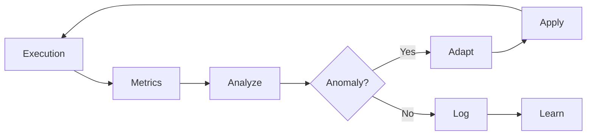

# Active Feedback Loop

> **Real-Time Feedback Processing & Immediate Response**
> Performance Monitoring | Adaptive Actions | Continuous Optimization

---

## Overview

Processes feedback in real-time with immediate adaptive responses, unlike passive logging.

---

## Feedback Flow



---

## Real-Time Metrics

| Metric | Collection | Target | Alert |
|--------|------------|--------|-------|
| Execution time | Per-worker | < 30s | > 60s |
| Quality score | Per-output | ≥ 0.85 | < 0.75 |
| Success rate | Rolling | ≥ 95% | < 85% |
| Error rate | Rolling | < 5% | > 15% |

---

## Adaptive Response Matrix

| Trigger | Action | Latency |
|---------|--------|---------|
| Quality drop | Retry with context | Immediate |
| Slow execution | Parallelize | Immediate |
| High errors | Circuit breaker | Immediate |
| Memory pressure | Flush cache | < 5s |

---

## Response Engine

```python
class FeedbackProcessor:
    async def process(self, metric):
        if self.is_anomaly(metric):
            action = self.get_action(metric.type)
            result = await action.execute(metric)
            self.log_response(metric, result)
            return result
        else:
            self.log_metric(metric)
            self.update_learning(metric)
```

---

## Feedback Queue

```json
{
  "queue": [
    {
      "id": "FB-001",
      "type": "quality_drop",
      "value": 0.72,
      "target": 0.85,
      "status": "pending",
      "action": "retry_with_context"
    }
  ]
}
```

---

## Integration Points

| Source | Metrics | Destination |
|--------|---------|-------------|
| Workers | Execution | Feedback Processor |
| Quality Gates | Scores | Decision Engine |
| Memory Bus | State | Parallel Coordinator |
| Feedback | Learnings | Self-Improvement Loop |

---

*Active Feedback Loop v1.0 | L5 Full Autonomy*
