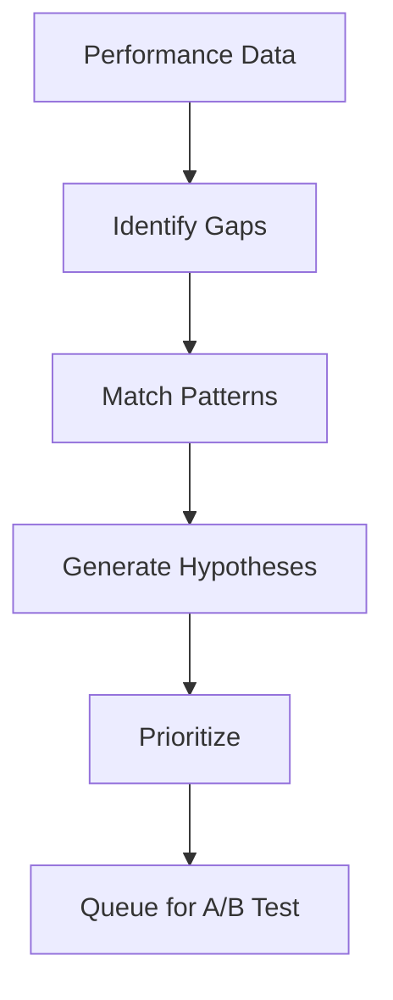

# Hypothesis Engine

> **Autonomous Improvement Hypothesis Generation**
> Pattern-Based | Data-Driven | Auto-Validation

---

## Overview

Autonomously generates improvement hypotheses from performance data.

---

## Hypothesis Generation Flow



---

## Gap Detection

| Gap Type | Indicator | Threshold |
|----------|-----------|-----------|
| Quality | Score below target | < 0.85 |
| Speed | Execution above limit | > 30s |
| Efficiency | Resource overuse | > 80% |
| Errors | Frequent failures | > 5% |

---

## Improvement Patterns

| Pattern | Trigger | Expected Impact |
|---------|---------|-----------------|
| Prompt Enhancement | Low quality | +10-15% quality |
| Parallel Expansion | Slow execution | -30-50% time |
| Cache Optimization | Repeated queries | -60% latency |
| Threshold Tuning | False positives | +5-10% accuracy |

---

## Hypothesis Schema

```json
{
  "id": "HYP-001",
  "gap": {
    "type": "quality",
    "current": 0.78,
    "target": 0.85
  },
  "pattern": "prompt_enhancement",
  "prediction": "+10% quality",
  "confidence": 0.75,
  "experiment": "EXP-001"
}
```

---

## Prioritization

```python
def prioritize(hypotheses):
    return sorted(
        hypotheses,
        key=lambda h: h.prediction * h.confidence,
        reverse=True
    )
```

---

## Success Tracking

| Metric | Value |
|--------|-------|
| Hypotheses generated | - |
| Experiments run | - |
| Success rate | - |
| Avg improvement | - |

---

*Hypothesis Engine v1.0 | Self-Improvement*
