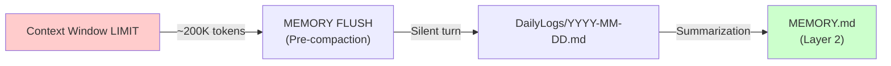

# Compaction Rules

> **vnBuilderPro-MAS2026 | CLAWDBOT Memory Pipeline v2.2.0**
> Memory flush and summarization rules

---

## Overview

Compaction manages the transition from ephemeral context to persistent memory, ensuring important information is preserved while keeping context manageable.



---

## Compaction Triggers

### 1. Automatic Trigger (Context Limit)

| Parameter | Value | Description |
|-----------|-------|-------------|
| **Context Threshold** | 180,000 tokens | ~90% of 200K limit |
| **Warning Threshold** | 160,000 tokens | Pre-warning at 80% |
| **Emergency Flush** | 195,000 tokens | Immediate flush at 97.5% |

### 2. Manual Trigger (/compact)

```
/compact              # Standard compaction
/compact --aggressive # Force full summarization
/compact --preview    # Show what would be compacted
```

---

## Pre-Compaction: Memory Flush

Before summarization, a silent turn stores durable information:

### Information to Preserve

| Category | Examples | Priority |
|----------|----------|----------|
| **Decisions** | Architecture choices, pattern selections | HIGH |
| **Facts** | Validated domain knowledge | HIGH |
| **Configurations** | Agent behaviors, tool settings | MEDIUM |
| **Learnings** | Marked with `[CURATE]` tag | MEDIUM |
| **Progress** | Task completions, milestones | LOW |

### Flush Template

```markdown
## Memory Flush: {timestamp}

### Decisions Made
- DEC-001: {decision} | Rationale: {rationale}

### Facts Learned
- FACT-001: {fact} | Source: {source} | Confidence: {score}

### Configurations Changed
- CONFIG-001: {setting} = {value}

### Session Progress
- Completed: {task_list}
- In Progress: {wip_list}
```

---

## Summarization Rules

### Content Processing

| Content Type | Action | Destination |
|--------------|--------|-------------|
| `[CURATE]` tagged | Promote | MEMORY.md |
| Decisions with rationale | Promote | MEMORY.md |
| Facts with high confidence | Promote | MEMORY.md |
| Session logs | Summarize | DailyLogs/YYYY-MM-DD.md |
| Verbose outputs | Discard | None |
| `[TEMPORARY]` tagged | Discard | None |

### Summarization Algorithm

```python
def summarize_for_compaction(content):
    # 1. Extract curated entries
    curated = extract_tagged_content(content, "[CURATE]")
    
    # 2. Identify decisions
    decisions = extract_decisions(content)
    
    # 3. Extract high-confidence facts
    facts = extract_facts(content, min_confidence=0.8)
    
    # 4. Summarize remaining content
    summary = llm_summarize(content, max_tokens=500)
    
    return {
        "promote_to_layer2": curated + decisions + facts,
        "keep_in_layer1": summary
    }
```

---

## Quality Gates

### Pre-Compaction Validation

| Check | Criteria | Action if Fails |
|-------|----------|-----------------|
| Coverage | All `[CURATE]` entries captured | Retry extraction |
| Completeness | No open decision threads | Warn user |
| Consistency | No contradictory facts | Flag for review |

### Post-Compaction Validation

| Check | Criteria | Action if Fails |
|-------|----------|-----------------|
| Integrity | MEMORY.md parses correctly | Rollback |
| Index Update | Search index refreshed | Re-index |
| Size Reduction | Context reduced by ≥30% | Log warning |

---

## Compaction Schedule

| Trigger | Frequency | Scope |
|---------|-----------|-------|
| Auto (context limit) | As needed | Current session |
| Daily maintenance | 00:00 UTC | Previous day's logs |
| Weekly archive | Sunday 00:00 | 7-day rollup |
| Monthly cleanup | 1st of month | 30-day archive |

---

*vnBuilderPro-MAS2026 Compaction Rules v2.2.0 | CLAWDBOT Standard*
