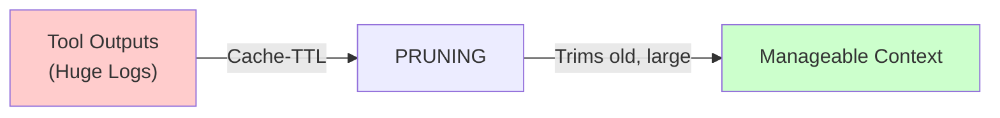

# Pruning Policies

> **vnBuilderPro-MAS2026 | CLAWDBOT Memory Pipeline v2.2.0**
> Cache-TTL and retention management

---

## Overview

Pruning trims old, large outputs to save costs when cache expires. It is intentionally lossy but keeps context manageable.



---

## Retention Tiers

| Tier | Age Range | Content State | Space Allocation |
|------|-----------|---------------|------------------|
| **Active** | 0-7 days | Full content | 100% |
| **Recent** | 8-30 days | Summarized | 30% |
| **Archive** | 31-90 days | Curated only | 10% |
| **Expired** | 90+ days | Pruned | 0% |

---

## Cache-TTL Configuration

```yaml
cache_ttl:
  default: 90d          # Default retention period
  
  by_content_type:
    curated_knowledge: never    # Layer 2 MEMORY.md entries
    daily_logs: 90d             # Layer 1 DailyLogs
    execution_logs: 30d         # Worker execution traces
    tool_outputs: 7d            # Verbose tool responses
    debug_traces: 3d            # Debug information
    
  by_size:
    small: 90d          # < 1KB
    medium: 30d         # 1KB - 10KB
    large: 7d           # 10KB - 100KB
    huge: 1d            # > 100KB
```

---

## Pruning Rules

### Rule 1: Size-Based Pruning

| Output Size | Action | Retention |
|-------------|--------|-----------|
| < 1 KB | Keep | 90 days |
| 1-10 KB | Summarize at 30d | Summary kept 60d more |
| 10-100 KB | Summarize at 7d | Summary kept 23d more |
| > 100 KB | Summarize at 1d | Summary kept 6d more |

### Rule 2: Type-Based Pruning

| Content Type | Pruning Strategy |
|--------------|------------------|
| **Decisions** | Never prune (Layer 2) |
| **Facts** | Never prune if confidence ≥ 0.9 |
| **Patterns** | Prune after 180d if unused |
| **Session Logs** | Summarize → Archive → Prune |
| **Tool Outputs** | Aggressive pruning (1-7d) |
| **Debug Info** | Prune after 3d |

### Rule 3: Usage-Based Retention

Content accessed recently gets retention bonus:

| Access Recency | Retention Bonus |
|----------------|-----------------|
| Last 7 days | +30d |
| Last 30 days | +14d |
| Last 90 days | +7d |
| Never accessed | No bonus |

---

## Pruning Modes

### Conservative Mode (Default)

```yaml
pruning:
  aggressive: false
  preserve_structure: true
  keep_summaries: true
  min_archive_before_prune: 30d
```

- Keeps summaries of pruned content
- Preserves file structure references
- Longer archive period before deletion

### Aggressive Mode

```yaml
pruning:
  aggressive: true
  preserve_structure: false
  keep_summaries: false
  min_archive_before_prune: 7d
```

- Deletes content without summary
- Removes empty file references
- Shorter archive period

---

## Pruning Schedule

| Job | Frequency | Target |
|-----|-----------|--------|
| Daily Cleanup | 03:00 UTC | Tool outputs > 100KB |
| Weekly Archive | Sunday 04:00 | 7-day old logs |
| Monthly Prune | 1st 05:00 | 30-day expired content |
| Quarterly Deep Clean | Q1,Q2,Q3,Q4 | 90-day+ content |

---

## Pruning Safety

### Exclusions (Never Prune)

| Category | Reason |
|----------|--------|
| MEMORY.md (Layer 2) | Curated knowledge |
| `[NEVER_PRUNE]` tagged | Explicit preservation |
| Active session data | Currently in use |
| Configuration files | System critical |

### Pre-Pruning Backup

```yaml
backup:
  enabled: true
  destination: "Memory/Archive/"
  compression: "gzip"
  retention: 365d
  restore_command: "/restore-memory {backup_id}"
```

---

## Monitoring

### Pruning Metrics

| Metric | Description | Alert Threshold |
|--------|-------------|-----------------|
| `memory.size.total` | Total memory size | > 500 MB |
| `memory.size.active` | Active tier size | > 100 MB |
| `memory.prune.daily_bytes` | Daily pruned bytes | < 1 KB (stale) |
| `memory.retention.avg_days` | Average content age | > 60 days |

### Pruning Report

```markdown
## Pruning Report: {date}

### Summary
- Total pruned: {bytes}
- Files affected: {count}
- Space reclaimed: {percentage}%

### By Category
| Category | Pruned | Retained |
|----------|--------|----------|
| Tool outputs | 45 MB | 5 MB |
| Session logs | 10 MB | 50 MB |
| Debug traces | 20 MB | 0 MB |

### Retention Status
- Active: {active_count} items
- Recent: {recent_count} items
- Archive: {archive_count} items
```

---

*vnBuilderPro-MAS2026 Pruning Policies v2.2.0 | CLAWDBOT Standard*
