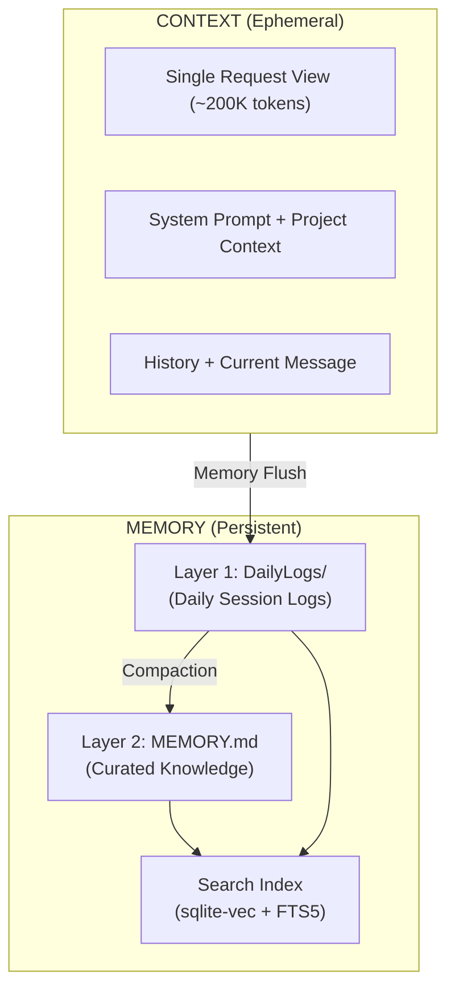

# Memory README

> **MASDesign-Workforce | CLAWDBOT Memory System v2.2.0**
> Two-Layer Persistent Storage Hub

---

## Overview

The Memory directory implements the **CLAWDBOT Two-Layer Memory Architecture**, providing persistent storage for cross-session context, execution history, and state management across the workforce.



---

## Two-Layer Architecture

### Layer 2: MEMORY.md (Long-term Curated Knowledge)

| Aspect | Description |
|--------|-------------|
| **Purpose** | Curated knowledge, decisions, facts, patterns |
| **File** | `MEMORY.md` |
| **Persistence** | Permanent |
| **Update** | Via compaction/curation |

### Layer 1: DailyLogs/ (Daily Session Logs)

| Aspect | Description |
|--------|-------------|
| **Purpose** | Session logs, notes, temporary learnings |
| **Directory** | `DailyLogs/` |
| **Format** | `YYYY-MM-DD.md` |
| **Persistence** | 90-day retention |

---

## Structure

```
Memory/
├── MEMORY.md                 # Layer 2: Curated Knowledge
├── memory-config.json        # Memory system configuration
├── DailyLogs/                # Layer 1: Daily session logs
│   ├── README.md             # Daily log guide
│   └── YYYY-MM-DD.md         # Daily log files
├── Pipeline/                 # Memory pipeline components
│   ├── indexing-config.json  # Chunking & embedding config
│   ├── compaction-rules.md   # Flush & summarization rules
│   └── pruning-policies.md   # Cache-TTL & retention
├── Context/                  # MAS project context
├── Evolution/                # Pattern evolution history
├── History/                  # Execution logs & reports
├── Sessions/                 # Session state templates
└── State/                    # Real-time worker state
```

---

## Memory Tools

| Tool | Command | Description |
|------|---------|-------------|
| **memory_search** | `/memory-search` | Semantic search (Vector + BM25) |
| **memory_get** | `/memory-get` | Read specific content |
| **memory_write** | `/memory-write` | Write/update memory files |
| **compact** | `/compact` | Manual compaction trigger |

---

## Memory Pipeline


---

## Compaction & Memory Flush

| Stage | Trigger | Action |
|-------|---------|--------|
| **Context Limit** | ~200K tokens | Initiate flush |
| **Memory Flush** | Pre-compaction | Store to `DailyLogs/YYYY-MM-DD.md` |
| **Summarization** | Auto/`/compact` | Summarize history, promote curated |

---

## Pruning (Cache-TTL)

| Retention | Content |
|-----------|---------|
| 0-7 days | Full content |
| 8-30 days | Summarized |
| 31-90 days | Curated only |
| 90+ days | Pruned |

---

## Memory Bus Integration

The Memory system integrates with these memory bus namespaces:

| Namespace | Purpose |
|-----------|---------|
| `memory.layer1.*` | Daily log operations |
| `memory.layer2.*` | Curated knowledge operations |
| `memory.index.*` | Search index operations |
| `memory.lifecycle.*` | Compaction & pruning |

---

*vnBuilderPro-MAS2026 Memory System v2.2.0 | CLAWDBOT Standard*
