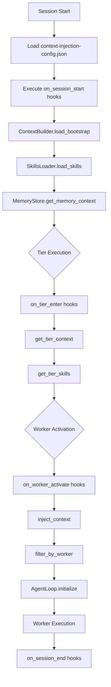

# Context Loader - Integration Documentation

> **vnBuilderProMax v2.3.2** | Context-Layer Integration Guide
>
> Defines how workers receive context from Context-Layer during execution.

---

## Overview

The Context Loader system ensures each worker receives the correct context before execution:

| Component | Purpose |
|-----------|---------|
| `context-injection-config.json` | Machine-parsable binding definitions |
| **ContextBuilder** CoreModule | Loads and injects context into workers |
| **SkillsLoader** CoreModule | Filters skills by tier/worker |
| **MemoryStore** CoreModule | Provides memory context |

---

## Flow Diagram



---

## Phase 0: Bootstrap Context Injection

Before Phase 1 (Strategy) begins, the system executes Phase 0:

### Step 1: Load Configuration

```python
config = load_json("Context-Layer/context-injection-config.json")
```

### Step 2: Execute Session Start Hooks

```python
# From config.execution_hooks.on_session_start
ContextBuilder.load_bootstrap()  # Load AGENTS.md, SOUL.md, etc.
SkillsLoader.load_skills()        # Index all available skills
MemoryStore.get_memory_context()  # Load MEMORY.md + today's log
```

### Step 3: Validate Context Availability

Ensure all required files exist:

- `bootstrap/AGENTS.md` ✓
- `bootstrap/SOUL.md` ✓
- All playbooks referenced in tier_bindings ✓
- All skills referenced in tier_bindings ✓

---

## Tier-Level Context Injection

When entering a new tier, execute `on_tier_enter` hooks:

```python
def enter_tier(tier_number):
    tier_config = config["tier_bindings"][f"tier_{tier_number}"]
    
    # Load tier-specific context
    tier_context = ContextBuilder.get_tier_context(tier_number)
    tier_skills = SkillsLoader.get_tier_skills(tier_number)
    
    return {
        "context": tier_context,
        "skills": tier_skills,
        "playbooks": tier_config["playbooks"],
        "commands": tier_config["commands"],
        "execution_mode": tier_config.get("execution_mode", "sequential")
    }
```

---

## Worker-Level Context Injection

When activating a specific worker:

```python
def activate_worker(worker_id):
    worker_config = config["worker_context_map"][worker_id]
    
    # Execute on_worker_activate hooks
    context = ContextBuilder.inject_context(worker_id)
    skills = SkillsLoader.filter_by_worker(worker_id)
    
    worker_context = {
        "tier": worker_config["tier"],
        "name": worker_config["name"],
        "primary_playbook": worker_config["primary_playbook"],
        "skills": skills,
        "commands": worker_config["commands"],
        "bootstrap": worker_config["bootstrap"],
        "context": context
    }
    
    AgentLoop.initialize(worker_context)
    return worker_context
```

---

## Context Binding Structure

### Tier Bindings

Each tier defines:

| Field | Description |
|-------|-------------|
| `name` | Tier name (Strategy, Intelligence, etc.) |
| `workers` | Worker IDs in this tier |
| `playbooks` | Playbooks available to tier |
| `skills` | Skills loaded for tier |
| `commands` | CLAWDBOT commands authorized |
| `bootstrap` | Bootstrap files to load |
| `execution_mode` | sequential, parallel, or barrier_sync |

### Worker Context Map

Each worker (W01-W22) defines:

| Field | Description |
|-------|-------------|
| `tier` | Parent tier number |
| `name` | Worker name |
| `primary_playbook` | Main playbook reference |
| `secondary_playbook` | Optional secondary playbook |
| `skills` | Skills specific to this worker |
| `commands` | Commands this worker can use |
| `bootstrap` | Bootstrap files for this worker |
| `role` | Optional: aggregator, synthesizer |

---

## Execution Hooks

| Hook | Trigger | Actions |
|------|---------|---------|
| `on_session_start` | Session begins | Load bootstrap, skills, memory |
| `on_tier_enter` | Entering new tier | Get tier context and skills |
| `on_worker_activate` | Worker starts | Inject worker-specific context |
| `on_parallel_spawn` | Parallel execution | Spawn subagents, coordinate |
| `on_session_end` | Session complete | Save to daily log, aggregate |

---

## Customization

When generating a new workforce, replace placeholders:

- `{WorkforceName}` → Actual workforce name
- `{PB01}`, `{PB02}`, ... → Actual playbook names
- `{SK01}`, `{SK02}`, ... → Actual skill names

Each workforce's `Team Orchestration/context-injection-config.json` should be customized based on the template.

---

*Context Loader v1.0 | vnBuilderProMax v2.3.2 | CoreModules Integration*
