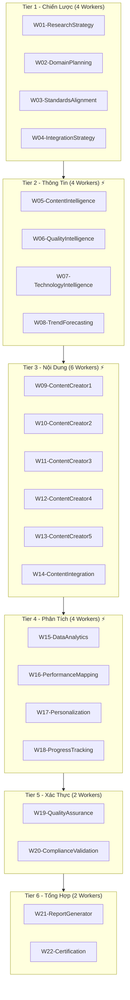

# vnBuilderPro-MAS2026

> **Hệ Thống Tự Chủ Hoàn Toàn L5 cho Thiết Kế Multi-Agent System**  
> 22 Workers | 528 Agents | HierarchicalSwarm 6 Tầng | **vnBuilderProMax v2.2.0**

---

## 🎯 Tổng Quan

vnBuilderPro-MAS2026 là hệ thống **tự động hóa hoàn toàn (L5 Full Autonomy)** cho việc tạo Multi-Agent System quy mô doanh nghiệp. Với khả năng **Zero-Human-Loop**, hệ thống có thể tự quyết định 100% mà không cần can thiệp của người dùng.

### Điểm Nổi Bật

| Tính Năng | Mô Tả |
|-----------|-------|
| 🤖 **L5 Autonomous** | Tự chủ hoàn toàn, 100% tự quyết định |
| ⚡ **Parallel Execution** | Thực thi song song cho Tier 2-4 |
| 🔄 **Self-Improvement** | Vòng phản hồi tích cực với A/B testing |
| 🛡️ **Auto-Recovery** | Tự phục hồi và xử lý lỗi |
| 📊 **Goal-Driven** | Định tuyến theo mục tiêu và ràng buộc |

---

## 📋 Mục Lục

1. [Kiến Trúc Hệ Thống](#-kiến-trúc-hệ-thống)
2. [Autonomous-Core Layer](#-autonomous-core-layer)
3. [Hướng Dẫn Sử Dụng](#-hướng-dẫn-sử-dụng)
4. [Các Lệnh](#-các-lệnh)
5. [10 Ví Dụ Thực Tế](#-10-ví-dụ-thực-tế)
6. [Tiêu Chuẩn Chất Lượng](#-tiêu-chuẩn-chất-lượng)
7. [Xử Lý Sự Cố](#-xử-lý-sự-cố)

---

## 🏗️ Kiến Trúc Hệ Thống

### HierarchicalSwarm 6 Tầng (22 Workers)



> ⚡ = Tier hỗ trợ thực thi song song

### Cấu Trúc Thư Mục

```
vnBuilderPro-MAS2026/
├── Autonomous-Core/           # 🆕 L5 Engine tự chủ
│   ├── autonomous-orchestrator.md
│   ├── goal-manager.md
│   ├── decision-engine.md
│   ├── parallel-coordinator.md
│   ├── feedback-processor.md
│   └── self-improvement-loop.md
├── Context-Layer/
│   ├── Knowledge-Base/        # Playbooks, Skills, Experience
│   └── Second-Brain/          # Brain, Memory, Command
├── Team Orchestration/        # 11 files điều phối
├── Workers/                   # 22 ROMA pipelines
└── Tools/
```

---

## 🤖 Autonomous-Core Layer

> **Lớp Tự Chủ Hoàn Toàn** - Trái tim của L5 Autonomy

### Thành Phần Chính

| Component | Chức Năng |
|-----------|-----------|
| **autonomous-orchestrator** | Điều phối tổng thể, quản lý vòng đời |
| **goal-manager** | Phân rã mục tiêu, ưu tiên hóa |
| **decision-engine** | Thỏa mãn ràng buộc, chính sách quyết định |
| **parallel-coordinator** | Điều phối thực thi song song |
| **feedback-processor** | Xử lý phản hồi thời gian thực |
| **self-improvement-loop** | Tối ưu liên tục |

### Mức Độ Tự Chủ

| Cấp Độ | Tên | Tỷ Lệ Tự Quyết | Can Thiệp |
|--------|-----|----------------|-----------|
| L3 | Delegated | 80% | Review định kỳ |
| L4 | Autonomous | 95% | Audit sau |
| **L5** | **Full Auto** | **100%** | **Chỉ override khẩn cấp** |

---

## 📖 Hướng Dẫn Sử Dụng

### Chế Độ Tự Chủ (L5)

```bash
# Kích hoạt chế độ tự chủ hoàn toàn
/vnBuilderPro_MAS2026 --mode autonomous

# Thực thi song song với tự chủ
/vnbp-orchestrate --autonomous --parallel
```

### Quy Trình 7 Pha

| Pha | Tên | Tier | Thời Gian |
|-----|-----|------|-----------|
| 1 | Strategic Planning | T1 | 1-2 ngày |
| 2 | Intelligence Gathering | T2 ⚡ | 2-3 ngày |
| 3 | Content Development | T3 ⚡ | 1-2 tuần |
| 4 | Analysis & Personalization | T4 ⚡ | 3-5 ngày |
| 5 | Quality Validation | T5 | 2-3 ngày |
| 6 | Reporting & Certification | T6 | 1-2 ngày |
| 7 | Memory Logging | Auto | Tự động |

### Thực Thi Song Song

```yaml
parallel_tiers:
  - tier: 2
    workers: [W05, W06, W07, W08]
    mode: full_parallel
  - tier: 3
    workers: [W09, W10, W11, W12, W13]
    mode: partial_parallel
  - tier: 4
    workers: [W15, W16, W17, W18]
    mode: barrier_sync
```

---

## 🔍 Các Lệnh

### Lệnh Chính

| Lệnh | Mô Tả |
|------|-------|
| `/vnBuilderProMax` | Tạo workforce hoàn chỉnh |
| `/vnbp-research` | Deep Research pipeline |
| `/vnbp-knowledge` | Tạo Knowledge-Base |
| `/vnbp-brain` | Xây dựng Second-Brain |
| `/vnbp-orchestrate` | Chạy tất cả các pha |
| `/vnbp-validate` | Xác thực chất lượng |

### Tùy Chọn Mới (L5)

| Tùy Chọn | Mô Tả |
|----------|-------|
| `--mode autonomous` | Kích hoạt L5 Full Autonomy |
| `--parallel` | Bật thực thi song song |
| `--self-improve` | Bật vòng tự cải thiện |

---

## 📚 10 Ví Dụ Thực Tế

### 1. Hệ Thống Y Tế AI

**Yêu cầu**: Workforce chẩn đoán y tế với 8 workers

**Kết quả**: 192 agents | Độ chính xác ≥ 0.95 | HIPAA compliant

---

### 2. Giao Dịch Tài Chính

**Yêu cầu**: Trading platform với phân tích real-time

**Kết quả**: 240 agents | Độ trễ < 50ms | SEC/FINRA compliant

---

### 3. Phân Tích Pháp Lý

**Yêu cầu**: Rà soát hợp đồng và due diligence

**Kết quả**: 144 agents | Precision ≥ 0.92 | Recall ≥ 0.88

---

### 4. Chuỗi Cung Ứng

**Yêu cầu**: Dự báo nhu cầu và logistics

**Kết quả**: 216 agents | MAPE < 10%

---

### 5. An Ninh Mạng

**Yêu cầu**: Phát hiện mối đe dọa 24/7

**Kết quả**: 192 agents | Detection ≥ 0.98 | SOC2

---

### 6. Thương Mại Điện Tử

**Yêu cầu**: Cá nhân hóa và A/B testing

**Kết quả**: 168 agents | Conversion +15%

---

### 7. Sản Xuất

**Yêu cầu**: Phát hiện lỗi với IoT

**Kết quả**: 192 agents | Defect detection ≥ 0.99

---

### 8. E-Learning

**Yêu cầu**: Lộ trình học thích ứng

**Kết quả**: 168 agents | Learning +20%

---

### 9. Bất Động Sản

**Yêu cầu**: Thẩm định tài sản tự động

**Kết quả**: 120 agents | Accuracy ±5%

---

### 10. Meta-MAS

**Yêu cầu**: Workforce tạo workforces khác

**Kết quả**: 528 agents | E-O ≥ 0.85

---

## 📊 Tiêu Chuẩn Chất Lượng

| Chỉ Số | Ngưỡng | Mô Tả |
|--------|--------|-------|
| E-O Score | ≥ 0.85 | Hiệu quả-Tối ưu |
| Pattern Compliance | 100% | 107 patterns |
| Memory Keys | 200+ | State keys |
| Autonomy Level | **L5** | **Full Auto** |

---

## 🔧 Xử Lý Sự Cố

| Vấn Đề | Giải Pháp |
|--------|-----------|
| Tạo workforce không hoàn thành | `/vnbp-orchestrate` |
| Quality gate thất bại | Xem PLAYBOOKS |
| Parallel timeout | Tăng timeout trong `parallel-execution-config.json` |
| Auto-recovery thất bại | Kiểm tra `feedback-loop-config.md` |

---

## 📚 Tham Khảo

- **Framework**: vnBuilderProMax v2.2.0
- **Autonomy**: L5 Full Autonomy Framework
- **Patterns**: 107 MAS Patterns
- **Memory**: CLAWDBOT v2.2.0

---

*vnBuilderPro-MAS2026 v2.2.0 | L5 Autonomous | 528 Agents | Zero-Human-Loop*
