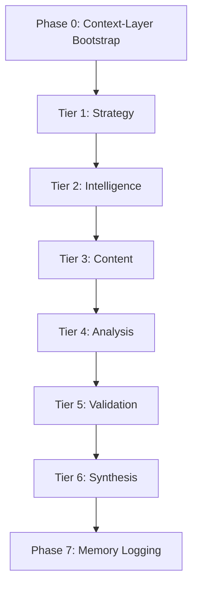

# WORKFLOW.md - Master Execution Sequence

> **{WorkforceName}-Workforce** | Team Orchestration
> **Standard**: vnBuilderProMax v2.3.4
> **Version**: 2.3.4 (Context-Layer Integrated)

---

## Execution Modes

| Mode | Duration | Use Case |
|------|----------|----------|
| Quick | 1-2 hours | Single task |
| Standard | 1-3 days | Full scope |
| Comprehensive | 1-2 weeks | Complete domain |

---

## 7-Phase Execution Flow (with Phase 0 Bootstrap)



**Legend**:

- P0 = Context-Layer Bootstrap (Yellow)
- T2, T3, T4 = Parallel Execution (Pink)
- P7 = Memory Logging (Green)

---

## Phase 0: Context-Layer Bootstrap

> [!IMPORTANT]
> This phase MUST execute before Tier 1 to establish the context foundation.

```yaml
phase: 0
name: Context-Layer Bootstrap
duration: 1-2 min
mandatory: true

steps:
  1. Load Bootstrap Files:
     - ContextBuilder.load_bootstrap()
     - Files:
       - Second-Brain/bootstrap/AGENTS.md
       - Second-Brain/bootstrap/SOUL.md
       - Second-Brain/bootstrap/USER.md
       - Second-Brain/bootstrap/TOOLS.md
       - Second-Brain/bootstrap/IDENTITY.md

  2. Initialize CoreModules:
     - Order: [ContextBuilder, SkillsLoader, MemoryStore, AgentLoop, SubagentManager]

  3. Load Knowledge-Base:
     - SkillsLoader.load_skills()
     - Paths:
       - Knowledge-Base/PLAYBOOKS/ ({N} playbooks)
       - Knowledge-Base/SKILLS/ ({N} skills)
       - Knowledge-Base/EXPERIENCE/ ({N} case studies)

  4. Restore Memory Context:
     - MemoryStore.get_memory_context()
     - Path: Second-Brain/Memory/

  5. Load Context Injection Config:
     - File: Team Orchestration/context-injection-config.json
     - Contains: tier_bindings, worker_context_map

outputs:
  - bootstrap_context: Loaded
  - coremodules: Initialized
  - knowledge_base: Available
  - memory_context: Restored
  - context_config: Ready
```

---

## Tier Activation Sequence

### Tier 1: Strategy (Sequential)

```yaml
workers: [W01, W02, W03, W04]
timeout: 30 min
context_injection:
  playbooks: [{PB-001}, {PB-002}]
  skills: [{SK-001}, {SK-002}]
  commands: [memory-search, memory-write, recall]
  bootstrap: [AGENTS.md, SOUL.md, USER.md]
outputs:
  - strategy.complete
  - plan.approved
```

### Tier 2: Intelligence (Parallel) ⚡

```yaml
workers: [W05, W06, W07, W08]
mode: full_parallel
timeout: 30 min
barrier: all_complete
context_injection:
  playbooks: [{PB-003}, {PB-004}]
  skills: [{SK-001}, {SK-002}, {SK-003}, {SK-004}]
  commands: [search, memory-search, recall]
  bootstrap: [AGENTS.md, SOUL.md]
coordinator: SubagentManager.spawn_parallel(2, workers)
```

### Tier 3: Content (Partial Parallel) ⚡

```yaml
workers: [W09, W10, W11, W12, W13]
mode: partial_parallel
aggregator: W14
timeout: 60 min
context_injection:
  playbooks: [{PB-001}, {PB-002}, {PB-003}, {PB-005}, {PB-006}]
  skills: [{SK-001}, {SK-002}, {SK-003}, {SK-004}, {SK-005}, {SK-006}, {SK-007}]
  commands: [memory-write, recall, save-all]
  bootstrap: [AGENTS.md, SOUL.md, TOOLS.md]
coordinator: SubagentManager.spawn_parallel(3, workers)
```

### Tier 4: Analysis (Barrier Sync) ⚡

```yaml
workers: [W15, W16, W17, W18]
mode: barrier_sync
timeout: 30 min
barrier: atomic_phase
context_injection:
  playbooks: [{PB-006}, {PB-007}]
  skills: [{SK-003}, {SK-005}, {SK-008}]
  commands: [memory-search, recall, list-memory]
  bootstrap: [AGENTS.md, SOUL.md]
coordinator: SubagentManager.spawn_parallel(4, workers)
```

### Tier 5: Validation (Sequential)

```yaml
workers: [W19, W20]
timeout: 20 min
quality_gate: mandatory
context_injection:
  playbooks: [{PB-007}, {PB-008}]
  skills: [{SK-004}, {SK-005}, {SK-006}]
  commands: [memory-search, recall]
  bootstrap: [AGENTS.md, SOUL.md]
```

### Tier 6: Synthesis (Sequential)

```yaml
workers: [W21, W22]
timeout: 15 min
context_injection:
  playbooks: [{PB-005}, {PB-006}, {PB-007}]
  skills: [{SK-007}, {SK-008}]
  commands: [save-all, compact, memory-write]
  bootstrap: [AGENTS.md, SOUL.md, IDENTITY.md]
outputs:
  - final.report.generated
  - deliverable.certified
```

---

## Phase 7: Memory Logging (Auto-Triggered)

> [!CAUTION]
> **MANDATORY**: This phase MUST execute after Tier 6 completion.

```yaml
phase: 7
name: Memory Logging
trigger: Automatic after Tier 6
mandatory: true

steps:
  1. Generate Execution Log:
     - MemoryStore.append_today(session_summary)
     - Path: Memory/DailyLogs/YYYY-MM-DD.md

  2. Update Memory Index:
     - Add entry to memory index
     - Tags: [session, execution, {domain}]

  3. Extract Patterns:
     - Identify reusable patterns
     - Promote to Layer 2 if significant

  4. Compact (if needed):
     - Check compaction threshold
     - Run: compact command

outputs:
  - execution_log: Written
  - memory_index: Updated
  - patterns: Extracted
```

---

## Quality Gates

| After Tier | Gate | Threshold |
|------------|------|-----------|
| P0 | Bootstrap Complete | 100% |
| T1 | Strategy Valid | ≥95% |
| T2 | Source Coverage | ≥85% |
| T3 | Component Quality | ≥80% |
| T4 | Analysis Score | ≥90% |
| T5 | Validation Pass | 100% |
| T6 | Completeness | ≥98% |
| P7 | Memory Logged | ✓ |

---

## Configuration Files Reference

| File | Purpose | Location |
|------|---------|----------|
| context-injection-config.json | Worker-context mappings | Team Orchestration/ |
| swarm-router-config.json | Tier routing + hooks | Team Orchestration/ |
| team-manifest.json | Workforce metadata | Team Orchestration/ |
| memory-config.json | Memory system config | Second-Brain/Memory/ |

---

*WORKFLOW.md v2.3.3 | {WorkforceName}-Workforce | Context-Layer Integrated*
