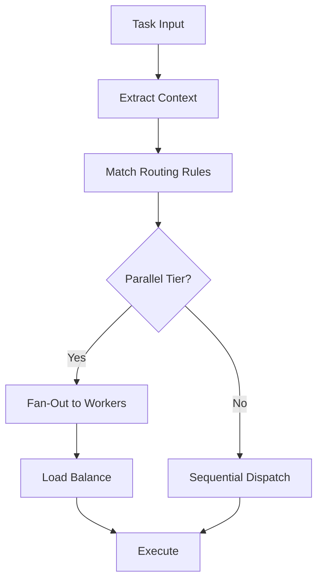

# Autonomous Routing Policy

> **Dynamic Worker Routing for L5 Autonomous Execution**
> Goal-Based Routing | Constraint Validation | Load Balancing

---

## Overview

Defines routing policies for autonomous worker selection and task distribution.

---

## Routing Decision Flow



---

## Routing Rules

### Tier-Based Routing

| Tier | Workers | Execution | Router Action |
|------|---------|-----------|---------------|
| 1 | W01-W04 | Sequential | Chain dispatch |
| 2 | W05-W08 | Parallel | Fan-out + merge |
| 3 | W09-W13 | Parallel | Fan-out → W14 aggregate |
| 4 | W15-W18 | Parallel | Fan-out + merge |
| 5 | W19-W20 | Sequential | Chain dispatch |
| 6 | W21-W22 | Sequential | Chain dispatch |

### Rule Configuration

```yaml
routing_rules:
  - name: "tier_1_strategy"
    condition: "phase == 'strategy'"
    workers: ["W01", "W02", "W03", "W04"]
    execution: "sequential"
    
  - name: "tier_2_intelligence"
    condition: "phase == 'intelligence'"
    workers: ["W05", "W06", "W07", "W08"]
    execution: "parallel"
    aggregation: "merge_all"
    
  - name: "tier_3_content"
    condition: "phase == 'content'"
    workers: ["W09", "W10", "W11", "W12", "W13"]
    execution: "parallel"
    aggregator: "W14"
    synchronization: "barrier"
```

---

## Goal-Based Routing

### Goal Type Mapping

| Goal Type | Priority Tiers | Skip Tiers | Custom Workers |
|-----------|----------------|------------|----------------|
| **Full Workforce** | All (1-6) | None | None |
| **Quick Generate** | 1, 3, 5, 6 | 2, 4 | None |
| **Knowledge Only** | 1, 2 | 3-6 | W09, W10 |
| **Validation Only** | 5, 6 | 1-4 | None |

---

## Load Balancing

### Worker Capacity

```yaml
load_balancing:
  strategy: "complexity_weighted"
  
  worker_capacity:
    default: 100
    W09: 120  # Higher capacity
    W14: 80   # Aggregator, less capacity
    
  distribution:
    algorithm: "least_loaded"
    fallback: "round_robin"
```

### Dynamic Adjustment

```python
def route_with_load_balance(task, workers):
    loads = get_current_loads(workers)
    complexity = estimate_task_complexity(task)
    
    # Find worker with most available capacity
    available = {w: w.capacity - loads[w] for w in workers}
    best_worker = max(available, key=available.get)
    
    if available[best_worker] >= complexity:
        return best_worker
    else:
        # Queue for later
        return queue_for_availability(task, workers)
```

---

## Constraint-Based Routing

### Routing Constraints

```yaml
constraints:
  hard:
    - max_parallel_workers: 6
    - max_retry_count: 3
    
  soft:
    - prefer_cached_context: true
    - balance_load: true
    
  domain_specific:
    - finance:
        require_workers: ["W19", "W20"]  # Compliance validation
    - healthcare:
        require_workers: ["W03", "W20"]  # Standards alignment
```

---

## Routing Decision Logging

```json
{
  "routing_id": "R-001",
  "task_id": "T-001",
  "timestamp": "2026-02-03T15:00:00Z",
  "decision": {
    "tier": 3,
    "workers": ["W09", "W10", "W11", "W12", "W13"],
    "execution": "parallel",
    "aggregator": "W14"
  },
  "reasoning": {
    "rule_matched": "tier_3_content",
    "load_balanced": true,
    "constraints_satisfied": true
  }
}
```

---

## Memory Bus Keys

| Key | Type | Description |
|-----|------|-------------|
| `routing.rules.active` | array | Active routing rules |
| `routing.decisions.log` | array | Routing decisions |
| `routing.load.current` | object | Current worker loads |
| `routing.queue.pending` | array | Queued tasks |

---

*Autonomous Routing Policy v1.0 | L5 Full Autonomy*
