# Execution Flowcharts

> **vnBuilderProMax v2.3.2** | **6-Tier HierarchicalSwarm** | **Execution Pipeline Visualization**
>
> Tài liệu lưu đồ thực thi chi tiết cho workforce 528-agent

---

## Mục Lục

1. [Master 8-Phase Pipeline](#1-master-8-phase-pipeline)
2. [Tier 1: Strategy Sequential Flow](#2-tier-1-strategy-sequential-flow)
3. [Tier 2: Intelligence Parallel Flow](#3-tier-2-intelligence-parallel-flow)
4. [Tier 3: Content Creation Parallel Flow](#4-tier-3-content-creation-parallel-flow)
5. [Tier 4: Analysis Barrier Sync Flow](#5-tier-4-analysis-barrier-sync-flow)
6. [Tier 5: Validation Sequential Flow](#6-tier-5-validation-sequential-flow)
7. [Tier 6: Synthesis Sequential Flow](#7-tier-6-synthesis-sequential-flow)
8. [Worker Task Execution Template](#8-worker-task-execution-template)
9. [Memory Bus Interaction Flow](#9-memory-bus-interaction-flow)
10. [Context Injection Pipeline](#10-context-injection-pipeline)
11. [Autonomous Decision Loop](#11-autonomous-decision-loop)
12. [Error Recovery Flow](#12-error-recovery-flow)

---

## 1. Master 8-Phase Pipeline

> **Tổng quan toàn bộ quy trình thực thi workforce từ Phase 0 đến Phase 7**

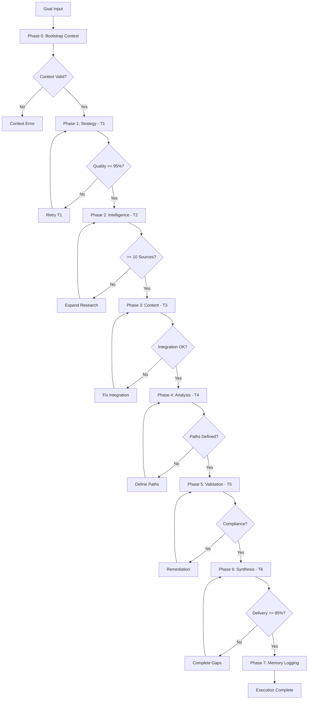

---

## 2. Tier 1: Strategy Sequential Flow

> **Sequential Execution**: W01 → W02 → W03 → W04

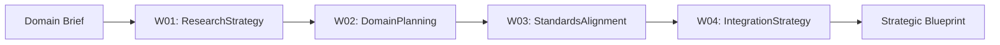

**Detailed W01 Flow:**

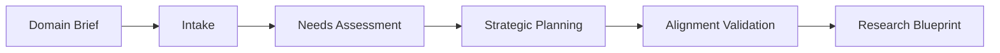

---

## 3. Tier 2: Intelligence Parallel Flow

> **Parallel Execution with Barrier Sync**: W05, W06, W07, W08

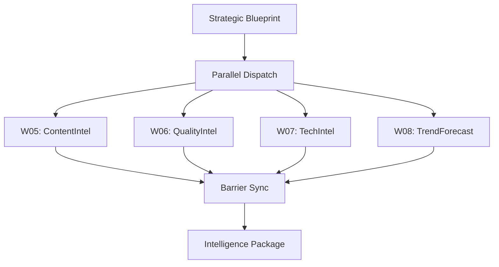

---

## 4. Tier 3: Content Creation Parallel Flow

> **Parallel with Aggregator Pattern**: W09-W13 parallel, W14 aggregator

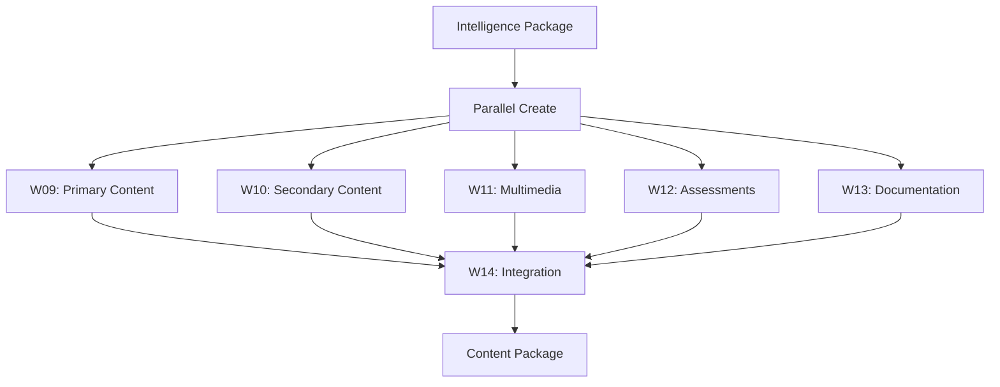

---

## 5. Tier 4: Analysis Barrier Sync Flow

> **Barrier Sync Parallel**: W15, W16, W17, W18

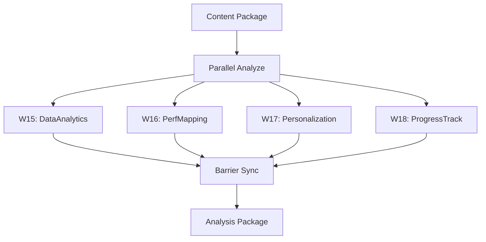

---

## 6. Tier 5: Validation Sequential Flow

> **Sequential Validation**: W19 → W20

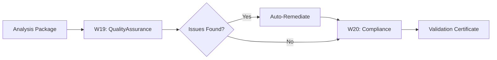

---

## 7. Tier 6: Synthesis Sequential Flow

> **Sequential Synthesis**: W21 → W22

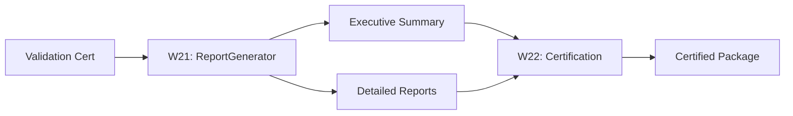

---

## 8. Worker Task Execution Template

> **Generic Worker Execution Flow** - Áp dụng cho tất cả 22 workers

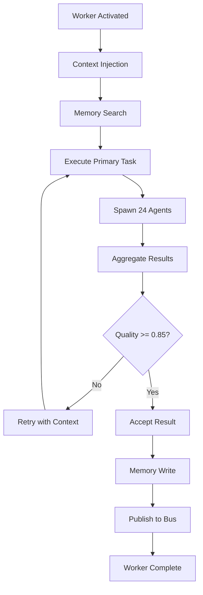

---

## 9. Memory Bus Interaction Flow

> **Worker Read/Write Patterns với Namespace Routing**

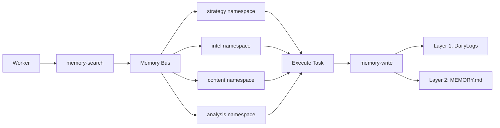

---

## 10. Context Injection Pipeline

> **Phase 0 Bootstrap Context Loading Flow**

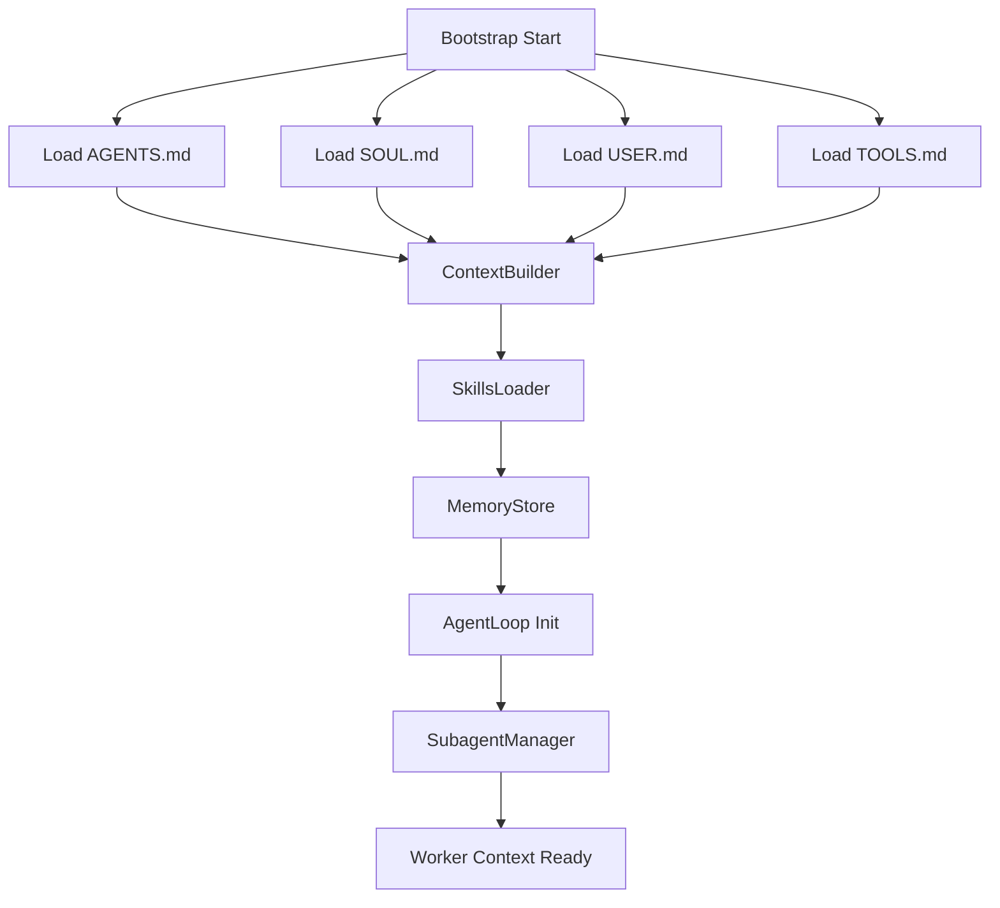

---

## 11. Autonomous Decision Loop

> **L5 Full Autonomy Goal-Driven Execution Cycle**

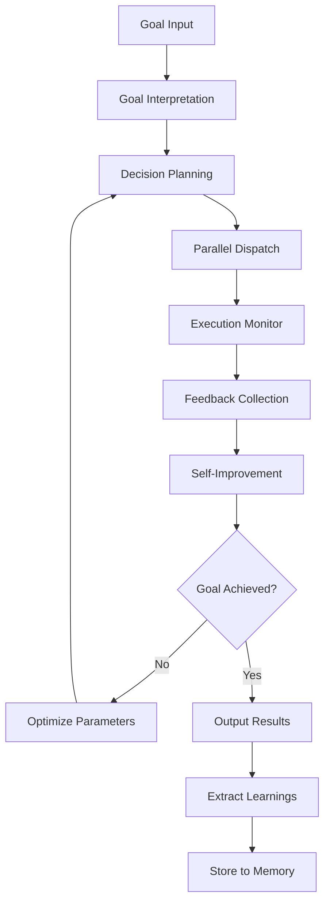

---

## 12. Error Recovery Flow

> **Automatic Error Handling và Escalation Paths**

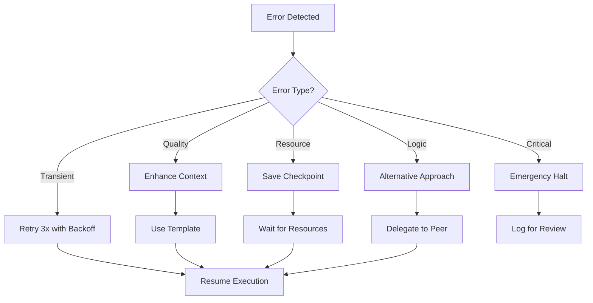

---

## Quick Reference

| Tier | Mode | Workers | Pattern |
|------|------|---------|---------|
| 1 | Sequential | W01-W04 | Chain |
| 2 | Parallel | W05-W08 | Barrier |
| 3 | Parallel+Agg | W09-W14 | Aggregator |
| 4 | Parallel | W15-W18 | Barrier |
| 5 | Sequential | W19-W20 | Chain |
| 6 | Sequential | W21-W22 | Chain |

---

*Execution Flowcharts v1.1 | vnBuilderProMax v2.3.2 | Basic Mermaid Syntax*
