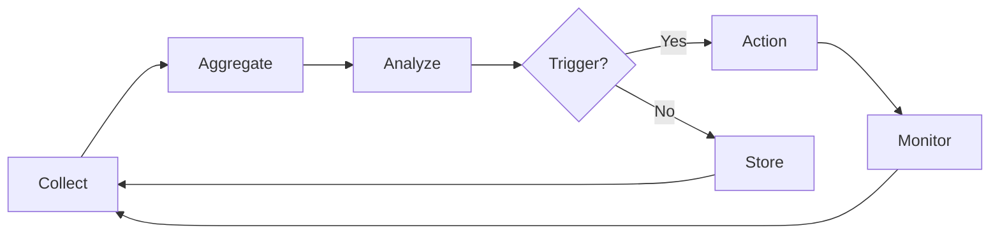

# Feedback Loop Configuration

> **Self-Improvement Feedback Loop Settings**
> Metrics Collection | Threshold Tuning | Improvement Triggers

---

## Overview

Configures the active feedback loop for continuous self-improvement.

---

## Metrics Collection

### Real-Time Metrics

| Metric | Collection | Interval | Storage |
|--------|------------|----------|---------|
| **Execution Time** | Per-worker | Continuous | 7 days |
| **Quality Score** | Per-output | Continuous | 30 days |
| **Success Rate** | Per-session | Rolling 1h | 90 days |
| **Error Rate** | Per-worker | Rolling 10min | 30 days |

### Collection Configuration

```yaml
metrics:
  collection:
    interval: "1s"
    aggregation_window: "60s"
    
  sources:
    execution:
      - worker_duration
      - phase_duration
      - total_duration
      
    quality:
      - output_quality_score
      - gate_pass_rate
      - validation_results
      
    errors:
      - error_count
      - error_types
      - retry_count
      - recovery_success
```

---

## Alert Thresholds

| Metric | Warning | Critical | Action |
|--------|---------|----------|--------|
| Execution time | > 45s | > 60s | Optimize/parallelize |
| Quality score | < 0.80 | < 0.70 | Retry with context |
| Success rate | < 90% | < 80% | Review patterns |
| Error rate | > 10% | > 20% | Circuit breaker |

### Threshold Configuration

```yaml
thresholds:
  execution_time:
    target: 30
    warning: 45
    critical: 60
    unit: "seconds"
    
  quality_score:
    target: 0.85
    warning: 0.80
    critical: 0.70
    
  success_rate:
    target: 0.95
    warning: 0.90
    critical: 0.80
    
  error_rate:
    target: 0.05
    warning: 0.10
    critical: 0.20
```

---

## Improvement Triggers

### Automatic Triggers

| Trigger | Condition | Action |
|---------|-----------|--------|
| **Quality Below Target** | avg score < 0.85 for 5 outputs | Generate hypothesis |
| **Time Above Limit** | avg time > 45s for 10 workers | Analyze bottleneck |
| **Repeated Errors** | same error 3+ times | Add to improvement queue |
| **Pattern Detected** | correlation identified | Create experiment |

### Trigger Configuration

```yaml
triggers:
  quality_improvement:
    condition: "avg_quality < target for sample_count >= 5"
    action: "generate_hypothesis"
    cooldown: "30min"
    
  time_optimization:
    condition: "avg_time > warning for sample_count >= 10"
    action: "analyze_bottleneck"
    cooldown: "1h"
    
  error_learning:
    condition: "same_error_count >= 3"
    action: "add_to_improvement_queue"
    cooldown: "15min"
```

---

## Feedback Processing

### Processing Pipeline



### Processing Configuration

```yaml
processing:
  pipeline:
    - collect: "real_time"
    - aggregate: "60s_window"
    - analyze: "statistical + ml"
    - trigger: "rule_based"
    
  output:
    immediate_action: true
    log_all: true
    forward_to_learning: true
```

---

## A/B Testing Integration

```yaml
ab_testing:
  enabled: true
  
  auto_experiment:
    trigger: "improvement_hypothesis_generated"
    min_samples: 50
    max_duration: "24h"
    significance: 0.95
    
  deployment:
    strategy: "canary"
    stages: [0.10, 0.50, 1.00]
    rollback_threshold: 0.10  # 10% degradation
```

---

## Memory Bus Keys

| Key | Type | Description |
|-----|------|-------------|
| `feedback.metrics.realtime` | object | Real-time metrics |
| `feedback.metrics.aggregated` | object | Aggregated metrics |
| `feedback.triggers.active` | array | Active triggers |
| `feedback.improvements.queue` | array | Improvement queue |
| `feedback.experiments.running` | array | Running experiments |

---

*Feedback Loop Configuration v1.0 | L5 Full Autonomy*
