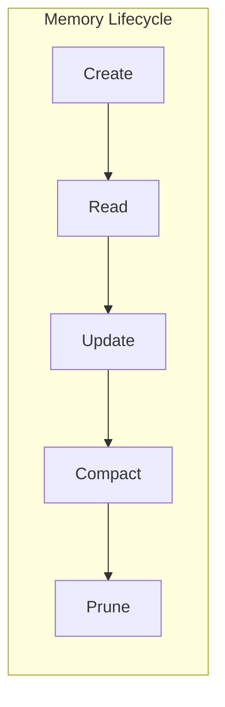
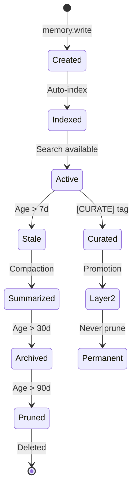

# Memory Lifecycle Contract

> **vnBuilderPro-MAS2026 | CLAWDBOT Memory System v2.3.1**
> Memory Lifecycle Management Protocol
> **CoreModules Integration**: MemoryStore (`read_today()`, `append_today()`, `get_memory_context()`)

---

## Overview

This contract defines the lifecycle management for the CLAWDBOT Two-Layer Memory System, including read/write protocols, compaction triggers, and pruning policies. Now integrated with **CoreModules/memory-store.md** for unified memory operations.



---

## Memory Operations Contract

### Read Operations

| Operation | Trigger | Source | Worker Stages |
|-----------|---------|--------|---------------|
| `memory.read.layer2` | Session start | MEMORY.md | ROMA:Intake |
| `memory.read.layer1` | Session start | DailyLogs/today.md | ROMA:Intake |
| `memory.search` | On demand | Index | Any |
| `memory.get` | Post-search | Files | Any |

### Write Operations

| Operation | Trigger | Target | Worker Stages |
|-----------|---------|--------|---------------|
| `memory.write.log` | Task complete | DailyLogs/today.md | ROMA:Deploy |
| `memory.write.curate` | Explicit tag | DailyLogs + MEMORY.md | ROMA:Deploy |
| `memory.write.decision` | Architecture choice | MEMORY.md | ROMA:Deploy |
| `memory.write.fact` | Knowledge acquisition | MEMORY.md | ROMA:Deploy |

---

## Lifecycle States



---

## ROMA Pipeline Integration

Each worker must integrate memory operations in their ROMA pipeline:

### INTAKE Stage

```yaml
memory_operations:
  - action: memory.read.layer2
    source: MEMORY.md
    purpose: Load curated knowledge
  - action: memory.read.layer1
    source: DailyLogs/{today}.md
    purpose: Load session context
  - action: memory.search
    query: "{task_context}"
    purpose: Find relevant prior knowledge
```

### DEPLOY Stage

```yaml
memory_operations:
  - action: memory.write.log
    target: DailyLogs/{today}.md
    content: "{execution_summary}"
  - action: memory.write.decision
    condition: "if architectural_decision"
    target: MEMORY.md
    format: "| {id} | {date} | {context} | {decision} | {rationale} |"
  - action: memory.write.curate
    condition: "if important_learning"
    tag: "[CURATE]"
```

### TEST Stage

```yaml
memory_validation:
  - check: memory.index.stale
    threshold: 1h
    action: trigger_reindex
  - check: memory.layer2.consistency
    action: validate_no_duplicates
```

---

## Compaction Contract

### Trigger Conditions

| Condition | Threshold | Action |
|-----------|-----------|--------|
| Context tokens | > 180K | Standard compaction |
| Emergency context | > 195K | Aggressive compaction |
| Daily maintenance | 00:00 UTC | Previous day rollup |
| Manual request | `/compact` | On-demand |

### Compaction Protocol

```yaml
compaction_protocol:
  pre_compaction:
    - flush_current_context
    - identify_curated_entries
    - backup_state
    
  execution:
    - promote_curated_to_layer2
    - summarize_regular_entries
    - delete_temporary_entries
    
  post_compaction:
    - validate_layer2_integrity
    - refresh_search_index
    - log_compaction_metrics
```

---

## Pruning Contract

### Retention Policy

| Content Type | TTL | Pruning Action |
|--------------|-----|----------------|
| Layer 2 (MEMORY.md) | Forever | Never prune |
| `[NEVER_PRUNE]` tagged | Forever | Never prune |
| Layer 1 with `[CURATE]` | Until promoted | Promote then prune |
| Layer 1 regular | 90 days | Summarize → Prune |
| Tool outputs | 7 days | Direct prune |
| Debug traces | 3 days | Direct prune |

### Pruning Safety

```yaml
pruning_safety:
  exclusions:
    - "MEMORY.md"
    - "**/*[NEVER_PRUNE]*"
    - "active_session/*"
    
  pre_prune_backup: true
  backup_retention: 365d
  
  dry_run_available: true
  confirmation_required: false  # Automated
```

---

## Memory Bus Keys

### Layer 1 Operations

| Key | Type | Description |
|-----|------|-------------|
| `memory.layer1.write` | event | Write to daily log |
| `memory.layer1.read` | event | Read daily log |
| `memory.layer1.today` | string | Today's log file path |
| `memory.layer1.recent` | array | Recent log entries (7d) |

### Layer 2 Operations

| Key | Type | Description |
|-----|------|-------------|
| `memory.layer2.write` | event | Write to MEMORY.md |
| `memory.layer2.read` | event | Read curated knowledge |
| `memory.layer2.decisions` | array | Decision registry |
| `memory.layer2.facts` | array | Facts registry |
| `memory.layer2.patterns` | array | Patterns registry |

### Index Operations

| Key | Type | Description |
|-----|------|-------------|
| `memory.index.status` | enum | healthy/stale/rebuilding |
| `memory.index.last_update` | timestamp | Last index update |
| `memory.index.chunk_count` | integer | Total chunks indexed |
| `memory.index.search` | function | Execute search |

### Lifecycle Operations

| Key | Type | Description |
|-----|------|-------------|
| `memory.lifecycle.compact` | event | Trigger compaction |
| `memory.lifecycle.prune` | event | Trigger pruning |
| `memory.lifecycle.flush` | event | Flush context to disk |
| `memory.lifecycle.status` | object | Current lifecycle state |

---

## Quality Gates

### Memory Write Quality

| Check | Criteria | Action |
|-------|----------|--------|
| Format | Valid Markdown | Reject if invalid |
| Duplicates | No duplicate decision IDs | Warn and suggest |
| Consistency | No contradictory facts | Flag for review |
| Completeness | Decisions have rationale | Prompt for rationale |

### Memory Read Quality

| Check | Criteria | Action |
|-------|----------|--------|
| Index freshness | < 1h stale | Trigger reindex |
| Search relevance | Score > 0.5 | Filter low scores |
| Result coverage | Both layers checked | Ensure hybrid search |

---

*vnBuilderPro-MAS2026 Memory Lifecycle Contract v2.2.0 | CLAWDBOT Standard*
