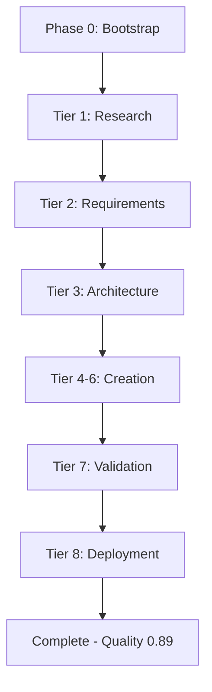
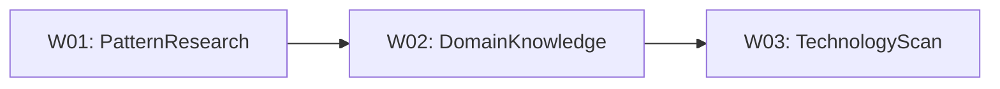
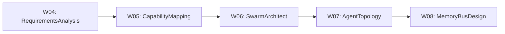
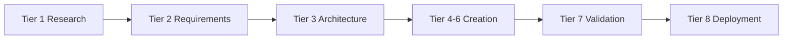

# Sample Execution

> **MASDesign-Workforce | Complete Execution Trace Example**

---

## Overview

This document illustrates a complete execution trace for creating a 10-worker, 240-agent E-Commerce MAS design using the MASDesign-Workforce.

---

## Session Information

| Attribute | Value |
|-----------|-------|
| **Session ID** | `mas-2026-01-30-001` |
| **Request** | Design MAS for E-Commerce automation |
| **Start Time** | 2026-01-30T09:00:00+07:00 |
| **End Time** | 2026-01-30T09:45:00+07:00 |
| **Duration** | 45 minutes |
| **Final Quality** | 0.89 |

---

## Execution Trace Flowchart

> **Visual Execution Flow** - E-Commerce MAS Design Session



**Tier 1 Detail:**



**Tier 2-3 Detail:**



---

## Tier Handoff Diagram



---

## Tier 1: Research & Intelligence

### Worker 01: PatternResearchWorker

**Execution Time**: 3 minutes

**Memory Bus Writes**:

```json
{
  "research.patterns.search_results": [
    {"name": "HierarchicalSwarm", "relevance": 0.92},
    {"name": "SequentialWorkflow", "relevance": 0.87},
    {"name": "SwarmRouter", "relevance": 0.85}
  ],
  "research.patterns.ranked_list": ["HierarchicalSwarm", "SwarmRouter"],
  "research.patterns.quality_score": 0.88
}
```

**Decision**: Selected HierarchicalSwarm as primary pattern.

### Worker 02: DomainKnowledgeWorker

**Execution Time**: 4 minutes

**Memory Bus Writes**:

```json
{
  "research.domain.knowledge": {
    "domain": "E-Commerce",
    "subdomains": ["Inventory", "Pricing", "Orders", "Fulfillment"],
    "regulations": ["PCI-DSS", "GDPR"]
  },
  "research.domain.framework_mapping": {
    "ROMA_applicable": true,
    "autonomy_level": "L3"
  }
}
```

### Worker 03: TechnologyScanWorker

**Execution Time**: 3 minutes

**Memory Bus Writes**:

```json
{
  "research.tech.recommendations": {
    "primary_stack": ["Python", "FastAPI", "Redis"],
    "mcp_servers": ["database", "api-gateway"],
    "deployment": "Docker + K8s"
  }
}
```

**Quality Gate**: Tier 1 passed with score 0.86

---

## Tier 2: Requirements Engineering

### Worker 04: RequirementsAnalysisWorker

**Execution Time**: 4 minutes

**Memory Bus Writes**:

```json
{
  "requirements.functional": [
    "Auto-inventory tracking",
    "Dynamic pricing engine",
    "Order orchestration",
    "Fulfillment optimization"
  ],
  "requirements.non_functional": [
    "Response time < 500ms",
    "99.9% availability",
    "Horizontal scalability"
  ],
  "requirements.quality_score": 0.87
}
```

### Worker 05: CapabilityMappingWorker

**Execution Time**: 3 minutes

**Memory Bus Writes**:

```json
{
  "capabilities.mapped": {
    "inventory": {"worker_count": 2, "agent_count": 48},
    "pricing": {"worker_count": 2, "agent_count": 48},
    "orders": {"worker_count": 3, "agent_count": 72},
    "fulfillment": {"worker_count": 3, "agent_count": 72}
  }
}
```

**Manual Approval**: Requirements Gate - APPROVED by user at 09:15

---

## Tier 3: Architecture Design

### Worker 06: SwarmArchitectWorker

**Execution Time**: 4 minutes

**Memory Bus Writes**:

```json
{
  "architecture.swarm.selected": "HierarchicalSwarm",
  "architecture.swarm.config": {
    "tiers": 5,
    "parallel_workers_per_tier": 2,
    "memory_bus_enabled": true
  }
}
```

### Worker 07: AgentTopologyWorker

**Execution Time**: 5 minutes

**Memory Bus Writes**:

```json
{
  "architecture.topology.graph": {
    "nodes": 240,
    "edges": 480,
    "max_depth": 5
  },
  "architecture.topology.worker_count": 10,
  "architecture.topology.tier_assignments": {
    "tier_1": ["InventoryResearch", "PricingResearch"],
    "tier_2": ["OrderAnalysis", "FulfillmentAnalysis"],
    "tier_3": ["WorkflowDesign", "IntegrationDesign"],
    "tier_4": ["QualityControl", "Compliance"],
    "tier_5": ["Deployment", "Evolution"]
  }
}
```

### Worker 08: MemoryBusDesignWorker

**Execution Time**: 4 minutes

**Memory Bus Writes**:

```json
{
  "architecture.memory.namespaces": [
    "inventory", "pricing", "orders", "fulfillment", "control"
  ],
  "architecture.memory.key_count": 156
}
```

**Quality Gate**: Architecture Gate - Score 0.84 - PASSED

---

## Tier 4-6: Knowledge, Agent, Integration

**Summary Execution** (12 minutes total):

| Worker | Output | Quality |
|--------|--------|---------|
| 09-Playbook | 8 playbooks generated | 0.86 |
| 10-Skill | 24 skills documented | 0.88 |
| 11-Spec | 240 agent specs | 0.85 |
| 12-Prompt | 240 L6 prompts | 0.87 |
| 13-Behavior | 56 behaviors defined | 0.84 |
| 14-Orch | Orchestration design | 0.86 |
| 15-Contract | Memory contract | 0.88 |
| 16-Test | 48 test cases | 0.85 |

---

## Tier 7: Quality & Validation

### Worker 17: QualityAssuranceWorker

**Execution Time**: 3 minutes

**Quality Assessment**:

```json
{
  "dimension_scores": {
    "completeness": 0.91,
    "accuracy": 0.88,
    "coherence": 0.87,
    "compliance": 0.89
  },
  "overall_score": 0.89,
  "issues_found": 2,
  "issues_resolved": 2
}
```

### Worker 18: PatternComplianceWorker

**Execution Time**: 2 minutes

**Compliance Report**:

- 107-Pattern Compliance: 94%
- Standard Adherence: 96%
- Deviations: 1 (documented)

**Quality Gate**: Operational Gate - Score 0.89 - PASSED

---

## Tier 8: Deployment & Evolution

### Worker 19: DeploymentPackagerWorker

**Execution Time**: 3 minutes

**Package Output**:

```
ECommerce-MAS-Package/
├── workforce.json           # Full workforce config
├── workers/                  # 10 worker definitions
├── knowledge-base/           # 3-tier KB
├── second-brain/             # Brain, Memory, Command
└── deployment/               # Deploy scripts
```

### Worker 20: EvolutionEngineWorker

**Execution Time**: 2 minutes

**Evolution Plan**:

```json
{
  "experiments_planned": 3,
  "metrics_tracked": ["quality_score", "execution_time", "error_rate"],
  "feedback_loop": "weekly",
  "next_review": "2026-02-06"
}
```

---

## Final Output Summary

| Metric | Value |
|--------|-------|
| **Workers Designed** | 10 |
| **Agents Created** | 240 |
| **Playbooks Generated** | 8 |
| **Skills Documented** | 24 |
| **Memory Keys Defined** | 156 |
| **Test Cases Written** | 48 |
| **Overall Quality Score** | 0.89 |

---

## Memory Bus Final State

```json
{
  "control.session_id": "mas-2026-01-30-001",
  "control.status": "completed",
  "control.final_quality": 0.89,
  "deployment.package.path": "ECommerce-MAS-Package/",
  "deployment.approved": true
}
```

---

*MASDesign-Workforce Sample Execution v1.0*
