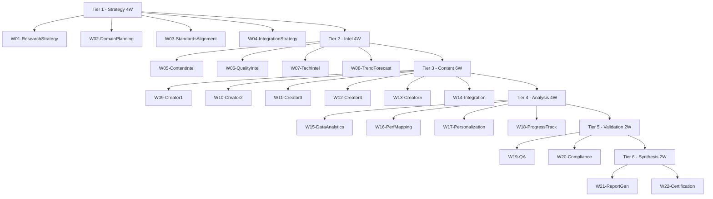

# 6-Tier HierarchicalSwarm Topology

> **vnBuilderProMax v2.1.0** | {WorkforceName}

---

## Topology Overview

---

## Tier Distribution

| Tier | Name | Workers | Agents | Function |
|------|------|---------|--------|----------|
| 1 | Strategy | 4 | 96 | Strategic planning, domain analysis, standards |
| 2 | Intelligence | 4 | 96 | Content, quality, technology intelligence |
| 3 | Content | 6 | 144 | Content creation, integration |
| 4 | Analysis | 4 | 96 | Analytics, personalization, tracking |
| 5 | Validation | 2 | 48 | QA, compliance validation |
| 6 | Synthesis | 2 | 48 | Reports, certification |
| **Total** | | **22** | **528** | |

---

## Worker Registry

### Tier 1 - Strategy

| ID | Worker | Primary Function |
|----|--------|------------------|
| W01 | ResearchStrategyWorker | Strategic research and domain analysis |
| W02 | DomainPlanningWorker | Domain knowledge structuring |
| W03 | StandardsAlignmentWorker | Standards compliance |
| W04 | IntegrationStrategyWorker | Cross-component integration |

### Tier 2 - Intelligence

| ID | Worker | Primary Function |
|----|--------|------------------|
| W05 | ContentIntelligenceWorker | Content analysis and curation |
| W06 | QualityIntelligenceWorker | Quality assessment intelligence |
| W07 | TechnologyIntelligenceWorker | Technology evaluation |
| W08 | TrendForecastingWorker | Trend analysis and forecasting |

### Tier 3 - Content Creation

| ID | Worker | Primary Function |
|----|--------|------------------|
| W09 | ContentCreator1Worker | Primary content creation |
| W10 | ContentCreator2Worker | Specialized content |
| W11 | ContentCreator3Worker | Interactive/multimedia |
| W12 | ContentCreator4Worker | Assessment content |
| W13 | ContentCreator5Worker | Documentation |
| W14 | ContentIntegrationWorker | Content integration |

### Tier 4 - Analysis

| ID | Worker | Primary Function |
|----|--------|------------------|
| W15 | DataAnalyticsWorker | Data analysis and insights |
| W16 | PerformanceMappingWorker | Competency mapping |
| W17 | PersonalizationWorker | Personalization strategies |
| W18 | ProgressTrackingWorker | Progress monitoring |

### Tier 5 - Validation

| ID | Worker | Primary Function |
|----|--------|------------------|
| W19 | QualityAssuranceWorker | Quality assurance |
| W20 | ComplianceValidationWorker | Standards compliance |

### Tier 6 - Synthesis

| ID | Worker | Primary Function |
|----|--------|------------------|
| W21 | ReportGeneratorWorker | Report generation |
| W22 | CertificationWorker | Certification/credentialing |

---

## Execution Patterns

### Sequential Execution

Default mode: Tiers execute in sequence T1 → T2 → T3 → T4 → T5 → T6

### Parallel Execution

Within each tier, workers can execute in parallel when no dependencies exist.

| Tier | Parallel Workers |
|------|-----------------|
| T1 | W01-W03 parallel, W04 waits |
| T2 | All parallel |
| T3 | W09-W13 parallel, W14 waits |
| T4 | All parallel |
| T5 | W19, W20 parallel |
| T6 | W21, W22 sequential |

---

*Swarm Topology v1.0.0 | {WorkforceName} | vnBuilderProMax v2.1.0*
