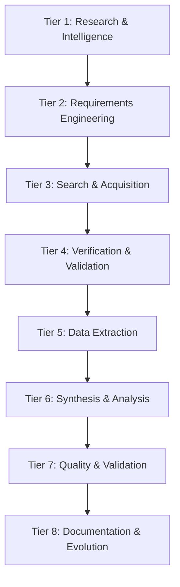

# DeepResearch-Workforce

> **Enterprise Deep Research Multi-Agent System**
> 22 Workers | 528 Agents | 8-Tier HierarchicalSwarm

---

## Overview

| Attribute | Value |
|-----------|-------|
| **Workforce** | DeepResearch-Workforce |
| **Version** | 2.1.0 |
| **Workers** | 22 |
| **Agents** | 528 |
| **Architecture** | 8-Tier HierarchicalSwarm |
| **Governance** | L3 Delegated Autonomy |
| **Efficiency** | arXiv:2601.14192v1 |

---

## User Agent Integration

This workforce integrates 6 specialized agents provided by the user:

| User Agent | Worker | Tier |
|------------|--------|------|
| **query-clarifier** | W01-QueryClarifierWorker | 1 |
| **academic-researcher** | W06-AcademicSearchWorker | 3 |
| **technical-researcher** | W07-TechnicalSearchWorker | 3 |
| **fact-checker** | W09-FactCheckWorker | 4 |
| **research-synthesizer** | W14-ResearchSynthesizerWorker | 6 |
| **report-generator** | W19-ReportGeneratorWorker | 8 |

---

## 8-Tier Architecture



---

## Directory Structure

```
DeepResearch-Workforce/
├── Second-Brain/
│   ├── Brain/           # Strategic intelligence
│   ├── Command/         # Slash commands
│   ├── Conversation/    # Session data
│   ├── Memory/          # Working memory
│   └── Scripts/         # Automation
├── Knowledge-Base/
│   ├── PLAYBOOKS/       # 8 strategic procedures
│   ├── SKILLS/          # 8 technical implementations
│   └── EXPERIENCE/      # 5 best practices
├── Workers/             # 22 worker directories
│   ├── 01-QueryClarifierWorker/
│   ├── ...
│   └── 22-CostBudgetOptimizationWorker/
└── Team Orchestration/
    ├── WORKFLOW.md
    ├── agent-specifications.md
    ├── agent-prompts.md
    ├── memory-bus-contract.md
    ├── swarm-router-config.json
    ├── team-manifest.json
    └── quality-checklists.md
```

---

## Quick Start

1. **Review** [Team Orchestration/WORKFLOW.md](Team%20Orchestration/WORKFLOW.md)
2. **Configure** routing in [swarm-router-config.json](Team%20Orchestration/swarm-router-config.json)
3. **Execute** research queries through Tier 1

---

## Quality Gates

| Gate | Threshold |
|------|-----------|
| Query Clarity | ≥ 0.8 |
| Protocol Review | Human approval |
| Verification Score | ≥ 0.95 |
| E-O Quality | ≥ 0.85 |

---

*DeepResearch-Workforce v2.1.0 | vnBuilderPro_MAS2026*
