Team Orchestration WORKFLOW

> **DeepResearch-Workforce v2.1.0 Team-Level Coordination**
> Enhanced with arXiv:2601.14192v1 Efficiency Patterns

---

## Overview

| Attribute              | Value                        |
| ---------------------- | ---------------------------- |
| **Workforce**    | DeepResearch-Workforce       |
| **Workers**      | 22                           |
| **Total Agents** | 528                          |
| **Tiers**        | 8                            |
| **Swarm Type**   | HierarchicalSwarm            |
| **Efficiency**   | arXiv:2601.14192v1 compliant |

---

## Execution Flow

```mermaid
flowchart TD
    subgraph Tier1[Tier 1: Research & Intelligence]
        W1[01-QueryClarifier]
        W2[02-DomainIntelligence]
        W3[03-TechnologyScan]
    end
  
    subgraph Tier2[Tier 2: Requirements Engineering]
        W4[04-ResearchProtocol]
        W5[05-SourceStrategy]
    end
  
    subgraph Tier3[Tier 3: Search & Acquisition]
        W6[06-AcademicSearch]
        W7[07-TechnicalSearch]
        W8[08-WebSearch]
        W21[21-EfficiencyArchitect]
    end
  
    subgraph Tier4[Tier 4: Verification & Validation]
        W9[09-FactCheck]
        W10[10-SourceValidation]
    end
  
    subgraph Tier5[Tier 5: Data Extraction]
        W11[11-ContentExtraction]
        W12[12-CitationMapping]
        W13[13-EvidenceGrading]
    end
  
    subgraph Tier6[Tier 6: Synthesis & Analysis]
        W14[14-ResearchSynthesizer]
        W15[15-PatternIdentification]
        W16[16-GapAnalysis]
    end
  
    subgraph Tier7[Tier 7: Quality & Validation]
        W17[17-QualityAssurance]
        W18[18-BiasDetection]
    end
  
    subgraph Tier8[Tier 8: Documentation & Evolution]
        W19[19-ReportGenerator]
        W20[20-EvolutionEngine]
        W22[22-CostBudgetOptimization]
    end
  
    Tier1 --> Tier2 --> Tier3 --> Tier4 --> Tier5 --> Tier6 --> Tier7 --> Tier8
```

---

## Worker Registry

| Tier | #            | Worker                                 | Agents | User Agent                     |
| ---- | ------------ | -------------------------------------- | ------ | ------------------------------ |
| 1    | 01           | QueryClarifierWorker                   | 24     | **query-clarifier**      |
| 1    | 02           | DomainIntelligenceWorker               | 24     | -                              |
| 1    | 03           | TechnologyScanWorker                   | 24     | -                              |
| 2    | 04           | ResearchProtocolWorker                 | 24     | -                              |
| 2    | 05           | SourceStrategyWorker                   | 24     | -                              |
| 3    | 06           | AcademicSearchWorker                   | 24     | **academic-researcher**  |
| 3    | 07           | TechnicalSearchWorker                  | 24     | **technical-researcher** |
| 3    | 08           | WebSearchWorker                        | 24     | -                              |
| 3    | **21** | **EfficiencyArchitectWorker**    | 24     | ★ §3-5                       |
| 4    | 09           | FactCheckWorker                        | 24     | **fact-checker**         |
| 4    | 10           | SourceValidationWorker                 | 24     | -                              |
| 5    | 11           | ContentExtractionWorker                | 24     | -                              |
| 5    | 12           | CitationMappingWorker                  | 24     | -                              |
| 5    | 13           | EvidenceGradingWorker                  | 24     | -                              |
| 6    | 14           | ResearchSynthesizerWorker              | 24     | **research-synthesizer** |
| 6    | 15           | PatternIdentificationWorker            | 24     | -                              |
| 6    | 16           | GapAnalysisWorker                      | 24     | -                              |
| 7    | 17           | QualityAssuranceWorker                 | 24     | -                              |
| 7    | 18           | BiasDetectionWorker                    | 24     | -                              |
| 8    | 19           | ReportGeneratorWorker                  | 24     | **report-generator**     |
| 8    | 20           | EvolutionEngineWorker                  | 24     | ★ §6                         |
| 8    | **22** | **CostBudgetOptimizationWorker** | 24     | ★ §6                         |

---

## Quality Gates

| Gate               | Location     | Threshold         | Blocking |
| ------------------ | ------------ | ----------------- | -------- |
| Query Clarity      | After Tier 1 | Confidence ≥ 0.8 | Yes      |
| Protocol Review    | After Tier 2 | Human approval    | Yes      |
| Search Coverage    | After Tier 3 | Known-item check  | Yes      |
| Verification Score | After Tier 4 | Accuracy ≥ 0.95  | Yes      |
| Synthesis Quality  | After Tier 6 | Coherence ≥ 0.85 | Yes      |
| E-O Quality        | After Tier 7 | E-O ≥ 0.85       | Yes      |

---

## Efficiency Integration (arXiv:2601.14192v1)

| Section           | Pattern                   | Workers         |
| ----------------- | ------------------------- | --------------- |
| §3 Memory        | Hierarchical construction | W21, All search |
| §4 Tool Learning | Parallel tool calling     | W06, W07, W08   |
| §5 Planning      | Adaptive planning         | W04, W14, W21   |
| §6 Benchmarks    | Cost/Pareto optimization  | W20, W22        |

---

*Team Orchestration WORKFLOW v2.1 | DeepResearch-Workforce*
