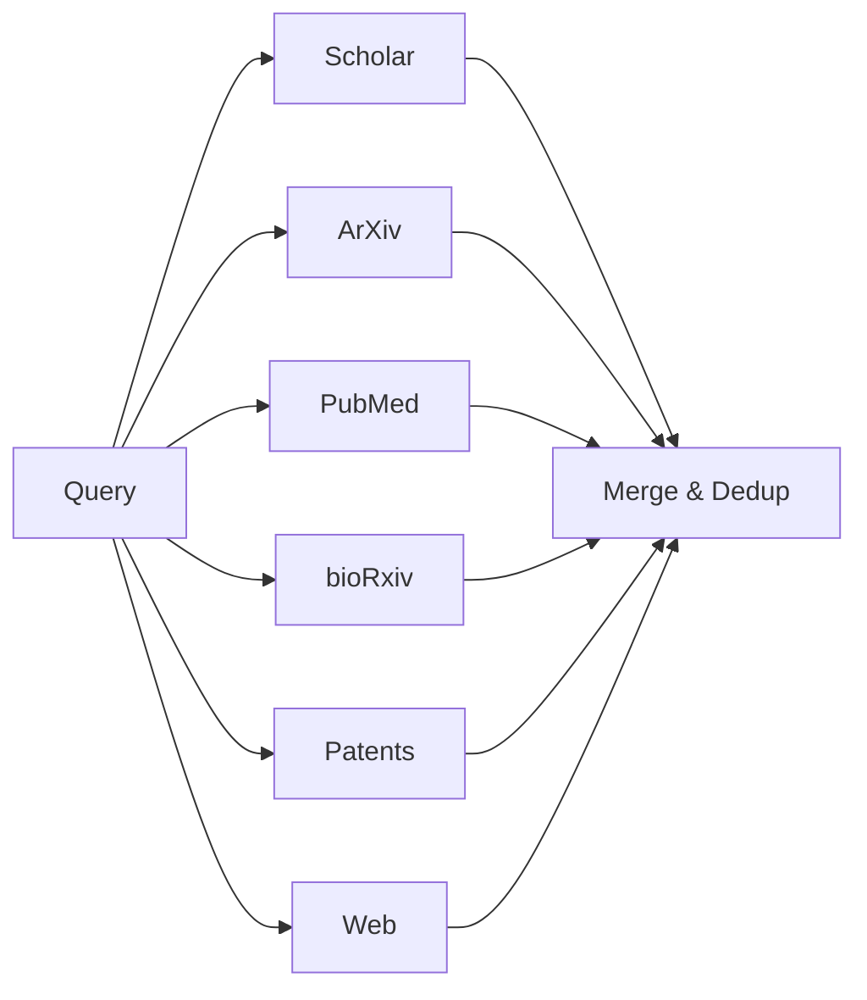

# Multi-Database Search Orchestration

> **Playbook ID**: PLAYBOOK-SDR-001
> **Domain**: ScholarDeepResearch-Workforce
> **Version**: 1.0.0

---

## Overview

Orchestrates parallel academic search across 6+ databases to maximize paper discovery while minimizing redundancy.

---

## Database Registry

| Priority | Database | Tool | Content Type |
|----------|----------|------|--------------|
| 1 | Google Scholar | advancedScholarSearch | Broad academic |
| 2 | Semantic Scholar | scholarSearch | Citation-ranked |
| 3 | ArXiv | arxivSearch | Preprints |
| 4 | PubMed | searchPubMed | Biomedical |
| 5 | bioRxiv | biorxivSearch | Bio preprints |
| 6 | Patents | patentSearch | IP/Technical |
| 7 | Web | WebSearchReranked | Non-academic |

---

## Execution Protocol

### Stage 1: Query Engineering

```
INPUT: user_query
1. Extract key concepts and entities
2. Generate Boolean search strings
3. Identify domain-specific terminology
4. Create database-specific query variants
OUTPUT: query_variants[]
```

### Stage 2: Parallel Dispatch



### Stage 3: Result Consolidation

1. Merge results from all databases
2. Deduplicate by DOI/title similarity
3. Rank by citation count + recency
4. Apply relevance reranking

---

## Quality Gates

| Gate | Threshold | Action |
|------|-----------|--------|
| Min Results | ≥8 papers | Expand query if below |
| Diversity | ≥3 databases | Ensure multi-source |
| Recency | ≥50% from last 5 years | Balance with classics |

---

## Memory Keys

| Key | Type | Purpose |
|-----|------|---------|
| `search.queries[]` | Array | Query variants used |
| `search.results[]` | Array | Consolidated results |
| `search.databases_hit` | Object | Per-database counts |

---

*Playbook PLAYBOOK-SDR-001 | Multi-Database Search Orchestration*
