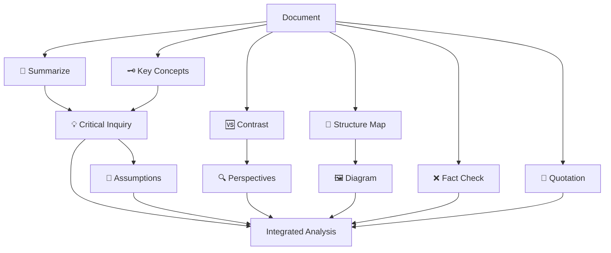

# Critical Reading Pipeline

> **Playbook ID**: PLAYBOOK-SDR-002
> **Domain**: ScholarDeepResearch-Workforce
> **Version**: 1.0.0

---

## Overview

Orchestrates the 10 Critical Reading Methods for comprehensive document analysis.

---

## Method Registry

| # | Method | Emoji | Worker | Output |
|---|--------|-------|--------|--------|
| 1 | Summarize & Question | 📜 | W11 | Summary + 3 questions |
| 2 | Critical Inquiry | 💡 | W12 | 3 challenging questions |
| 3 | Contrast Analysis | 🆚 | W13 | Perspective comparison table |
| 4 | Key Concept Clarity | 🗝️ | W11 | Main ideas explained |
| 5 | Structure Mapping | 🧠 | W14 | Document mindmap |
| 6 | Perspective Research | 🔍 | W13 | Diverse viewpoint articles |
| 7 | Reflective Quotation | 💬 | W11 | Notable excerpts + commentary |
| 8 | Fact Check | ❌ | W17 | Factual inaccuracies list |
| 9 | Assumption Identification | 🧐 | W12 | Underlying assumptions |
| 10 | Diagram | 🖼️ | W14 | Illustrative diagrams/flowcharts |

---

## Execution Flow

---

## Method Selection Heuristics

| Document Type | Recommended Methods |
|---------------|---------------------|
| Research Paper | 1, 2, 4, 8, 9 |
| Review Article | 1, 3, 5, 6, 7 |
| Technical Report | 4, 5, 8, 10 |
| Opinion/Editorial | 2, 3, 6, 9 |
| Dataset Paper | 4, 8, 10 |

---

## Quality Standards

- **Summarize**: 50+ words per article summary
- **Questions**: Non-trivial, thought-provoking
- **Fact Check**: Verify against cited sources
- **Diagrams**: Use Mermaid or image generation

---

*Playbook PLAYBOOK-SDR-002 | Critical Reading Pipeline*
