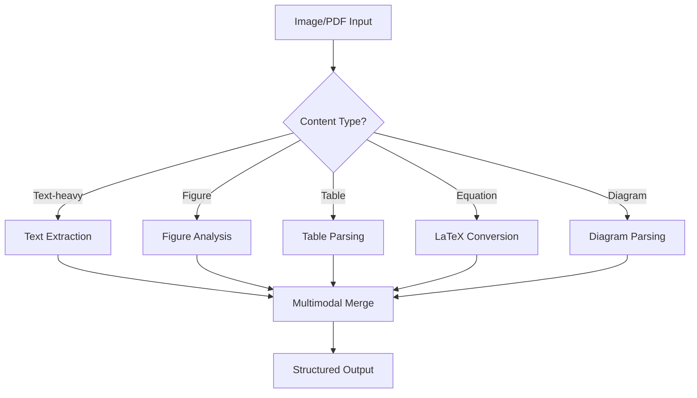

# Multimodal Document Analysis

> **Playbook ID**: PLAYBOOK-SDR-004
> **Domain**: ScholarDeepResearch-Workforce
> **Version**: 1.0.0

---

## Overview

Leverages vision capabilities for document analysis, figure interpretation, and visual content extraction.

---

## Capabilities Matrix

| Input Type | Analysis Method | Output |
|------------|-----------------|--------|
| PDF Pages | Page layout analysis | Structured text + regions |
| Figures/Charts | Visual interpretation | Textual description |
| Tables | Structure extraction | Markdown tables |
| Equations | OCR + LaTeX | LaTeX representation |
| Diagrams | Semantic parsing | Component descriptions |

---

## Processing Pipeline



---

## Figure Analysis Protocol

1. **Identify figure type**: Chart, graph, photo, diagram
2. **Extract visual elements**: Axes, legends, data points
3. **Generate textual description**: Detailed caption
4. **Cross-reference with text**: Link to paper sections

---

## Table Extraction

```
INPUT: Table image
1. Detect cell boundaries
2. Extract cell contents
3. Identify headers
4. Generate Markdown table
OUTPUT: | Header1 | Header2 | ...
```

---

## Integration Points

| Worker | Usage |
|--------|-------|
| W03-MultimodalProcessingWorker | Primary processing |
| W09-ContentExtractionWorker | PDF page analysis |
| W14-StructureVisualizationWorker | Diagram generation |

---

*Playbook PLAYBOOK-SDR-004 | Multimodal Document Analysis*
