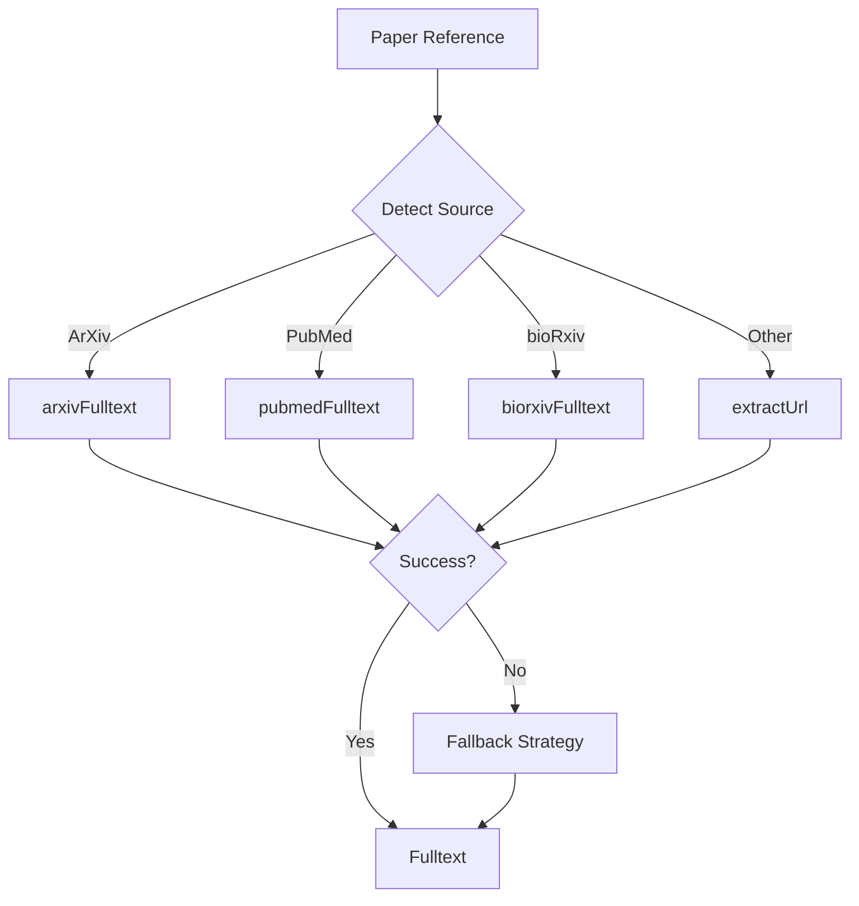

# Fulltext Retrieval Orchestration

> **Playbook ID**: PLAYBOOK-SDR-006
> **Domain**: ScholarDeepResearch-Workforce
> **Version**: 1.0.0

---

## Overview

Orchestrates fulltext retrieval across platforms using appropriate tools.

---

## Tool Selection Matrix

| Source | Primary Tool | Fallback |
|--------|--------------|----------|
| Any URL | extractUrl | Manual download |
| ArXiv | arxivFulltext | extractUrl on PDF |
| PubMed | pubmedFulltext | extractUrl on PMC |
| bioRxiv | biorxivFulltext | extractUrl on PDF |
| General | extractUrl | WebSearchReranked for alt source |

---

## Retrieval Protocol

---

## Fallback Strategies

1. **DOI Resolution**: Use DOI to find alternative access
2. **Preprint Search**: Check if preprint available
3. **Institutional Access**: Flag for user intervention
4. **Open Access**: Search for OA version

---

## Memory Keys

| Key | Purpose |
|-----|---------|
| `fulltext.retrieved[]` | Successfully retrieved papers |
| `fulltext.failed[]` | Failed retrieval attempts |
| `fulltext.fallback_used` | Fallback strategy count |

---

*Playbook PLAYBOOK-SDR-006 | Fulltext Retrieval Orchestration*
