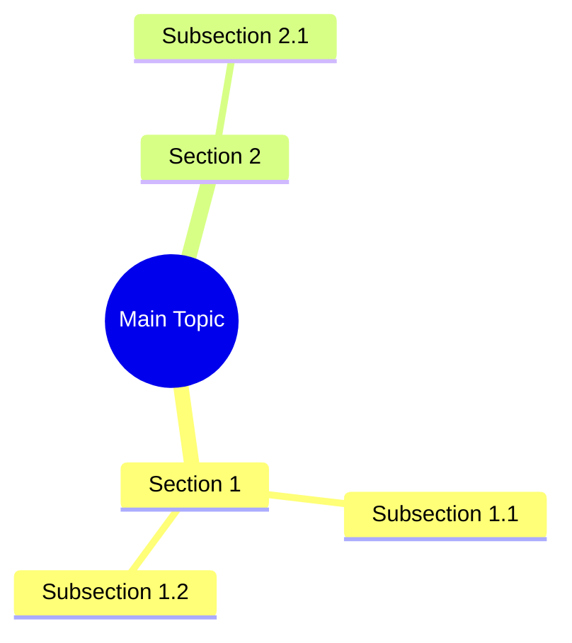

# Structure & Diagramming

> **Skill ID**: SKILL-SDR-009
> **Methods**: 🧠 Structure Mapping, 🖼️ Diagram Generation
> **Tools**: image generation

---

## Overview

Skills for visualizing document structure and generating diagrams.

---

## Method 5: Structure Mapping 🧠

**Process**:

1. Identify document's structural components
2. Create mindmap visualization
3. Show relationships between sections

**Output Format (Mermaid)**:

---

## Method 10: Diagram Generation 🖼️

**Process**:

1. Identify key concepts needing visualization
2. Select appropriate diagram type
3. Generate illustrative diagram

**Diagram Types**:

| Type | Use Case |
|------|----------|
| Flowchart | Processes, workflows |
| Sequence | Interactions, protocols |
| Class | Relationships, hierarchies |
| State | Transitions, stages |

**Tools**:

- Mermaid for text-based diagrams
- image generation for complex visuals

---

*Skill SKILL-SDR-009 | Structure & Diagramming*
