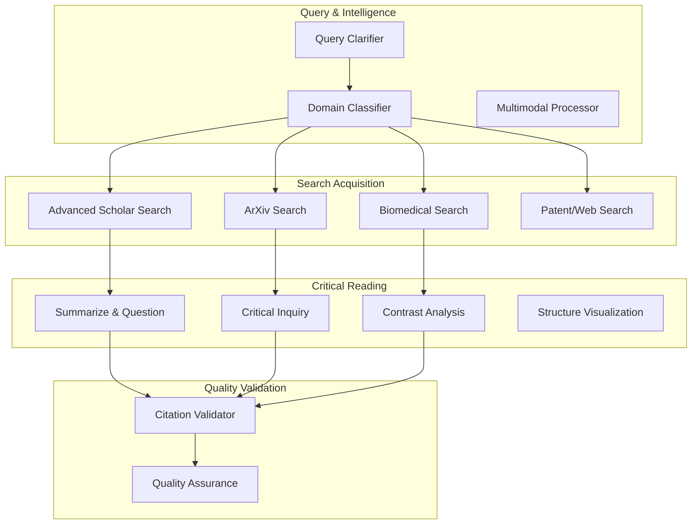

# Scholar Research Integration Patterns

> **Connecting ScholarDeepResearch-Workforce to Academic Intelligence**

---

## Overview

This document describes how the 22-worker ScholarDeepResearch-Workforce executes multi-database academic research with critical reading analysis.

---

## Integration Architecture

---

## Integration Patterns

### Pattern 1: Multi-Database Search Cascade

**Trigger**: User research query
**Flow**:

1. Query clarification (W01)
2. Domain classification (W02)
3. Parallel database search (W06-W08, W21)
4. Result merge and deduplication
5. Content extraction (W09)

### Pattern 2: Critical Reading Pipeline

**Trigger**: After content extraction
**Flow**:

1. Apply 10 Critical Reading Methods
2. Generate summaries with questions
3. Identify assumptions and contrasts
4. Create structure visualizations

### Pattern 3: Citation Validation Loop

**Trigger**: Before report generation
**Flow**:

1. Extract all citations
2. Validate DOI format and resolution
3. HTTP test all links
4. Flag invalid citations
5. Calculate E-O score

---

## Trigger Commands

| Command | Purpose | Workers |
|---------|---------|---------|
| `search:scholar` | Google Scholar search | W06 |
| `search:arxiv` | ArXiv preprint search | W07 |
| `search:pubmed` | PubMed/bioRxiv search | W08 |
| `read:critical` | Apply critical reading | W11-W14 |
| `validate:citations` | Citation validation | W18 |
| `report:generate` | Generate research report | W20 |
| `research:full` | Full 8-tier pipeline | All 22 workers |

---

## Configuration

See [research-config.json](research-config.json) for agent mappings and quality gates.

---

*Integration Patterns v1.0 | ScholarDeepResearch-Workforce*
