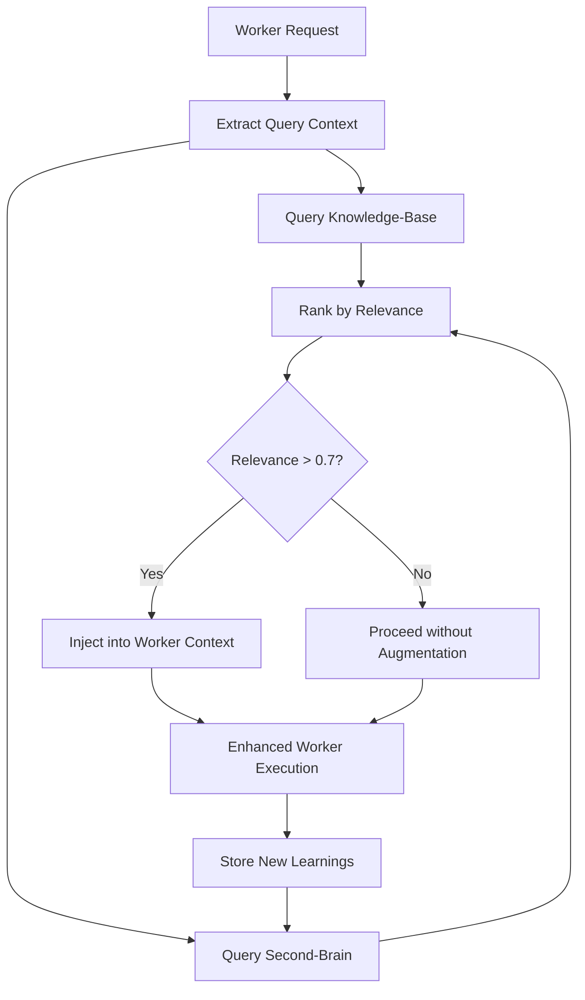

# Context Retrieval Engine

> **Automatic Context Augmentation for Research Quality**

---

## Overview

The Retrieval Engine automatically queries the Context-Layer before each worker execution to enhance research quality through relevant context injection.

---

## Retrieval Flow

---

## Retrieval Patterns

### Pattern 1: Playbook Retrieval

**Source**: Knowledge-Base/PLAYBOOKS/
**Query**: Research task type + domain
**Injection Point**: Worker prompt preamble

### Pattern 2: Skill Retrieval

**Source**: Knowledge-Base/SKILLS/
**Query**: Tool requirements + method selection
**Injection Point**: Technical context section

### Pattern 3: Experience Retrieval

**Source**: Knowledge-Base/EXPERIENCE/
**Query**: Similar past research patterns
**Injection Point**: Best practices section

### Pattern 4: Brain Intelligence

**Source**: Second-Brain/Brain/
**Query**: Autonomy + escalation context
**Injection Point**: Decision context

### Pattern 5: Memory Recall

**Source**: Second-Brain/Memory/
**Query**: Session history + cached results
**Injection Point**: History context

---

## Quality Improvement Hooks

| Worker Tier | Retrieval Priority | Sources |
|-------------|-------------------|---------|
| Tier 1 (Query) | Query patterns | PLAYBOOKS, EXPERIENCE |
| Tier 2 (Strategy) | Search strategies | SKILLS, Brain |
| Tier 3 (Search) | Database patterns | SKILLS, PLAYBOOKS |
| Tier 4 (Extraction) | Extraction rules | SKILLS, EXPERIENCE |
| Tier 5 (Reading) | Critical methods | PLAYBOOKS, SKILLS |
| Tier 6 (Analysis) | Analysis patterns | SKILLS, Brain |
| Tier 7 (Validation) | Quality standards | PLAYBOOKS, EXPERIENCE |
| Tier 8 (Delivery) | Report templates | Memory, Brain |

---

## Configuration

See [index-config.json](index-config.json) for indexing and search configuration.

---

*Retrieval Engine v1.0 | ScholarDeepResearch-Workforce*
