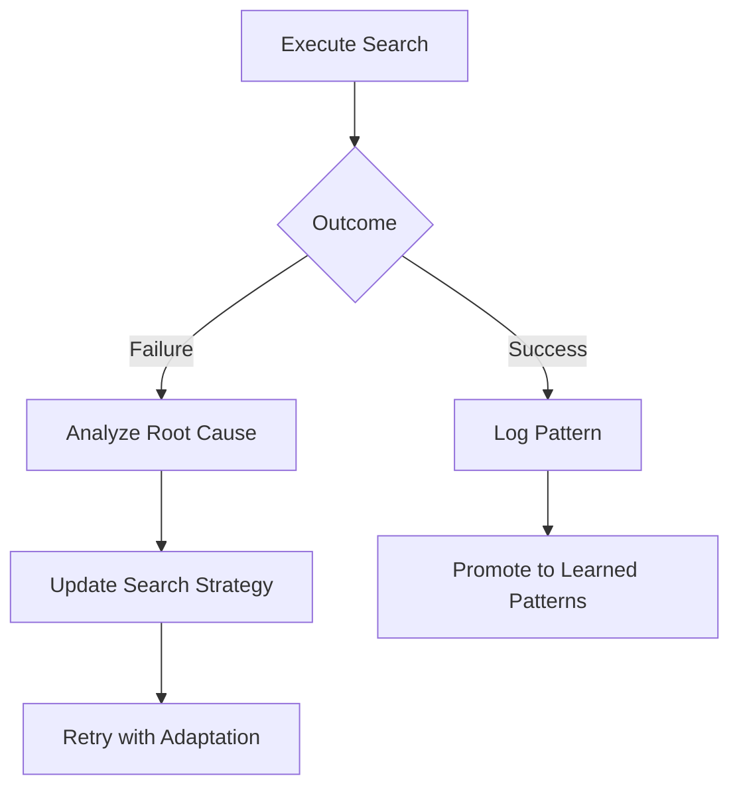

# Full Autonomy Framework

> L3 Delegated Autonomy specification for ScholarDeepResearch-Workforce.

## Autonomy Levels

### Level 3: Delegated Autonomy

The workforce can execute complete research pipelines with strategic human checkpoints.

| Phase | Autonomy Level | Human Touchpoint |
|-------|----------------|------------------|
| Query Clarification | Supervised | Approval if ambiguous |
| Domain Classification | Full Autonomy | None |
| Database Search | Full Autonomy | None |
| Fulltext Retrieval | Full Autonomy | None |
| Critical Reading | Delegated | Method selection override |
| Data Analysis | Delegated | Statistical approach validation |
| Citation Validation | Full Autonomy | None |
| Quality Assessment | Supervised | E-O score review |
| Report Generation | Delegated | Format approval |

## Decision Boundaries

### Autonomous Decisions

1. **Search Strategy Optimization**: Adjust Boolean queries based on initial yield
2. **Database Selection**: Route queries to optimal sources
3. **Critical Reading Method**: Apply appropriate methods per document type
4. **Citation Formatting**: Apply citation styles automatically
5. **Visualization Generation**: Create charts and diagrams

### Human-Required Decisions

1. **Query Ambiguity**: Unclear research scope or domain
2. **Conflicting Evidence**: Sources with contradictory findings
3. **Report Type Selection**: For complex multi-domain queries
4. **Quality Overrides**: Override E-O score thresholds

## Escalation Triggers

```yaml
escalation_triggers:
  - condition: "confidence_score < 0.7"
    action: "request_human_review"
  - condition: "conflicting_sources_detected"
    action: "flag_for_synthesis_discussion"
  - condition: "query_ambiguity > 0.5"
    action: "request_query_clarification"
```

## Self-Improvement Loop



---

*Autonomy v1.0.0 | ScholarDeepResearch-Workforce*
