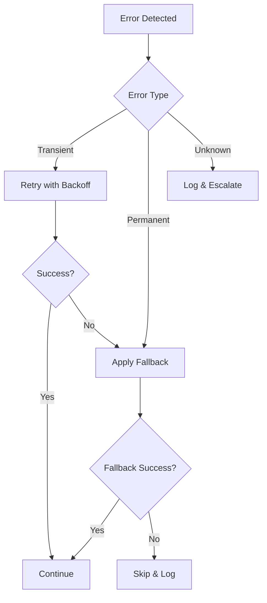

# Self-Healing Protocols

> Error recovery and resilience mechanisms.

## Recovery Strategies

### Search Failures

| Error Type | Detection | Recovery |
|------------|-----------|----------|
| Empty results | 0 results returned | Broaden query, try alternative database |
| Timeout | > 30s response | Retry with backoff, switch to fallback |
| Rate limit | 429 response | Exponential backoff, rotate sources |
| Invalid query | Syntax error | Auto-correct common patterns |

### Extraction Failures

| Error Type | Detection | Recovery |
|------------|-----------|----------|
| PDF unavailable | 403/404 response | Try alternative URL, skip and log |
| Parsing error | Exception raised | Fallback to basic extraction |
| Encoding issue | Unicode error | Auto-detect and convert encoding |

### Validation Failures

| Error Type | Detection | Recovery |
|------------|-----------|----------|
| DOI invalid | Resolution fails | Flag as unverified, continue |
| Link dead | HTTP error | Search for alternative, flag |
| Citation mismatch | Metadata conflict | Log discrepancy, use primary source |

## Recovery Flow

---

*Self-Healing v1.0.0 | ScholarDeepResearch-Workforce*
