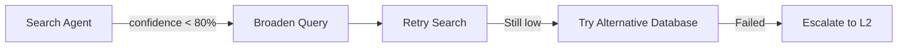

# Escalation Matrix

> Human escalation pathways for decisions exceeding autonomy limits.

## Escalation Levels

| Level | Trigger | Response Time | Resolver |
|-------|---------|---------------|----------|
| **L1** | Low confidence (70-80%) | Immediate | System retry |
| **L2** | Ambiguous query | User response | User clarification |
| **L3** | Conflicting sources | 24 hours | Domain expert |
| **L4** | Critical error | Immediate | System administrator |

## Escalation Workflows

### L1: Low Confidence Search



### L2: Ambiguous Query

```yaml
trigger: "query_ambiguity > 0.5"
workflow:
  1. Present disambiguation options to user
  2. User selects clarification
  3. Re-execute with clarified query
  4. Log clarification pattern for learning
```

### L3: Conflicting Sources

```yaml
trigger: "conflicting_evidence_detected"
workflow:
  1. Document all conflicting sources
  2. Present synthesis options
  3. Request domain expert review
  4. Apply expert decision to synthesis
```

## Contact Matrix

| Role | Responsibilities | Notification Method |
|------|------------------|---------------------|
| User | Query clarification, format selection | In-chat prompt |
| Domain Expert | Conflict resolution | Email notification |
| System Admin | Critical errors | System alert |

---

*Escalation Matrix v1.0.0 | ScholarDeepResearch-Workforce*
</Parameter>
<parameter name="Complexity">2
