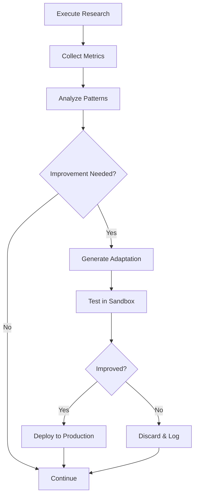

# Self-Evolution Engine

> Continuous learning and improvement architecture.

## Evolution Mechanisms

### 1. Pattern Recognition

```yaml
pattern_detection:
  source: "execution_history"
  analysis:
    - success_patterns: "Identify high-quality search strategies"
    - failure_patterns: "Detect common search failures"
    - optimization_opportunities: "Find efficiency gains"
  output: "Memory/Evolution/learned-patterns.json"
```

### 2. Behavioral Adaptation

```yaml
adaptation_triggers:
  - metric: "search_relevance"
    threshold: "<0.80"
    action: "adjust_query_engineering"
  - metric: "citation_validity"
    threshold: "<1.00"
    action: "enhance_validation_rules"
  - metric: "eo_score"
    threshold: "<0.85"
    action: "refine_quality_thresholds"
```

### 3. Knowledge Accumulation

```yaml
knowledge_sources:
  - completed_searches: "Extract query patterns"
  - user_feedback: "Learn from clarifications"
  - reading_outcomes: "Refine method selection"
```

## Evolution Lifecycle



## Metrics Tracked

| Category | Metrics |
|----------|---------|
| **Search** | Relevance score, source diversity, retrieval rate |
| **Reading** | Summary quality, method coverage |
| **Validation** | Citation accuracy, link validity |
| **Efficiency** | Time per phase, cost per query |
| **Quality** | E-O score, user satisfaction |

---

*Self-Evolution Engine v1.0.0 | ScholarDeepResearch-Workforce*
