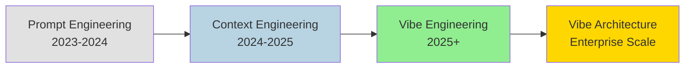
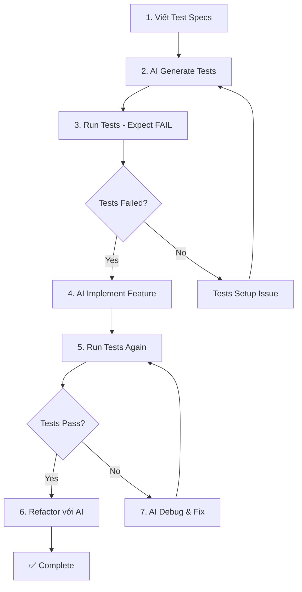

# Hướng Dẫn Thực Hành Tốt Nhất Viết Prompt cho Vibe Coding

> **ScholarDeepResearch-Workforce v2.0.0**  
> Session: `2026-01-31_vibe_coding_prompt_best_practices`  
> Generated: 2026-01-31T13:34:00+07:00

---

## Executive Summary

"**Vibe Coding**" là thuật ngữ được **Andrej Karpathy** đặt ra vào đầu năm 2025 để mô tả phương pháp phát triển phần mềm với sự hỗ trợ của AI. Trong đó, các lập trình viên mô tả mục tiêu bằng ngôn ngữ tự nhiên và AI sẽ tạo ra code thông qua quy trình prompting lặp đi lặp lại.

Tài liệu này tổng hợp **các hướng dẫn thực hành tốt nhất** để viết prompt hiệu quả trong môi trường Vibe Coding, bao gồm các công cụ như **Cursor**, **Claude Code**, **GitHub Copilot**, và các AI coding assistant khác.

---

## 1. Vibe Coding Là Gì?

### 1.1 Định Nghĩa

| Thuộc Tính | Mô Tả |
|------------|-------|
| **Khái niệm** | Lập trình viên hướng dẫn AI LLM tạo code thông qua prompting lặp |
| **Trọng tâm** | Mô tả ngôn ngữ tự nhiên thay vì code từng dòng |
| **Mục tiêu** | Làm cho phát triển phần mềm trực quan và dễ tiếp cận hơn |
| **Cha đẻ** | Andrej Karpathy (Q1/2025) |

### 1.2 Sự Tiến Hóa của Paradigm



**Giải thích:**

- **Prompt Engineering**: Tập trung vào cấu trúc và độ chính xác của instruction
- **Context Engineering**: Tối ưu hóa toàn bộ context window với thông tin phù hợp
- **Vibe Engineering**: Định nghĩa behavior và constraint rõ ràng cho AI agents
- **Vibe Architecture**: Orchestration quy mô enterprise với many-agent systems

---

## 2. Nguyên Tắc Cốt Lõi

### 2.1 Clarity & Specificity (Rõ Ràng & Cụ Thể)

> [!IMPORTANT]
> Prompt phải ngắn gọn, cụ thể, và rõ ràng. Không sử dụng hướng dẫn mơ hồ.

| Đúng ✅ | Sai ❌ |
|---------|--------|
| "Tạo React component hiển thị bảng user với pagination, mỗi trang 10 rows" | "Làm một cái bảng đẹp" |
| "Viết Python function sắp xếp list số nguyên theo bubble sort, có docstring" | "Viết code sắp xếp" |
| "Thêm error handling cho API call, throw custom exception khi status != 200" | "Xử lý lỗi đi" |

**Checklist:**

- [ ] Goal: Mục tiêu cuối cùng là gì?
- [ ] Technology: Framework/language nào?
- [ ] Styling: Có yêu cầu UI/UX cụ thể?
- [ ] Functionality: Tính năng chi tiết?
- [ ] Constraints: Giới hạn và điều kiện?

### 2.2 Modularization & Iteration (Module Hóa & Lặp)

> [!TIP]
> Chia task lớn thành các bước nhỏ, dễ quản lý. Xây dựng từ đơn giản đến phức tạp.

**Vòng lặp Vibe Coding:**

```
┌─────────────┐     ┌─────────────┐     ┌─────────────┐     ┌─────────────┐
│   PROMPT    │────▶│    CODE     │────▶│    TEST     │────▶│  FEEDBACK   │
│  (Mô tả)    │     │  (AI tạo)   │     │  (Verify)   │     │  (Điều chỉnh)│
└─────────────┘     └─────────────┘     └─────────────┘     └──────┬──────┘
       ▲                                                           │
       └───────────────────────────────────────────────────────────┘
                              NEW PROMPT
```

**Ví dụ phân rã task:**

```markdown
# Task: Build E-commerce Shopping Cart

## Phase 1: Data Model
Prompt 1: "Định nghĩa TypeScript interface cho CartItem với id, productId, quantity, price"
Prompt 2: "Tạo Cart type chứa array CartItem và total calculation methods"

## Phase 2: Core Logic  
Prompt 3: "Viết addToCart function với validation quantity > 0"
Prompt 4: "Implement removeFromCart và updateQuantity functions"

## Phase 3: UI Component
Prompt 5: "Tạo CartList React component render danh sách items"
Prompt 6: "Thêm CartSummary component hiển thị total và checkout button"

## Phase 4: Integration
Prompt 7: "Kết nối components với CartContext state management"
Prompt 8: "Thêm localStorage persistence để giữ cart khi reload"
```

### 2.3 Context Engineering (Kỹ Thuật Ngữ Cảnh)

> [!CAUTION]
> Context Engineering quan trọng hơn Prompt Engineering đơn thuần. Tối ưu toàn bộ context window, không chỉ instruction.

**3 Yếu Tố Context:**

| Yếu Tố | Mô Tả | Ví Dụ |
|--------|-------|-------|
| **Right Information** | Thông tin cần thiết | Architecture diagrams, API specs |
| **Right Format** | Định dạng phù hợp | JSON, Markdown, Code snippets |
| **Right Time** | Thời điểm đúng | Khi bắt đầu task, không phải giữa chừng |

**Role Assignment:**

```markdown
# Gán vai trò cho AI

## Ví dụ tốt:
"Bạn là Senior Backend Developer với 10 năm kinh nghiệm Python/FastAPI.
Bạn đặt priority cho:
- Type safety với Pydantic models
- Comprehensive error handling
- Unit test coverage > 80%
- Clean code principles (SOLID, DRY)"

## Ví dụ xấu:
"Viết code backend cho tôi"
```

---

## 3. Rules Files: .cursorrules & CLAUDE.md

### 3.1 Cursor Rules (`.cursorrules`)

**Vị trí:** `.cursor/rules/` hoặc root `.cursorrules`

**Cấu trúc mẫu:**

```markdown
# Project Rules for Cursor AI

## Tech Stack
- Language: TypeScript 5.x
- Framework: Next.js 14 (App Router)
- Styling: Tailwind CSS v4
- Database: PostgreSQL + Prisma ORM
- Testing: Vitest + React Testing Library

## Coding Conventions
- Use functional components with hooks
- Prefer named exports over default exports  
- All functions must have JSDoc comments
- Maximum file length: 300 lines
- Use absolute imports from @/

## Naming Patterns
- Components: PascalCase (UserProfile.tsx)
- Hooks: camelCase with 'use' prefix (useAuth.ts)
- Utils: camelCase (formatDate.ts)
- Constants: SCREAMING_SNAKE_CASE

## File Structure
```

src/
├── app/           # Next.js App Router pages
├── components/    # Reusable UI components
├── hooks/         # Custom React hooks
├── lib/           # Utilities and helpers
├── services/      # API and external services
└── types/         # TypeScript type definitions

```

## Forbidden Patterns
- No `any` type
- No inline styles
- No console.log in production code
- No hardcoded strings (use constants/i18n)

## Testing Requirements
- All exported functions must have unit tests
- Components must have snapshot tests
- API routes must have integration tests
```

### 3.2 Claude Code Rules (`CLAUDE.md`)

**Vị trí:** Root project directory

**Cấu trúc mẫu:**

```markdown
# CLAUDE.md - Project Guidelines for Claude Code

## Project Overview
E-commerce platform với 3 modules chính:
1. Product Catalog (read-heavy, caching critical)
2. Order Management (transactional, ACID required)
3. User Authentication (security-first)

## Architecture
- Microservices architecture
- Event-driven communication (RabbitMQ)
- API Gateway pattern (Kong)

## Key Commands
- `pnpm dev` - Start development server
- `pnpm test` - Run test suite
- `pnpm lint` - Check code quality
- `pnpm db:migrate` - Run database migrations

## Coding Standards
1. **Error Handling**: Mọi async operation phải có try-catch
2. **Validation**: Input validation ở boundary (API layer)
3. **Logging**: Structured logging với Winston
4. **Security**: Never log sensitive data (passwords, tokens)

## Current Sprint Focus
- Feature: Implement wishlist functionality
- Bug: Fix race condition in checkout flow
- Tech Debt: Migrate from Jest to Vitest

## Constraints
- Response time < 200ms for API endpoints
- Bundle size < 300KB for initial load
- Support browsers: Chrome 90+, Firefox 88+, Safari 14+
```

---

## 4. Advanced Prompting Techniques

### 4.1 Chain-of-Thought Emulation

```markdown
# Yêu cầu AI giải thích reasoning

Prompt: "Implement authentication middleware cho Express.js.
Trước khi viết code, hãy giải thích:
1. Authentication flow sẽ như thế nào?
2. Những edge cases cần xử lý?
3. Tại sao chọn approach này thay vì alternatives?"
```

### 4.2 Error-Forward Prompting

```markdown
# Khi gặp lỗi, forward cho AI debug

Prompt: "Code của bạn throw error sau:
```

TypeError: Cannot read property 'map' of undefined at UserList.tsx:23

```

Context: data được fetch từ API có thể null khi loading.
Hãy fix bug và thêm loading state handling."
```

### 4.3 Comparative Prompting

```markdown
# Yêu cầu multiple solutions với trade-offs

Prompt: "Implement pagination cho product listing.
Đưa ra 3 approaches:
1. Offset-based pagination
2. Cursor-based pagination  
3. Keyset pagination

Với mỗi approach, phân tích:
- Pros/Cons
- Performance characteristics
- Use cases phù hợp

Recommend approach tốt nhất cho dataset ~1M products."
```

### 4.4 Meta-Prompting

```markdown
# Prompting có cấu trúc intentional

## Template: Feature Implementation

### 1. Specification
- Feature: [Tên tính năng]
- User Story: As a [role], I want [goal] so that [benefit]
- Acceptance Criteria: [List các điều kiện]

### 2. Technical Design
- Components affected: [List]
- API changes: [List endpoints]
- Database changes: [Schema modifications]

### 3. Implementation Request
[Actual implementation prompt]

### 4. Testing Expectations
- Unit tests cho: [List functions]
- Integration tests cho: [List flows]
```

### 4.5 Reverse-Prompting

```markdown
# Yêu cầu AI tạo reusable prompt từ solution

Prompt: "Đây là code tôi vừa viết để implement rate limiting:
[code block]

Hãy viết một prompt template có thể tái sử dụng để generate 
similar rate limiting implementation cho các project khác.
Include variables cho: max requests, time window, và response format."
```

---

## 5. Test-Driven Vibe Coding (TDD)

> [!NOTE]
> TDD là best practice quan trọng trong Vibe Coding để đảm bảo code quality và prevent regressions.

### 5.1 TDD Workflow với AI



### 5.2 TDD Prompt Template

```markdown
# TDD Session for: [Feature Name]

## Step 1: Test Specification
"Viết test cases cho calculateDiscount function với các scenarios:
- No discount khi cart < 100$
- 10% discount khi cart >= 100$
- 20% discount khi cart >= 500$ VÀ user là VIP member
- Edge case: negative values, empty cart"

## Step 2: Verify Tests Fail
[Run tests, confirm họ fail như expected]

## Step 3: Implementation
"Implement calculateDiscount function để pass tất cả tests trên.
Requirements:
- Pure function (no side effects)
- Type-safe với TypeScript
- Handle edge cases gracefully"

## Step 4: Refactor
"Refactor implementation để:
- Extract magic numbers thành named constants
- Add JSDoc documentation
- Improve readability nếu cần"
```

---

## 6. Session Management & Context Hygiene

### 6.1 Context Window Best Practices

| Practice | Rationale |
|----------|-----------|
| **Fresh sessions cho new tasks** | Tránh context drift từ conversations trước |
| **Giữ context window ngắn** | AI performs tốt hơn với focused context |
| **Clear conversation khi switch domain** | Tránh AI confuse giữa different codebases |
| **Reference files explicitly** | Đừng assume AI nhớ files từ turns trước |

### 6.2 Khi Nào Start New Session

- ✅ Bắt đầu feature hoàn toàn mới
- ✅ Switch sang project/codebase khác
- ✅ AI bắt đầu đưa ra suggestions không liên quan
- ✅ Sau khi hoàn thành một milestone lớn
- ❌ Giữa chừng một implementation task
- ❌ Khi đang debug một issue (cần history)

---

## 7. Tool-Specific Guidelines

### 7.1 Cursor AI

| Feature | Best Practice |
|---------|---------------|
| **Composer** | Sử dụng cho multi-file changes |
| **Chat** | Dùng cho Q&A và quick fixes |
| **@symbols** | Reference files/functions explicitly |
| **Cmd+K** | Inline edits với focused context |
| **Rules** | Maintain `.cursorrules` cho consistency |

### 7.2 Claude Code

| Feature | Best Practice |
|---------|---------------|
| **CLAUDE.md** | Cập nhật khi project evolves |
| **@mentions** | Reference specific files |
| **Multi-turn** | Maintain conversation flow |
| **Code review** | Yêu cầu explain before approve |

### 7.3 GitHub Copilot

| Feature | Best Practice |
|---------|---------------|
| **Copilot Chat** | Context-aware Q&A |
| **Inline suggestions** | Accept với Tab, reject với Esc |
| **Comments** | Viết descriptive comments trước code |
| **Docstrings** | Cho AI context về function purpose |

---

## 8. Anti-Patterns (Những Điều Cần Tránh)

> [!WARNING]
> Tránh các anti-patterns sau để Vibe Coding hiệu quả hơn.

### 8.1 Vague Prompts

```markdown
# ❌ Sai
"Fix the bug"
"Make it better"
"Clean up the code"

# ✅ Đúng
"Fix null pointer exception ở line 45 khi user.profile undefined"
"Improve performance của search function bằng cách thêm debounce 300ms"
"Refactor UserService: extract validation logic vào separate validator class"
```

### 8.2 Overloaded Prompts

```markdown
# ❌ Sai: Quá nhiều requirements trong một prompt
"Tạo complete e-commerce app với login, products, cart, checkout, 
payment integration, admin panel, analytics, và deploy lên AWS"

# ✅ Đúng: Chia nhỏ
"Phase 1: Tạo Product model với Prisma schema"
"Phase 2: Implement CRUD API cho Products"
"Phase 3: Build ProductList UI component"
[Continue with more focused prompts...]
```

### 8.3 Blindly Accepting Code

```markdown
# ❌ Sai
AI generate code → Copy paste → Deploy

# ✅ Đúng
AI generate code → Review → Test → Understand → Modify if needed → Deploy
```

### 8.4 Security Outsourcing

```markdown
# ❌ Nguy hiểm
"Implement authentication" (rồi trust completely)

# ✅ An toàn
"Implement authentication using [specific library].
Ensure:
- Password hashing với bcrypt (cost factor 12)
- JWT với short expiry (15 minutes)
- Refresh token rotation
- Rate limiting on login endpoints
After generation, tôi sẽ security review trước khi merge."
```

---

## 9. Productivity Metrics

### 9.1 Vibe Coding Efficiency Indicators

| Metric | Target | Measurement |
|--------|--------|-------------|
| **Prompt Iterations** | < 3 per feature | Số lần phải refine prompt |
| **Code Acceptance Rate** | > 70% | % code AI tạo được giữ nguyên |
| **Bug Introduction Rate** | < 10% | % AI code có bugs post-deploy |
| **Time to First Working Code** | -50% vs manual | So sánh với coding thủ công |
| **Context Refresh Rate** | < 1 per hour | Số lần phải start new session |

### 9.2 Quality Gates

```markdown
# Trước khi merge AI-generated code:

## Mandatory Checks
- [ ] Code compiles/runs without errors
- [ ] All existing tests pass
- [ ] New tests written cho new code
- [ ] Linting passes (ESLint, Prettier)
- [ ] Type checking passes

## Security Review (for sensitive areas)
- [ ] Input validation present
- [ ] No hardcoded secrets
- [ ] SQL injection prevention
- [ ] XSS prevention (if UI)
- [ ] Authentication/Authorization correct

## Code Review
- [ ] Logic is correct và understandable
- [ ] Follows project conventions
- [ ] No unnecessary complexity
- [ ] Performance acceptable
```

---

## 10. Summary & Recommendations

### 10.1 Key Takeaways

1. **Context > Prompt**: Tối ưu toàn bộ context window, không chỉ instruction text
2. **Iterate Quickly**: Vibe coding là về iteration - đừng cố perfect prompt từ đầu
3. **Maintain Rules Files**: `.cursorrules` và `CLAUDE.md` là persistent system prompts
4. **TDD Works**: Test-first approach với AI reduces bugs significantly
5. **Stay in Control**: AI là collaborator, không phải autopilot
6. **Security Mindset**: Never outsource security thinking to AI

### 10.2 Getting Started Checklist

- [ ] Tạo `.cursorrules` hoặc `CLAUDE.md` cho project
- [ ] Define coding conventions và tech stack trong rules
- [ ] Practice iterative prompting với small tasks
- [ ] Establish review process cho AI-generated code
- [ ] Build prompt library cho common tasks
- [ ] Track metrics để improve workflow

---

## References

1. Andrej Karpathy - "Vibe Coding" concept (2025)
2. Medium - Vibe Coding vs Prompt Engineering
3. Cursor Documentation - Rules Configuration
4. Claude Code - CLAUDE.md Guidelines
5. GitHub Copilot - Best Practices 2025
6. arXiv:2601.14192v1 - Toward Efficient Agents (Efficiency Patterns)

---

*Báo cáo được tạo bởi ScholarDeepResearch-Workforce v2.0.0*  
*Session: 2026-01-31_vibe_coding_prompt_best_practices*
