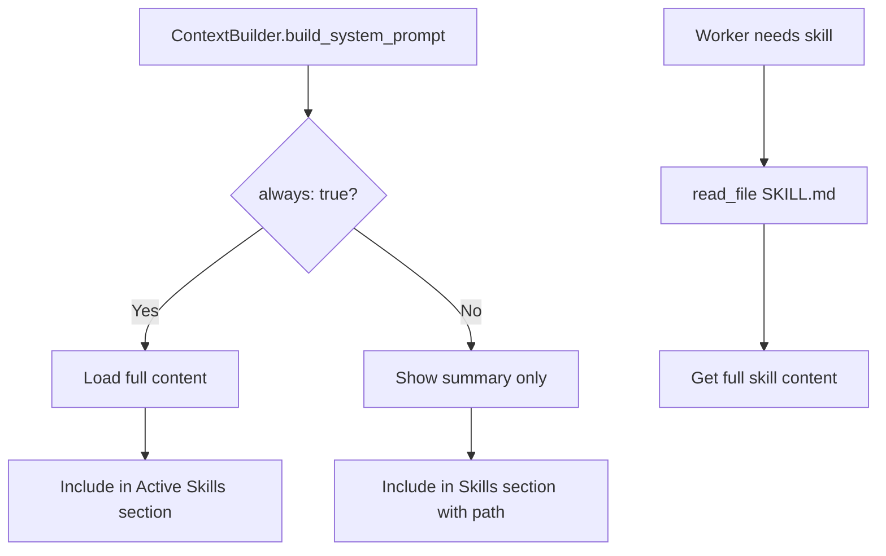

# ContextBuilder - Prompt Assembly

> **Module Documentation**: vnBuilderPro-MAS2026 CoreModules
>
> Builds the complete context (system prompt + messages) for worker LLM calls.

---

## 📋 Overview

| Attribute | Value |
|-----------|-------|
| **Source** | nanobot `agent/context.py` pattern |
| **Dependencies** | MemoryStore, SkillsLoader |
| **Bootstrap Files** | 5 (AGENTS, SOUL, USER, TOOLS, IDENTITY) |
| **Integration** | 22 Worker pipelines |

---

## 🏗️ Class Structure

```python
class ContextBuilder:
    """
    Builds the context (system prompt + messages) for workers.
    
    Assembles bootstrap files, memory, skills, and conversation history
    into a coherent prompt for the LLM.
    """
    
    BOOTSTRAP_FILES = ["AGENTS.md", "SOUL.md", "USER.md", "TOOLS.md", "IDENTITY.md"]
    
    def __init__(self, workspace: Path):
        self.workspace = workspace
        self.bootstrap_dir = workspace / "Context-Layer" / "Second-Brain" / "bootstrap"
        self.memory = MemoryStore(workspace)
        self.skills = SkillsLoader(workspace)
```

---

## 📚 Bootstrap Files

| File | Purpose | Location |
|------|---------|----------|
| `AGENTS.md` | Agent behavior instructions | bootstrap/ |
| `SOUL.md` | Personality and tone | bootstrap/ |
| `USER.md` | User-specific preferences | bootstrap/ |
| `TOOLS.md` | Tool usage guidelines | bootstrap/ |
| `IDENTITY.md` | Custom identity overrides | bootstrap/ |

---

## 🔧 Methods

### `build_system_prompt(skill_names: list[str] | None = None) -> str`

Build the system prompt from bootstrap files, memory, and skills.

```python
def build_system_prompt(self, skill_names: list[str] | None = None) -> str:
    """
    Build the system prompt from bootstrap files, memory, and skills.
    
    Args:
        skill_names: Optional list of skills to include.
    
    Returns:
        Complete system prompt.
    """
    parts = []
    
    # Core identity
    parts.append(self._get_identity())
    
    # Bootstrap files
    bootstrap = self._load_bootstrap_files()
    if bootstrap:
        parts.append(bootstrap)
    
    # Memory context
    memory = self.memory.get_memory_context()
    if memory:
        parts.append(f"# Memory\n\n{memory}")
    
    # Skills - progressive loading
    # 1. Always-loaded skills: include full content
    always_skills = self.skills.get_always_skills()
    if always_skills:
        always_content = self.skills.load_skills_for_context(always_skills)
        if always_content:
            parts.append(f"# Active Skills\n\n{always_content}")
    
    # 2. Available skills: only show summary
    skills_summary = self.skills.build_skills_summary()
    if skills_summary:
        parts.append(f"""# Skills

The following skills extend your capabilities. Read the full skill file when needed.

{skills_summary}""")
    
    return "\n\n---\n\n".join(parts)
```

### `_get_identity() -> str`

Get the core identity section for vnBuilderPro-MAS2026 workers.

```python
def _get_identity(self) -> str:
    """Get the core identity section."""
    from datetime import datetime
    now = datetime.now().strftime("%Y-%m-%d %H:%M (%A)")
    workspace_path = str(self.workspace.resolve())
    
    return f"""# vnBuilderPro-MAS2026 Worker

You are a worker in the vnBuilderPro-MAS2026 HierarchicalSwarm.
528 agents | 22 workers | 8-tier architecture | L5 Autonomous

## Current Time
{now}

## Workspace
Your workspace is at: {workspace_path}
- Memory files: {workspace_path}/Context-Layer/Second-Brain/Memory/MEMORY.md
- Daily logs: {workspace_path}/Context-Layer/Second-Brain/Memory/DailyLogs/YYYY-MM-DD.md
- Skills: {workspace_path}/Context-Layer/Knowledge-Base/SKILLS/

## Capabilities
- Execute assigned ROMA pipeline tasks
- Read, write, and edit files
- Access Knowledge-Base (PLAYBOOKS, SKILLS, EXPERIENCE)
- Communicate with other workers via Memory Bus
- Report results to tier orchestrator

IMPORTANT: Follow your assigned ROMA pipeline. Log significant events to DailyLogs.
When completing tasks, ensure quality gates are met before proceeding."""
```

### `build_messages(...) -> list[dict[str, Any]]`

Build the complete message list for an LLM call.

```python
def build_messages(
    self,
    history: list[dict[str, Any]],
    current_message: str,
    skill_names: list[str] | None = None,
    media: list[str] | None = None,
) -> list[dict[str, Any]]:
    """
    Build the complete message list for an LLM call.

    Args:
        history: Previous conversation messages.
        current_message: The new user message.
        skill_names: Optional skills to include.
        media: Optional list of local file paths for images/media.

    Returns:
        List of messages including system prompt.
    """
    messages = []

    # System prompt
    system_prompt = self.build_system_prompt(skill_names)
    messages.append({"role": "system", "content": system_prompt})

    # History
    messages.extend(history)

    # Current message (with optional image attachments)
    user_content = self._build_user_content(current_message, media)
    messages.append({"role": "user", "content": user_content})

    return messages
```

### `add_tool_result(...) -> list[dict[str, Any]]`

Add a tool result to the message list.

```python
def add_tool_result(
    self,
    messages: list[dict[str, Any]],
    tool_call_id: str,
    tool_name: str,
    result: str
) -> list[dict[str, Any]]:
    """Add a tool result to the message list."""
    messages.append({
        "role": "tool",
        "tool_call_id": tool_call_id,
        "name": tool_name,
        "content": result
    })
    return messages
```

### `add_assistant_message(...) -> list[dict[str, Any]]`

Add an assistant message to the message list.

```python
def add_assistant_message(
    self,
    messages: list[dict[str, Any]],
    content: str | None,
    tool_calls: list[dict[str, Any]] | None = None
) -> list[dict[str, Any]]:
    """Add an assistant message to the message list."""
    msg: dict[str, Any] = {"role": "assistant", "content": content or ""}
    
    if tool_calls:
        msg["tool_calls"] = tool_calls
    
    messages.append(msg)
    return messages
```

---

## 🔄 System Prompt Structure

```
┌─────────────────────────────────────────────────────────────────┐
│                         SYSTEM PROMPT                            │
├─────────────────────────────────────────────────────────────────┤
│ # vnBuilderPro-MAS2026 Worker                                    │
│ [Core identity, capabilities, workspace info]                    │
│                                                                  │
│ ---                                                              │
│                                                                  │
│ ## AGENTS.md (if exists)                                         │
│ [Agent behavior instructions]                                    │
│                                                                  │
│ ## SOUL.md (if exists)                                           │
│ [Personality and tone]                                           │
│                                                                  │
│ ## USER.md (if exists)                                           │
│ [User preferences]                                               │
│                                                                  │
│ ## TOOLS.md (if exists)                                          │
│ [Tool usage guidelines]                                          │
│                                                                  │
│ ---                                                              │
│                                                                  │
│ # Memory                                                         │
│ ## Long-term Memory                                              │
│ [Contents of MEMORY.md]                                          │
│                                                                  │
│ ## Today's Notes                                                 │
│ [Contents of DailyLogs/YYYY-MM-DD.md]                            │
│                                                                  │
│ ---                                                              │
│                                                                  │
│ # Active Skills                                                  │
│ [Full content of always-loaded skills]                           │
│                                                                  │
│ # Skills                                                         │
│ [Summary of available skills for progressive loading]            │
└─────────────────────────────────────────────────────────────────┘
```

---

## 💡 Progressive Skill Loading

ContextBuilder implements a progressive skill loading strategy:

1. **Always-Loaded Skills**: Skills marked `always: true` are fully included
2. **Available Skills**: Other skills show only summary, worker uses `read_file` to load full content when needed

This minimizes context size while maintaining skill availability.



---

## 🖼️ Media Handling

The `_build_user_content` method handles image attachments:

```python
def _build_user_content(self, text: str, media: list[str] | None) -> str | list[dict[str, Any]]:
    """Build user message content with optional base64-encoded images."""
    if not media:
        return text
    
    images = []
    for path in media:
        p = Path(path)
        mime, _ = mimetypes.guess_type(path)
        if not p.is_file() or not mime or not mime.startswith("image/"):
            continue
        b64 = base64.b64encode(p.read_bytes()).decode()
        images.append({
            "type": "image_url", 
            "image_url": {"url": f"data:{mime};base64,{b64}"}
        })
    
    if not images:
        return text
    return images + [{"type": "text", "text": text}]
```

---

## 📊 Worker Integration (6-Tier HierarchicalSwarm)

Each of the 22 workers uses ContextBuilder with tier-specific context:

| Tier | Name | Workers | Context Customization |
|------|------|---------|----------------------|
| 1 | Strategy | W01-W04 | Strategy playbooks, planning skills |
| 2 | Intelligence | W05-W08 | Research playbooks, intelligence skills |
| 3 | Content | W09-W14 | Content playbooks, creation skills (W14: aggregator) |
| 4 | Analysis | W15-W18 | Analysis playbooks, metrics skills |
| 5 | Validation | W19-W20 | Quality playbooks, compliance skills |
| 6 | Synthesis | W21-W22 | Synthesis playbooks, reporting skills |

---

## 🔄 Context Injection Methods

### `get_tier_context(tier: int) -> dict`

Get tier-level context from context-injection-config.json:

```python
def get_tier_context(self, tier: int) -> dict:
    """Get tier-specific context based on context-injection-config.json."""
    config = self._load_injection_config()
    tier_key = f"tier_{tier}"
    tier_config = config["tier_bindings"].get(tier_key, {})
    
    return {
        "name": tier_config.get("name"),
        "playbooks": tier_config.get("playbooks", []),
        "skills": tier_config.get("skills", []),
        "commands": tier_config.get("commands", []),
        "bootstrap": tier_config.get("bootstrap", []),
        "execution_mode": tier_config.get("execution_mode", "sequential")
    }
```

### `inject_context(worker_id: str) -> dict`

Inject worker-specific context:

```python
def inject_context(self, worker_id: str) -> dict:
    """Inject worker-specific context from context-injection-config.json."""
    config = self._load_injection_config()
    worker_config = config["worker_context_map"].get(worker_id, {})
    
    # Load bootstrap files specific to this worker
    bootstrap_content = self._load_bootstrap_files(
        filter=worker_config.get("bootstrap", [])
    )
    
    return {
        "tier": worker_config.get("tier"),
        "name": worker_config.get("name"),
        "primary_playbook": worker_config.get("primary_playbook"),
        "skills": worker_config.get("skills", []),
        "commands": worker_config.get("commands", []),
        "bootstrap_content": bootstrap_content,
        "role": worker_config.get("role")
    }
```

---

## 🔗 Related Modules

| Module | Relationship |
|--------|--------------|
| [MemoryStore](memory-store.md) | Provides memory context |
| [SkillsLoader](skills-loader.md) | Provides skills content |
| [AgentLoop](agent-loop.md) | Calls build_messages() |

---

*vnBuilderPro-MAS2026 CoreModules | ContextBuilder v2.3.2 | 6-Tier HierarchicalSwarm | Context Injection*
