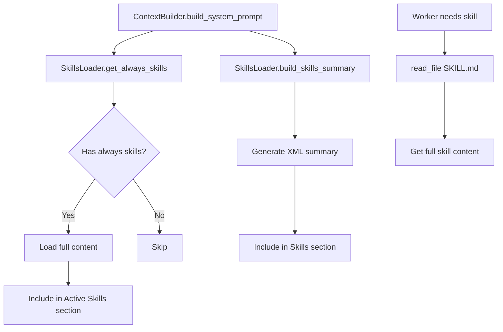

# SkillsLoader - Skills Management

> **Module Documentation**: vnBuilderPro-MAS2026 CoreModules
>
> Manages skill discovery, loading, and progressive context inclusion.

---

## 📋 Overview

| Attribute | Value |
|-----------|-------|
| **Source** | nanobot `agent/skills.py` pattern |
| **Skill Location** | Knowledge-Base/SKILLS/ |
| **Format** | SKILL.md with YAML frontmatter |
| **Loading** | Progressive (always vs on-demand) |

---

## 🏗️ Skills Directory Structure

```
Context-Layer/
├── Knowledge-Base/
│   └── SKILLS/                     # All workforce skills
│       ├── skill-format-standard.md   # Template
│       ├── roma-pipeline.md
│       ├── agent-specification.md
│       ├── prompt-engineering.md
│       ├── memory-contracts.md
│       ├── integration-patterns.md
│       ├── pattern-application.md
│       ├── testing-protocols.md
│       ├── packaging-deployment.md
│       ├── 09-dynamic-session-naming.md
│       ├── 10-phase-output-persistence.md
│       ├── 11-domain-knowledge-generation.md
│       └── 12-worker-taxonomy-design.md
```

---

## 📚 SKILL.md Format

```markdown
---
vnbuilder:
  name: skill-name
  description: Brief description of the skill
  always: false           # If true, always include in context
  tier: [1,2,3,4,5,6,7,8] # Applicable worker tiers
  requires:
    bins: [command1]      # Required CLI tools
    env: [API_KEY]        # Required environment variables
---

# Skill Name

Instructions for using this skill...
```

### Frontmatter Fields

| Field | Required | Type | Description |
|-------|----------|------|-------------|
| `name` | Yes | string | Unique skill identifier |
| `description` | Yes | string | Brief description (shown in summary) |
| `always` | No | boolean | Always load in context (default: false) |
| `tier` | No | array | Worker tiers that use this skill |
| `requires.bins` | No | array | Required CLI tools |
| `requires.env` | No | array | Required environment variables |

---

## 🔧 Class Structure

```python
class SkillsLoader:
    """
    Loader for workforce skills.
    
    Skills are markdown files (SKILL.md) that teach workers how to perform
    specific tasks or use certain tools.
    """
    
    def __init__(self, workspace: Path):
        self.workspace = workspace
        self.skills_dir = workspace / "Context-Layer" / "Knowledge-Base" / "SKILLS"
```

---

## 📚 Methods

### `list_skills(filter_unavailable: bool = True) -> list[dict]`

List all available skills.

```python
def list_skills(self, filter_unavailable: bool = True) -> list[dict]:
    """
    List all available skills.
    
    Args:
        filter_unavailable: If True, filter out skills with unmet requirements.
    
    Returns:
        List of skill info dicts with 'name', 'path', 'tier'.
    """
    skills = []
    
    if self.skills_dir.exists():
        for skill_file in self.skills_dir.glob("*.md"):
            if skill_file.name == "skill-format-standard.md":
                continue  # Skip template
            
            meta = self._get_skill_meta(skill_file)
            if filter_unavailable and meta:
                if not self._check_requirements(meta):
                    continue
            
            skills.append({
                "name": meta.get("name", skill_file.stem) if meta else skill_file.stem,
                "path": str(skill_file),
                "tier": meta.get("tier", []) if meta else []
            })
    
    return skills
```

### `load_skill(name: str) -> str | None`

Load a skill by name.

```python
def load_skill(self, name: str) -> str | None:
    """
    Load a skill by name.
    
    Args:
        name: Skill name (file stem without .md).
    
    Returns:
        Skill content or None if not found.
    """
    skill_file = self.skills_dir / f"{name}.md"
    if skill_file.exists():
        return skill_file.read_text(encoding="utf-8")
    
    # Try matching by frontmatter name
    for file in self.skills_dir.glob("*.md"):
        meta = self._get_skill_meta(file)
        if meta and meta.get("name") == name:
            return file.read_text(encoding="utf-8")
    
    return None
```

### `build_skills_summary() -> str`

Build a summary of all skills for progressive loading.

```python
def build_skills_summary(self) -> str:
    """
    Build a summary of all skills (name, description, path, availability).
    
    This is used for progressive loading - the worker can read the full
    skill content using read_file when needed.
    
    Returns:
        XML-formatted skills summary.
    """
    skills = self.list_skills(filter_unavailable=False)
    if not skills:
        return ""
    
    lines = []
    for skill in skills:
        meta = self._get_skill_meta_by_name(skill["name"])
        available = self._check_requirements(meta) if meta else True
        description = meta.get("description", "No description") if meta else "No description"
        tier = meta.get("tier", []) if meta else []
        
        missing = ""
        if not available and meta:
            missing = f' missing="{self._get_missing_requirements(meta)}"'
        
        tier_str = f' tier="{",".join(map(str, tier))}"' if tier else ""
        
        lines.append(f'<skill name="{skill["name"]}" '
                    f'path="{skill["path"]}" '
                    f'available="{str(available).lower()}"{missing}{tier_str}>'
                    f'{description}</skill>')
    
    return "\n".join(lines)
```

### `get_always_skills() -> list[str]`

Get skills marked as always=true.

```python
def get_always_skills(self) -> list[str]:
    """Get skills marked as always=true that meet requirements."""
    always_skills = []
    
    for skill in self.list_skills():
        meta = self._get_skill_meta_by_name(skill["name"])
        if meta and meta.get("always"):
            always_skills.append(skill["name"])
    
    return always_skills
```

### `get_tier_skills(tier: int) -> list[str]`

Get skills applicable to a specific tier.

```python
def get_tier_skills(self, tier: int) -> list[str]:
    """Get skills applicable to a specific worker tier."""
    tier_skills = []
    
    for skill in self.list_skills():
        meta = self._get_skill_meta_by_name(skill["name"])
        if meta:
            skill_tiers = meta.get("tier", [])
            if not skill_tiers or tier in skill_tiers:
                tier_skills.append(skill["name"])
    
    return tier_skills
```

### `load_skills_for_context(skill_names: list[str]) -> str`

Load specific skills for inclusion in worker context.

```python
def load_skills_for_context(self, skill_names: list[str]) -> str:
    """
    Load specific skills for inclusion in worker context.
    
    Args:
        skill_names: List of skill names to load.
    
    Returns:
        Formatted skills content.
    """
    parts = []
    
    for name in skill_names:
        content = self.load_skill(name)
        if content:
            # Strip frontmatter
            content = self._strip_frontmatter(content)
            parts.append(f"## {name}\n\n{content}")
    
    return "\n\n---\n\n".join(parts)
```

---

## 🔄 Progressive Loading Flow



---

## 📦 Skill Examples

### ROMA Pipeline Skill

```markdown
---
vnbuilder:
  name: roma-pipeline
  description: 6-stage ROMA worker execution pipeline
  always: true
  tier: [1,2,3,4,5,6,7,8]
---

# ROMA Pipeline

## Overview
The ROMA (Role-Orchestration-Methods-Activation) pipeline defines
standardized worker execution with 6 stages...
```

### Memory Contracts Skill

```markdown
---
vnbuilder:
  name: memory-contracts
  description: Memory Bus contract specifications for cross-worker state
  always: false
  tier: [3,6]
---

# Memory Contracts

## Overview
Defines typed keys for the Memory Bus shared state system...
```

### Domain-Specific Skill

```markdown
---
vnbuilder:
  name: healthcare-diagnostics
  description: Clinical reasoning patterns for healthcare workforces
  always: false
  tier: [1,4,5]
  requires:
    env: [MEDICAL_API_KEY]
---

# Healthcare Diagnostics

## HIPAA Compliance
...
```

---

## 🔍 Requirements Checking

Skills can specify requirements that must be met:

```python
def _check_requirements(self, skill_meta: dict) -> bool:
    """Check if skill requirements are met (bins, env vars)."""
    requires = skill_meta.get("requires", {})
    
    # Check binary requirements
    for bin_name in requires.get("bins", []):
        if not shutil.which(bin_name):
            return False
    
    # Check environment variables
    for env_var in requires.get("env", []):
        if not os.environ.get(env_var):
            return False
    
    return True
```

---

## 💡 Creating New Skills

1. Create file: `Context-Layer/Knowledge-Base/SKILLS/my-skill.md`
2. Add YAML frontmatter:

```markdown
---
vnbuilder:
  name: my-skill
  description: Does something useful
  always: false
  tier: [3,4,5]
  requires:
    bins: [my-tool]
---

# My Custom Skill

## Overview
Description of what this skill does.

## Usage
How workers should use this skill.

## Examples
Concrete examples of skill application.
```

---

## 📊 Tier-Skill Mapping

| Tier | Default Skills |
|------|----------------|
| 1 (Research) | pattern-research, domain-analysis |
| 2 (Requirements) | requirements-parsing, capability-mapping |
| 3 (Architecture) | swarm-selection, memory-bus-design |
| 4 (Knowledge) | playbook-generation, skill-documentation |
| 5 (Agent) | agent-specification, prompt-engineering |
| 6 (Integration) | orchestration-design, memory-contracts |
| 7 (Quality) | quality-assurance, pattern-compliance |
| 8 (Deployment) | packaging-deployment, evolution-engine |

---

## 🔗 Related Modules

| Module | Relationship |
|--------|--------------|
| [ContextBuilder](context-builder.md) | Consumes skills content |
| [AgentLoop](agent-loop.md) | Skills included in processing |
| [MemoryStore](memory-store.md) | Skills can access memory |

---

*vnBuilderPro-MAS2026 CoreModules | SkillsLoader v2.3.0 | Nanobot Pattern*
