# Swarm Topology

> **SEO-AEO-GEO-EEAT-BlogWriter** | 6-Tier Architecture | 528 Agents

---

## Architecture Diagram

```mermaid
graph TD
    subgraph T1["Tier 1 - Strategy"]
        W01[W01-ContentStrategyResearch]
        W02[W02-SEOAEOGEOPlanning]
        W03[W03-EEATStandardsAlignment]
        W04[W04-IntegrationStrategy]
    end
    
    subgraph T2["Tier 2 - Intelligence ⚡"]
        W05[W05-KeywordEntityIntelligence]
        W06[W06-CompetitorAnalysis]
        W07[W07-SearchIntentClassification]
        W08[W08-TrendForecasting]
    end
    
    subgraph T3["Tier 3 - Content ⚡"]
        W09[W09-ContentOutline]
        W10[W10-HumanFirstCopywriter]
        W11[W11-SEOOptimization]
        W12[W12-AEOGEOEnhancement]
        W13[W13-VisualStructuredData]
        W14[W14-ContentIntegration]
    end
    
    subgraph T4["Tier 4 - Analysis ⚡"]
        W15[W15-ReadabilityVoiceAnalyzer]
        W16[W16-EEATComplianceMapper]
        W17[W17-Personalization]
        W18[W18-ProgressTracking]
    end
    
    subgraph T5["Tier 5 - Validation"]
        W19[W19-QualityAssurance]
        W20[W20-ComplianceValidation]
    end
    
    subgraph T6["Tier 6 - Synthesis"]
        W21[W21-FinalDeliverablesGenerator]
        W22[W22-Certification]
    end
    
    T1 --> T2
    T2 --> T3
    T3 --> T4
    T4 --> T5
    T5 --> T6
```

## Tier Summary

| Tier | Name | Workers | Agents | Mode |
|------|------|---------|--------|------|
| T1 | Strategy | 4 | 96 | Sequential |
| T2 | Intelligence | 4 | 96 | Parallel |
| T3 | Content | 6 | 144 | Partial Parallel |
| T4 | Analysis | 4 | 96 | Parallel |
| T5 | Validation | 2 | 48 | Sequential |
| T6 | Synthesis | 2 | 48 | Sequential |
| **Total** | | **22** | **528** | |

---

*swarm-topology.md | v2.3.3*
