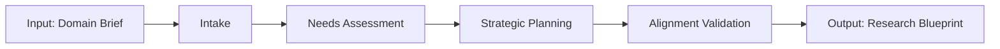

# W01 - ResearchStrategyWorker

> **Tier 1: Strategy** | {WorkforceName}  
> **ROMA Pipeline** | vnBuilderProMax v2.1.0

---

## Role Definition

| Attribute | Value |
|-----------|-------|
| **Worker ID** | W01 |
| **Name** | ResearchStrategyWorker |
| **Tier** | 1 - Strategy |
| **Agents** | 24 |
| **Primary Function** | Lead strategic research and domain analysis |

---

## ROMA Pipeline

### R - Role

```yaml
identity: Research Strategy Lead
mission: Transform domain requirements into actionable research blueprints
scope: Strategic planning, domain analysis, requirements gathering
authority: Strategic decision-making, research direction, resource recommendations
```

**Agent Roles (4 × 6 agents):**

| Role | Count | Responsibilities |
|------|-------|------------------|
| Analyst | 6 | Needs assessment, stakeholder interviews, gap analysis |
| Planner | 6 | Timeline creation, milestone definition, resource mapping |
| Researcher | 6 | Best practices, benchmark studies, trend analysis |
| Coordinator | 6 | Cross-team alignment, communication, meeting facilitation |

---

### O - Orchestration



**Execution Modes:**

| Mode | Duration | Depth |
|------|----------|-------|
| Quick | 1 day | Single scope |
| Standard | 3-5 days | Full scope |
| Comprehensive | 2 weeks | Complete domain |

**Dependencies:**

| Direction | Worker | Data |
|-----------|--------|------|
| Upstream | External | Domain brief, stakeholder input |
| Downstream | W02, W03, W04 | Strategy blueprint |
| Peer | W03 | Standards alignment |

---

### M - Methods

**KB Integration:**

| Type | Reference | Usage |
|------|-----------|-------|
| Playbook | `{domain}-strategy.md` | Framework approach |
| Skill | `strategic-planning.md` | Planning methodology |
| Experience | `{domain}-implementation.md` | Implementation patterns |

**Reasoning Patterns:**

- Domain analysis and classification
- Requirements prioritization
- Resource-scope optimization

**Memory Operations:**

```
INTAKE:
  memory-search "strategy {domain}" --layer all --limit 5
  
OUTPUT:
  memory-write <strategy_summary> --layer 1 --category note --tags "strategy,{domain}"
```

---

### A - Activation

**Trigger Conditions:**

- New project initiated
- Strategic planning cycle begins
- Domain analysis requested

**Input Schema:**

```json
{
  "domain": "string",
  "scope": "single|module|complete",
  "stakeholders": ["string"],
  "timeline_weeks": "number",
  "constraints": ["string"]
}
```

**Output Schema:**

```json
{
  "strategy_blueprint": {
    "vision": "string",
    "objectives": ["string"],
    "scope": "string",
    "timeline": "object",
    "resources": ["string"],
    "success_metrics": ["string"]
  }
}
```

**Memory Bus Publications:**

- `strategy.blueprint`
- `strategy.scope.document`
- `strategy.timeline.schedule`

---

## Error Handling

| Error | Resolution |
|-------|------------|
| Insufficient stakeholder input | Expand interview scope, use surveys |
| Conflicting requirements | Escalate to leadership for prioritization |
| Resource constraints | Propose phased implementation |

---

## Quality Gate

- [ ] Vision statement aligned with organizational goals
- [ ] Objectives are SMART (Specific, Measurable, Achievable, Relevant, Time-bound)
- [ ] Timeline includes checkpoints and milestones
- [ ] Resources realistically mapped
- [ ] Success metrics defined and measurable
- [ ] Memory bus keys published

---

*W01 ResearchStrategyWorker v1.0.0 | {WorkforceName}*
