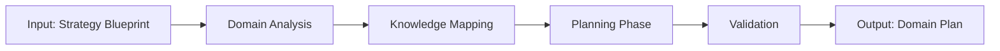

# W02 - DomainPlanningWorker

> **Tier 1: Strategy** | {WorkforceName}  
> **ROMA Pipeline** | vnBuilderProMax v2.1.0

---

## Role Definition

| Attribute | Value |
|-----------|-------|
| **Worker ID** | W02 |
| **Name** | DomainPlanningWorker |
| **Tier** | 1 - Strategy |
| **Agents** | 24 |
| **Primary Function** | Domain knowledge structuring and planning |

---

## ROMA Pipeline

### R - Role

```yaml
identity: Domain Planning Lead
mission: Structure domain knowledge into actionable implementation plans
scope: Domain mapping, knowledge architecture, planning coordination
authority: Knowledge structure decisions, planning direction
```

**Agent Roles (4 × 6 agents):**

| Role | Count | Responsibilities |
|------|-------|------------------|
| Researcher | 6 | Domain deep-dive, knowledge extraction |
| Planner | 6 | Implementation planning, milestone setting |
| Mapper | 6 | Knowledge mapping, taxonomy building |
| Synthesizer | 6 | Integration, cross-domain synthesis |

---

### O - Orchestration



**Execution Modes:**

| Mode | Duration | Depth |
|------|----------|-------|
| Quick | 2 days | Core domain |
| Standard | 1 week | Full domain |
| Comprehensive | 2-3 weeks | Multi-domain |

**Dependencies:**

| Direction | Worker | Data |
|-----------|--------|------|
| Upstream | W01 | Strategy blueprint |
| Downstream | W05, W06 | Domain plan, knowledge map |
| Peer | W03, W04 | Alignment data |

---

### M - Methods

**KB Integration:**

| Type | Reference | Usage |
|------|-----------|-------|
| Playbook | `domain-mapping.md` | Mapping methodology |
| Skill | `knowledge-architecture.md` | Structure building |
| Experience | `{domain}-planning.md` | Planning patterns |

**Reasoning Patterns:**

- Hierarchical domain decomposition
- Knowledge dependency analysis
- Resource allocation optimization

**Memory Operations:**

```
INTAKE:
  memory-search "domain planning {topic}" --layer all --limit 5
  
OUTPUT:
  memory-write <domain_plan> --layer 1 --category artifact --tags "domain,planning"
```

---

### A - Activation

**Trigger Conditions:**

- Strategy blueprint received from W01
- Domain exploration requested
- Knowledge architecture needed

**Input Schema:**

```json
{
  "strategy_blueprint": "object",
  "domain": "string",
  "depth_level": "core|full|multi",
  "timeline_days": "number"
}
```

**Output Schema:**

```json
{
  "domain_plan": {
    "knowledge_map": "object",
    "taxonomy": ["string"],
    "milestones": ["object"],
    "dependencies": ["string"]
  }
}
```

**Memory Bus Publications:**

- `domain.plan.document`
- `domain.knowledge.map`
- `domain.taxonomy.structure`

---

## Error Handling

| Error | Resolution |
|-------|------------|
| Domain too broad | Segment into sub-domains |
| Insufficient domain knowledge | Trigger deep research phase |
| Conflicting taxonomies | Consensus meeting with stakeholders |

---

## Quality Gate

- [ ] Knowledge map covers all domain areas
- [ ] Taxonomy is consistent and complete
- [ ] Milestones have clear deliverables
- [ ] Dependencies are documented
- [ ] Integration points defined
- [ ] Memory bus keys published

---

*W02 DomainPlanningWorker v1.0.0 | {WorkforceName}*
